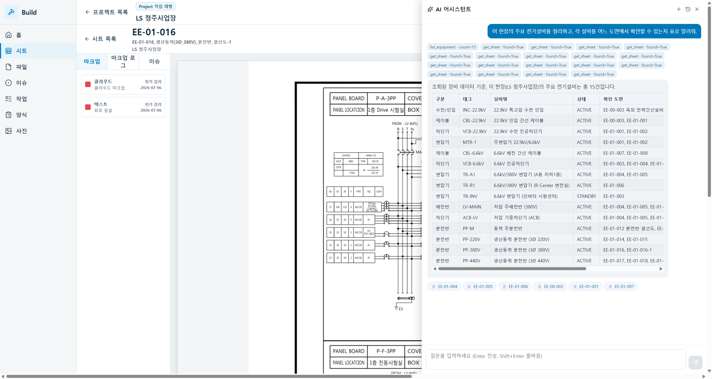

# 부록 — 데이터 파이프라인 · 저장소 실태 · 관측성(Observability)

> 제안 신뢰를 위해, **데이터가 어떻게 만들어지고, 어디에 저장되며, AI 답변의 근거를 어떻게 추적하는지**를 과장 없이 밝힙니다. 아래는 모두 실제 코드·런타임 로그로 확인한 사실입니다.

---

## 1. 도면 → 메타데이터: 무엇이 "자동 추출"이고 무엇이 "사람이 시드"인가

이 구분이 핵심입니다. 통합제안서가 "이 시스템은 (이번 범위) AI 자동 도면 분석기가 **아니다**"라고 못 박은 것과 정확히 일치합니다.

### (A) 자동 추출 — 도면 파일에서 기계가 뽑는다 `conversion.py` · `sheet_meta.py`
1. **업로드**: PDF/DWG → `drawing_file` 메타(id·파일명·포맷·크기·프로젝트) 등록.
2. **변환**
   - PDF → **PyMuPDF(fitz)**: 페이지 분할 + PNG 렌더 + 페이지 텍스트를 **좌표(bbox)까지** 추출.
   - DWG → **ODA File Converter** CLI로 DXF 변환 → **ezdxf**로 벡터 요소(선·폴리라인·원·호·텍스트·치수) 추출, `$INSUNITS` 단위로 실척 측정.
3. **시트 번호·제목·공종 휴리스틱**(`sheet_meta.py`) — 페이지마다:
   - **번호**: 5단계 우선순위 — ①파일명 접두번호가 페이지 텍스트에도 있으면 고신뢰 → ②타이틀블록 라벨(`DWG NO`·`도면번호`)의 **바로 아래/우측 값을 좌표로 공간 페어링** → ③라벨 근처 선형 후보 → ④파일명 번호 → ⑤`Page N`.
   - **공종**: 번호 토큰(EE/E/A/M/P…) 스캔 → E(전기)/A/M/… 판정, `SCALE·DATE·REV·날짜`는 오인식 방지.
   - 청주 40장은 파일명이 `EE-xx-xxx`라 **번호 100% 추출·전부 공종 E**.

### (B) 사람이 시드 — 도면에서 자동으로 못 뽑는 지식 `scripts/seed_ontology.py`
- **설비 온톨로지(장비 15종 + 도면 바인딩 33)는 도면 자동 인식이 아니라, 청주 실계통(단선결선도·분전반)을 보고 손으로 큐레이트**해 적재한 것입니다.
- 이슈 10·작업 6·양식 4·사진 4도 데모 시드.
- **⚠️ 그래서** AI가 "MTR-1 → EE-01-001" 표를 낼 때 그 설비 지식은 **AI의 도면 비전 인식이 아니라 이 시드 데이터**에서 옵니다. 도면 이미지에서 설비를 자동 인식하는 것은 후속 고도화(비전/OCR) 영역입니다.

| 데이터 | 출처 | 방식 |
|---|---|---|
| 시트 번호·제목·공종 | **도면 자동 추출** | 타이틀블록 좌표/텍스트 휴리스틱 |
| PDF 페이지·PNG·DXF 벡터 | **도면 자동 변환** | PyMuPDF·ODA·ezdxf |
| 설비 15종·설비↔도면 바인딩 | **사람이 시드** | 실계통 수동 큐레이트 |
| 이슈·작업·양식·사진 | **데모 시드** | 전기 실무 기준 |

---

## 2. 저장소 실태 — JSON이 권위, TypeDB는? (라이브 검증)

**결론: 화면·AI가 보는 조회의 권위는 JSON이다. TypeDB는 온톨로지에서만 실제 TypeQL 조회가 돈다.**

| 데이터 | 쓰기 | **읽기(조회)** | 근거 |
|---|---|---|---|
| 드로잉·시트·파일·이슈 | JSON (+typedb 모드면 TypeDB 미러) | **항상 JSON 미러** | `store.py:952` 주석 "TypeDB 조회는 후속" — 드로잉 스토어는 typedb 모드여도 read는 미러 |
| 설비 온톨로지 | JSON 미러 + TypeDB | **TypeQL(match/select + appears_on) 또는 미러** | `ontology.py:149` `_query_equipment` — 직접연결 시 실 그래프 순회 |

**기본 서버는 JSON입니다** — TypeDB Python 드라이버가 이 Windows 호스트에서 간헐적 패닉(`overflow subtracting durations`, 프로세스 abort)을 내서, 8000은 안정성을 위해 기본 JSON 미러로 읽습니다(`ontology.py:38`). TypeDB 직접 조회는 **명시 플래그**로만 켭니다.

### 라이브 검증 (2026-07-06, `XD_STORE=typedb XD_ONTOLOGY_DIRECT_TYPEDB=1`)
```
GET /health                 → {"store_backend":"typedb", ...}
log  store:    TypeDB connected: 127.0.0.1:1729/xd_drawings
log  ontology: Ontology: store TypeDB 드라이버 재사용 (xd_drawings)
GET /api/ontology/status    → {"backend":"typedb"}
GET /api/ontology/equipment → count=15   (TypeQL: match $e isa equipment,
                               (equip:$e, on_sheet:$s) isa appears_on; select …)
GET /api/drawings           → 40         (드로잉은 설계상 JSON 미러)
```
→ **온톨로지 설비 15종은 실제 TypeQL 그래프 조회로 나옵니다(미러 폴백 아님, 로그·status로 확정).** 드로잉 40장은 같은 typedb 모드에서도 JSON 미러가 읽습니다.


*라이브 캡처 — 이 설비 표(15종·설비→도면 바인딩)는 `store_backend=typedb`·`ontology backend=typedb` 상태에서 AI가 `/api/ontology/equipment`(TypeQL `match … appears_on … select`)를 호출해 받은 결과입니다. 백엔드 로그에 해당 조회가 200으로 기록됩니다. 화면상 JSON 모드와 동일하게 보이지만(툴 칩·표 동일), 근거 데이터는 TypeDB 그래프에서 옵니다.*

**정직한 위치:** 통합제안서 §9의 "TypeDB 직접 쿼리화 = 5단계 지능화 옵션"과 일치. 스키마·적재·연결·(온톨로지)조회는 실증됐고, 드로잉 조회의 TypeQL 전환과 드라이버 안정화가 구축/고도화 항목입니다.

---

## 3. 관측성 — "무슨 근거로 이 답이 나왔나"를 추적한다

AI 사이드카(8001)는 모든 대화와 외부 호출을 **격리 저장**합니다(기존 8000 무관).

### (A) 대화·근거 — `backend/ai/_ai_data/conversations.json`
대화 100건 저장 중. assistant 메시지마다 답변의 **근거**를 기록:
- **`tool_calls`**: 호출한 도구별 `{name, arguments, result_summary}` — 어느 도구를, **어떤 인자로**, 무슨 결과를 얻었는지.
  ```json
  {"name":"get_project_summary","arguments":{},"result_summary":"sheets=40 open_issues=10 files=40"}
  {"name":"list_equipment","arguments":{"sheet_id":""},"result_summary":"count=15"}
  {"name":"search","arguments":{"query":"ESS 배터리 태양광 PV"},"result_summary":"sheets=0 issues=0 files=0"}
  ```
  (마지막 줄이 환각 probe의 "없음" 답변 근거 — 검색 결과 0건이 그대로 남음)
- **`references`**: 답변이 가리키는 실체 `{type, id, label}`(시트/이슈) → 딥링크.
- 이 `tool_calls`가 UI의 **툴 칩**으로도 표시됩니다(소스별 조회 내용 + 결과 요약을 사용자가 즉석 검증).

### (B) 외부 호출 감사 — `backend/ai/_ai_data/egress_audit.jsonl`
외부 LLM 호출마다 append-only 1줄(**메타데이터만**, 본문·API키 미기록):
```json
{"ts":"2026-07-06T01:37:37Z","provider":"openai","model":"gpt-5.5",
 "conversation_id":"conv-…","project":"LS 청주사업장",
 "tool_names":["search","list_files"],"token_estimate":63,"egress":true,"ok":true}
```
언제·어느 모델로·어느 대화에서·어떤 도구를 썼고·성공했는지. `POST /api/ai/egress/mode`로 외부 전송 on/off 게이트도 있습니다.

### 정직한 한계
- **모델 내부 추론(chain-of-thought)은 저장 안 됩니다** — LLM이 반환하지 않습니다. 저장되는 "근거"는 **툴콜(무엇을 조회해 무엇을 얻었나) + 참조 실체**입니다.
- 현재 툴 칩·저장 로그는 **소스 라벨(TypeDB/JSON)을 구분 표기하지 않습니다**(지금은 사실상 전부 JSON이라). 소스별 라벨링은 소규모 개선 항목.
- `result_summary`는 요약(count)이며 원본 행 전체 스냅샷은 아닙니다.

---

## 4. 요약 — 고객에게 정직하게

- **자동**: 도면 → 시트 번호/제목/공종·페이지·벡터. **시드**: 설비↔도면 지식·이슈/작업/양식.
- **조회 권위는 JSON**. 온톨로지만 실 TypeQL 조회 실증(라이브 확인). TypeDB 전면 조회·드라이버 안정화 = 구축/고도화.
- **모든 AI 답변의 근거(툴콜·인자·결과·참조)와 외부 호출(egress)이 감사 로그로 저장**됩니다 — "왜 이 답이 나왔나"를 사후 추적 가능. 단 모델 내부 추론은 대상 아님.
