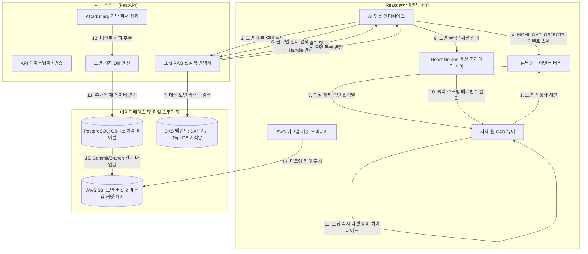

---
tags:
  - 데이터지식스튜디오
  - 개발설계
  - 시스템아키텍처
  - 아키텍처
  - Mermaid
  - 하이브리드검색
  - Git_like
aliases:
  - 시스템 아키텍처 설계 명세
  - SAD 상세 지침
created: 2026-06-11
updated: 2026-06-11
related:
  - "[[design_documents_map]]"
  - "[[01_Requirements/README]]"
  - "[[01_Requirements/03_functional_requirements]]"
---

# 02. 시스템 아키텍처 설계서 (SAD)

## 1. 하이브리드 도면 지식 플랫폼 아키텍처
본 플랫폼은 사용자가 도면을 띄운 상태에서의 내부 질의(내부 검색)와 도면 밖 글로벌 검색창에서의 질의(글로벌 검색)를 모두 수용하며, 도면의 버전과 마크업을 Git 스타일로 제어하는 하이브리드 토폴로지를 가집니다.

---

## 2. 하이브리드 연동 핵심 컴포넌트 설계 명세

### ① 세션 라우팅 & 파라미터 바인딩 (Route & Viewer Context)
* **글로벌 검색 전이 메커니즘**:
    * 사용자가 도면 외부에서 특정 설비(예: `VLV-101`)를 질문하여 도면 리스트 중 하나를 클릭하면, 라우터는 다음과 같은 규격의 URL로 뷰어를 트리거합니다.
      `https://dks.platform/project/청주/viewer?drawing_id=4a5b6c&highlight=1A2D&focus=true`
    * 웹 CAD 뷰어는 로딩 프로세스 완료 시점에 URL의 `highlight` 파라미터(Handle ID)를 파싱하여, PostgreSQL의 `entity_mappings`를 대조해 런타임 `db_id`를 획득하고 즉각 포커싱 액션을 자체 구동합니다.
* **도면 내 실시간 연동**:
    * 뷰어가 활성화되어 있을 때 챗봇 대화창에서 이벤트가 수신되면, 뷰어를 리로드하지 않고 **프론트엔드 이벤트 버스**를 통해 런타임 메모리 내에서 즉각 객체를 제어합니다.

### ② Git-like 버전 제어 & Diff 컴포넌트 (Git-like Versioning)
* **도면 커밋 관리**:
    * 도면이 업데이트되면 백엔드 파서는 새로운 도면 레코드를 생성하고 이를 이전 도면 레코드의 하위 노드(Commit Parent 관계)로 PostgreSQL에 기록합니다.
* **도면 기하 Diff 엔진**:
    * 새로운 버전이 등록되는 시점에 백엔드 `DiffEngine`이 작동하여 구버전 기하 JSON과 신버전 기하 JSON을 배치 비교합니다.
    * 좌표가 정확히 일치하나 속성이 변한 것(수정), 새로운 좌표에 생성된 것(추가), 기존 좌표에서 없어진 것(삭제)을 판별하여 `drawings_diff` 캐시 테이블에 저장해 둡니다.
    * 사용자가 뷰어에서 '비교 토글'을 켜면, 뷰어는 서버로부터 이 Diff 데이터를 가져와 기존 도면 위에 오버랩 드로잉합니다.

### ③ Git-like 마크업 이력 (Markup Commit Layer)
* **마크업 레이어링**:
    * 사용자가 뷰어 화면 위에 펜으로 지시선을 그리고 저장하면, 도면의 원본 파일을 수정하는 것이 아니라, 해당 도면의 특정 버전(Commit ID)을 부모로 두는 **'마크업 커밋(Markup Commit)'** 객체를 생성합니다.
    * 이 마크업 데이터는 [[JSON]] 벡터 패스 구조로 S3 스토리지에 업로드되며, PostgreSQL에는 `markup_commits` 테이블에 작성자, 작성일, 내용, 부모 도면 버전 정보가 기록됩니다.
    * 뷰어는 도면 로딩 시 활성화된 마크업 커밋 레이어들의 JSON을 병렬 다운로드하여 뷰어 씬 위에 투명 오버레이로 덧그려줍니다.
