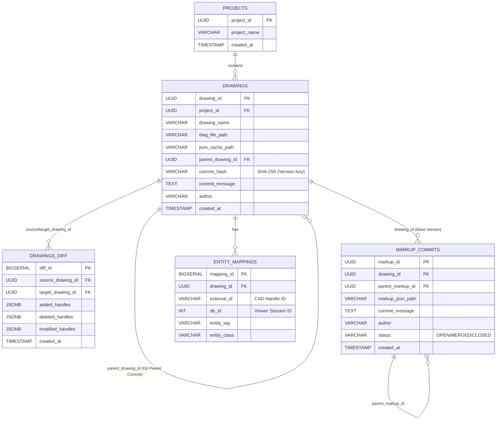

---
tags:
  - 데이터지식스튜디오
  - 개발설계
  - 데이터베이스
  - RDB
  - Git_like
  - ERD
created: 2026-06-12
related:
  - "[[README]]"
  - "[[02_typedb_ontology_mapping]]"
---

# 03-1. RDB 스키마 및 Git-like 도면 이력 설계 명세

> **목적**: 웹 CAD 플랫폼의 코어 데이터를 저장하고, 도면 파일 및 마크업 데이터에 대한 Git 스타일의 분산/계층적 버전 제어를 지원하기 위한 PostgreSQL 관계형 데이터베이스 상세 스키마 설계입니다.

## 1. 개체-관계 모델 (ERD)

## 2. 테이블별 핵심 설계 의도 및 인덱싱 전략

### 2.1 도면 커밋 트리 `drawings`
* **설계 의도**: 단순한 파일 덮어쓰기가 아닙니다. 새 도면이 업로드되면 무조건 새로운 레코드가 `INSERT`되며, 이전 버전의 `drawing_id`를 `parent_drawing_id`로 가리켜 **Commit Tree**를 형성합니다.
* **무결성 유지**: 도면 파일의 `commit_hash`(SHA-256)를 기반으로 중복 업로드를 방지합니다.

### 2.2 도면 차분 캐시 `drawings_diff`
* **설계 의도**: 무거운 도면 데이터 비교 연산을 클라이언트가 직접 수행하지 않습니다. 백엔드 워커가 비동기로 구/신버전 JSON을 파싱하여, 차이점(추가/삭제/수정)의 `Handle ID` 배열만 `JSONB` 타입으로 저장합니다.
* **인덱싱 전략**: `source_drawing_id`, `target_drawing_id` 복합 유니크 제약조건 설정. 클라이언트가 Diff 모드를 켤 때 이 두 키를 조건으로 즉시 쿼리합니다.

### 2.3 마크업 커밋 오버레이 `markup_commits`
* **설계 의도**: 도면 위에 펜이나 텍스트로 남긴 주석을 독립적인 커밋 생명주기로 관리합니다. 마크업 자체도 수정/답글이 달릴 수 있으므로 `parent_markup_id`로 마크업 브랜치를 형성할 수 있습니다. `status` 필드를 통해 해당 이슈의 해결 상태를 제어합니다.

### 2.4 빠른 객체 맵업 `entity_mappings`
* **설계 의도**: 글로벌 검색 및 챗봇 연동 시 병목을 막기 위해 뷰어용 임시 ID(`db_id`)와 캐드 불변 ID(`external_id`) 간 매핑을 전담하는 테이블입니다. 빈번한 조회가 발생하므로 B-Tree 인덱스 최적화가 필수적입니다.
