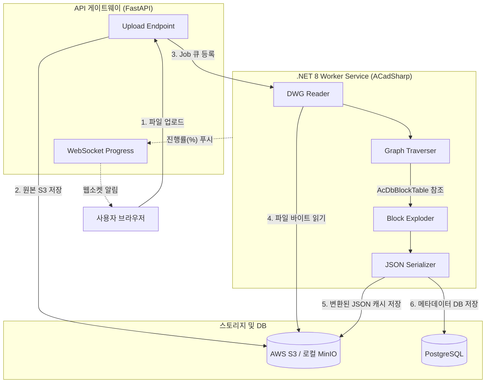

---
tags:
  - 데이터지식스튜디오
  - 개발설계
  - 파이프라인
  - 백엔드
  - ACadSharp
  - 도면변환
created: 2026-06-12
related:
  - "[[README]]"
  - "[[02_api_and_event_spec]]"
  - "[[01_Requirements/03_functional_requirements]]"
---

# 04-1. 도면 파싱 파이프라인 및 백엔드 엔진 설계 명세

> **목적**: 외부 클라우드 의존 없이, `.dwg` 및 `.dxf` 바이너리 파일을 자체 해독하여 프론트엔드가 즉시 렌더링할 수 있는 경량화된 `JSON` 구조로 변환하는 백엔드 엔진의 구조와 동작 명세를 정의합니다.

---

## 1. ACadSharp 기반 도면 파싱 파이프라인 아키텍처



---

## 2. 도면 해독(Parsing) 핵심 워크플로우

엔진은 도면 객체 지향 구조(AcDbDatabase)를 아래 4단계로 철저하게 해부합니다.

1. **Header 및 Meta 추출**: 
   * `$EXTMIN`, `$EXTMAX` 값을 읽어 도면의 전체 Bounding Box 크기 획득.
   * `$MEASUREMENT` (Metric/Imperial) 단위 확인.
2. **Layer 테이블 해독**:
   * `AcDbLayerTable`을 순회하며 레이어명, 활성/비활성(Frozen), 기본 컬러(ACI), 선형(Linetype) 인덱스 매핑 구성.
3. **Block 전개 (Exploder)**:
   * CAD 도면의 객체는 `INSERT`(블록 참조) 안에 실제 `LINE`, `TEXT` 등이 숨어있는 계층형 구조입니다.
   * `AcDbBlockTable`에 정의된 원본 블록을 찾고, 삽입된 X, Y 좌표와 스케일(Scale), 회전각도(Rotation) 행렬(Matrix)을 곱해 **글로벌 좌표계(WCS)로 평탄화(Flatten)** 합니다.
4. **기하 객체 순회 (Entity Traversal)**:
   * `LINE`, `LWPOLYLINE`, `CIRCLE`, `ARC`, `TEXT`, `MTEXT` 타입만 필터링하여 순회합니다. (3D 솔리드나 프록시 객체는 안전하게 스킵 처리)
   * 추출 시 해당 엔티티의 CAD 고유 **Handle ID(예: `2A5`)**를 반드시 함께 바인딩하여 뷰어 연동의 키값으로 삼습니다.

---

## 3. 웹 렌더링 최적화 JSON 스키마 규격

ACadSharp가 생성하여 S3에 저장하는 최종 산출물(JSON)의 구조입니다. 프론트엔드의 `JSON.parse()` 속도를 위해 최소한의 키명으로 작성됩니다.

```json
{
  "metadata": {
    "version": "1.0.0",
    "filename": "A_plant_piping_plan.dwg",
    "commit_hash": "a1b2c3d4...",
    "bounds": {
      "min": [-1000.5, -2000.0],
      "max": [5000.0, 8000.0]
    },
    "origin": [0, 0]
  },
  "layers": [
    { "name": "0", "color": 16777215, "visible": true },
    { "name": "M_PIPE_NEW", "color": 65280, "visible": true }
  ],
  "geometry": {
    "lines": [
      // [Handle, LayerIdx, X1, Y1, X2, Y2] -> 배열 압축으로 파싱 속도/용량 극대화
      ["1F2", 1, 10.0, 20.0, 50.0, 60.0],
      ["1F3", 1, 50.0, 60.0, 100.0, 60.0]
    ],
    "circles": [
      // [Handle, LayerIdx, CX, CY, Radius]
      ["2A4", 0, 150.0, 200.0, 25.5]
    ],
    "texts": [
      // [Handle, LayerIdx, X, Y, Height, Rotation, TextValue]
      ["3B1", 1, 50.0, 65.0, 2.5, 0.0, "V-101"]
    ]
  }
}
```

### 💡 용량 최적화 전략 (Flatten Array)
일반적인 Key-Value JSON `[{"handle":"1F2", "x1":10...}]` 형태는 키 스트링의 중복으로 인해 파일 크기가 기하급수적으로 커집니다. 위 스키마처럼 **형태소 배열(Flatten Array)** 로 구축하면 100MB 도면이 5MB 미만의 JSON으로 압축되며, 브라우저의 메모리 로딩 타임을 획기적으로 줄일 수 있습니다.

---

## 4. 예외 및 에러 핸들링 (Proxy Entity Defense)

* **Proxy Entity 보호**: Civil 3D나 Plant 3D 전용 객체가 포함된 도면 파싱 시, ACadSharp가 `NotImplementedException`을 뱉어 스레드가 죽는 현상을 방지하기 위해 `try-catch` 블록으로 래핑하고, 해당 객체를 무시(`Skip`) 처리한 후 로그 테이블에 "N개 프록시 객체 무시됨"으로 Warning을 기록합니다.
* **XRef (외부 참조) 결측**: 외부 도면 파일(.dwg)을 링크로 끌어다 쓰는 XRef 객체의 경우, 단일 파일 업로드 시에는 링크가 깨져 표현되지 않습니다. 이를 위해 플랫폼은 '프로젝트 단위 압축파일(ZIP) 통째 업로드' 기능을 열어두어 백엔드에서 XRef 패스를 내부 컨테이너 경로로 리졸빙(Resolving) 하도록 지원합니다.
