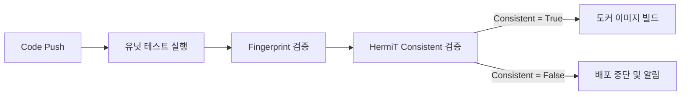

---
tags:
  - 데이터지식스튜디오
  - 개발설계
  - 인프라
  - 배포
  - Docker
  - CI_CD
  - HermiT
aliases:
  - 배포 및 인프라 설계 명세
  - DEP 상세 지침
created: 2026-06-11
updated: 2026-06-11
related:
  - "[[design_documents_map]]"
  - "[[06_AI_Ontology/README]]"
---

# 07. 배포 및 인프라 설계서 (DEP)

## 1. 멀티 스테이지 도커(Docker) 빌드 최적화 설계

백엔드 도면 분석 파이프라인(C# .NET) 및 서비스 오케스트레이터(FastAPI)의 격리된 도커 이미지 빌드 사양입니다.

### ① C# 백엔드 변환기 도커파일 (Multi-stage Build)
* **설명**: 빌드 환경에만 .NET SDK를 포함하고 실행 이미지에는 런타임만 유지하여 이미지 크기를 150MB 이하로 최소화합니다.
```dockerfile
# 1. 빌드 스테이지
FROM mcr.microsoft.com/dotnet/sdk:8.0 AS build-env
WORKDIR /app

# 프로젝트 파일 복사 및 NuGet 패키지 복원 (ACadSharp 의존성 포함)
COPY *.csproj ./
RUN dotnet restore

# 소스 복사 및 배포 바이너리 빌드
COPY . ./
RUN dotnet publish -c Release -o out

# 2. 런타임 스테이지
FROM mcr.microsoft.com/dotnet/runtime:8.0
WORKDIR /app
COPY --from=build-env /app/out .

ENTRYPOINT ["dotnet", "DwgParserWorker.dll"]
```

---

## 2. 클라우드 및 온프레미스(On-Premise) 인프라 구성 설계
독자적인 플랫폼 구조를 취함에 따라, 외부 오토데스크 서버와의 연결 없이 완벽히 로컬 프라이빗 망 내부나 표준 AWS 환경에 단독 배포할 수 있는 토폴로지입니다.

* **파일 보존 및 전송 보안 (S3 / Local NAS)**:
    * 원본 [[DWG]] 및 변환 [[JSON]] 캐시 파일은 프라이빗 [[AWS]] S3 버킷에 저장되며, 사용자가 도면을 뷰어로 다운로드할 때는 **유효 시간 5분짜리 서명된 URL (Signed URL)**을 API 서버가 동적으로 발급하여 파일 직접 유출을 원천 차단합니다.
* **서비스 클러스터링**:
    * 백엔드 API와 파서 워커는 Docker Container 기반의 **AWS ECS (Fargate)** 또는 Kubernetes 클러스터에 배포하여 트래픽 증가 시 자동 스케일링(Auto-scaling) 처리를 수행합니다.
    * TypeDB 데이터베이스 서버는 성능 확보를 위해 고속 IOPS SSD를 탑재한 독립 EC2 혹은 전용 VM 환경에 영구 보존(Persistent Volume) 구조로 배포합니다.

---

## 3. HermiT Consistent 가드 테스트를 포함한 CI/CD 파이프라인

배포 시 온톨로지 지식 모델의 무결성을 깨뜨리는 오류(Inconsistency)가 코드 빌드 단계에 포함되는 것을 강제 방어하기 위한 CI/CD 자동화 사양입니다.



### GitHub Actions CI 명세 예시 (`.github/workflows/ci.yml`)
```yaml
name: DKS Backend CI

on:
  push:
    branches: [ main, develop ]

jobs:
  test_and_verify:
    runs-on: ubuntu-latest
    steps:
    - name: 소스 코드 체크아웃
      uses: actions/checkout@v3

    - name: 파이썬 및 .NET 런타임 설치
      uses: actions/setup-python@v4
      with:
        python-version: '3.10'

    - name: 의존성 설치 (TypeDB Client, HermiT Wrapper 등)
      run: |
        pip install -r requirements.txt

    - name: Fingerprint 및 Invariant 자동 검증
      run: |
        python _Python_code/phase1/validator/invariant_checker.py

    - name: HermiT 추론기 정합성 검증 테스트 (Inconsistency 검사)
      run: |
        python -m pytest _Python_code/tests/phase1/regression/
        # HermiT 추론 결과가 consistent = True 여야만 빌드 단계로 진행됨.
```
* **품질 방어**: 설계 단계의 온톨로지 규칙 충돌이 일어나 38개 클래스 및 58개 이상 인스턴스의 추론 관계가 꼬이면 빌드 실행 단계에서 에러 코드를 반환하여 자동 배포 프로세스를 안전하게 중단시킵니다.
