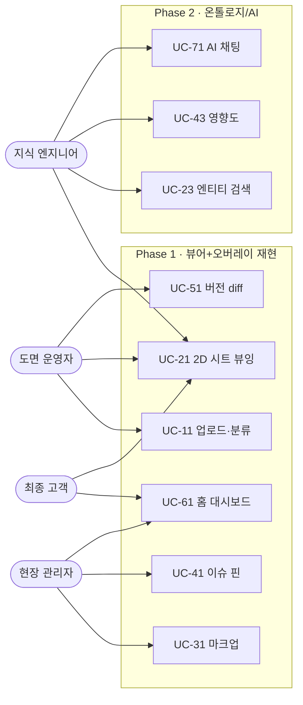

---
tags:
  - 도면관리시스템
  - 요구사항
  - 페르소나
  - 유스케이스
  - SRS
aliases:
  - 페르소나-유스케이스
  - 사용자 시나리오
created: 2026-06-12
related:
  - [[01-1_범위정의-SRS]]
  - [[_ACC-Build-화면분석-재현설계]]
  - [[02-1_정보구조-IA]]
  - [[데이터-지식-스튜디오]]
---

# 페르소나 & 유스케이스

## 1. 목적
- 청주 사업장 [[도면관리 시스템]]의 **사용자 유형(페르소나)** 과 **핵심 시나리오(유스케이스)** 를 정의하는 문서.
- 이후 IA·화면설계·기능명세가 "누가, 왜, 무엇을" 하는지 추적할 수 있는 근거.
- 본 문서가 소유하는 주제 = **사용자와 시나리오만**. 화면/기능 상세는 [[_ACC-Build-화면분석-재현설계]]에 위임.

## 2. 배경 / 전제
- 1차 목표 = [[ACC Build]]( [[Autodesk Construction Cloud]] ) 동등 재현. 모든 페르소나는 ACC Build의 사용자상에서 출발.
- ★스코프 전제: 본 시스템은 **CAD 편집기가 아니라 "뷰어 + 주석/이벤트 오버레이"**. [[DWG]] 원본은 편집하지 않음 → DWG→파싱→기하 JSON→웹 2D 뷰어 렌더 위에 마크업/이슈/이벤트만 오버레이.
- 1차 범위 = **2D 시트(도면) 한정**. 3D BIM/Bridge 범위 밖.
- 차별점: [[DKS]]( [[데이터 지식 스튜디오]] )의 "도면=진실원천" + Phase 0 파싱 산출물(분야·도면번호·태그) → ACC엔 없는 **설비 엔티티 단위** 검색/영향도/AI채팅을 향후(Phase 2) [[TypeDB]] 온톨로지로 바인딩.
- 전제 분리: 페르소나별 **Phase 1(뷰어/오버레이 재현)** 과 **Phase 2(온톨로지/AI)** 시나리오를 구분 표기.

## 3. 페르소나

### 3.1 도면 운영자 (Drawing Operator)
> 의도 메모: 일상적으로 도면을 올리고/정리하고/버전 관리하는 주 사용자. 빈도 최고. 채울 항목 ↓
- 역할/책임: (도면 업로드·폴더 분류·버전 갱신·시트 메타 관리)
- 주 사용 모듈: 파일([[CDE]])·시트·시트비교
- 숙련도/디바이스: (PC 기반, CAD 배경 보통) — TBD
- 핵심 니즈 / 페인포인트: (최신 도면 식별, 버전 혼선 방지)

### 3.2 지식 엔지니어 (Knowledge Engineer)
> 의도 메모: DKS 차별점의 주체. 파싱 산출물·엔티티 태깅·온톨로지 바인딩 담당. Phase 2 핵심.
- 역할/책임: (도면 파싱 검수, 설비 엔티티 ID 매핑, 마크업/이슈↔엔티티 연결 규칙 운영)
- 주 사용 모듈: 시트 뷰어·이슈·(Phase 2) AI채팅/지식질의
- 핵심 니즈: (픽셀 핀이 아닌 **엔티티 ID 기반** 주석, 영향도 추적)
- ❓ 운영자와 역할 분리 수준 — 겸직 가능 여부 TBD

### 3.3 현장 관리자 (Site Manager)
> 의도 메모: 현장에서 이슈를 생성/확인하고 마크업으로 소통. 모바일/태블릿 가능성.
- 역할/책임: (현장 이슈 등록, 마크업 코멘트, 상태 추적)
- 주 사용 모듈: 이슈(핀+상세폼)·마크업·홈 대시보드
- 디바이스: (태블릿/모바일 뷰 필요 여부) — TBD
- 핵심 니즈: (위치 기반 이슈, 빠른 상태 파악)

### 3.4 최종 고객 (End Customer / 청주 사업장)
> 의도 메모: 납품 대상. 열람·승인·진행현황 확인 중심. 편집 권한 최소.
- 역할/책임: (도면 열람, 진행/이슈 현황 모니터링, 산출물 확인)
- 주 사용 모듈: 홈 위젯 대시보드·시트(읽기)·파일(다운로드)
- 권한: (읽기 위주, 일부 코멘트) — RBAC 상세는 [[01-3_비기능요구-NFR]]에 위임
- 핵심 니즈: (가시성, 신뢰 가능한 최신본)

### 3.5 페르소나 요약 매트릭스
> 의도 메모: 페르소나 × (주 모듈 / 권한레벨 / 빈도 / Phase) 표 1개로 압축.
- 컬럼: 페르소나 | 주 모듈 | 권한 | 사용빈도 | Phase1/2 비중 — 표 채우기 TBD

## 4. 핵심 유스케이스
> 표기 규약: UC-NN | 행위자 | 트리거 | 주 흐름 1~2줄 | 연관 모듈 | Phase

### 4.1 도면/파일 관리 (UC-10번대)
- **UC-11 도면 업로드·분류**: 운영자가 [[DWG]]/[[PDF]] 업로드 → 백엔드 파싱 → 시트 등록. (Phase1)
- **UC-12 버전 갱신·이력**: 신규 버전 업로드 시 이전본 보존·최신 표시. (Phase1)
- **UC-13 폴더형 CDE 정리**: [[CDE]] 폴더 트리 구성·검색. (Phase1)

### 4.2 도면 열람·탐색 (UC-20번대)
- **UC-21 2D 시트 뷰잉**: 기하 JSON을 웹 뷰어( [[PDF.js]] / 커스텀 캔버스 )로 렌더·줌·팬. (Phase1)
- **UC-22 시트 목록 필터/정렬**: 분야·도면번호·태그로 데이터테이블 탐색. (Phase1)
- **UC-23 엔티티 단위 검색**: 설비 엔티티 ID로 도면 위치 하이라이트. (Phase2, [[TypeDB]])

### 4.3 마크업·주석 (UC-30번대)
- **UC-31 마크업 작성**: 펜·도형·화살표·텍스트 오버레이(원본 불변). (Phase1)
- **UC-32 마크업↔엔티티 바인딩**: 마크업을 픽셀 좌표 + **설비 엔티티 ID** 양쪽에 묶기. (Phase2)

### 4.4 이슈 관리 (UC-40번대)
- **UC-41 이슈 핀 생성**: 도면 위 핀 + 상세폼(담당·상태·기한). (Phase1)
- **UC-42 이슈 목록·필터·내보내기**: 데이터테이블 + 인스펙터. (Phase1)
- **UC-43 이슈 영향도 추적**: 엔티티 ID 기반 연관 도면/설비 영향 분석. (Phase2)

### 4.5 시트 비교 (UC-50번대)
- **UC-51 버전 오버레이 diff**: 두 버전 시트를 겹쳐 변경점 시각화. (Phase1)

### 4.6 대시보드·현황 (UC-60번대)
- **UC-61 홈 위젯 대시보드**: 이슈/도면/활동 위젯 카드. (Phase1)
- **UC-62 고객 진행현황 열람**: 최종고객용 읽기 대시보드. (Phase1)

### 4.7 AI 지식질의 (UC-70번대 · Phase2)
- **UC-71 도면 기반 AI 채팅**: 온톨로지 엔티티에 바인딩된 질의응답. (Phase2)
- **UC-72 실시간 이벤트 오버레이**: [[WebSocket]] 기반 설비 이벤트를 뷰어 위 표시. (Phase2)
- ❓ Phase2 범위/우선순위 — DKS 트랙과 경계 TBD

## 5. 유스케이스 다이어그램 (Mermaid)
> 의도 메모: 행위자–유스케이스 연결 개관. Phase2는 점선/주석으로 구분. 노드 확정되면 보강.

## 6. 결정 대기 항목 (TBD / ❓)
- ❓ 지식 엔지니어 vs 도면 운영자 역할 분리/겸직 여부.
- ❓ 현장 관리자 모바일·태블릿 지원 범위(반응형 vs 전용).
- ❓ 최종 고객 권한 세분(읽기 전용 vs 코멘트 허용) — RBAC 표 위임.
- ❓ Phase2 AI/온톨로지 유스케이스의 본 시스템 vs DKS 트랙 경계.
- TBD: 페르소나별 사용빈도·디바이스 실측 데이터(인터뷰 후 채움).

## 7. 관련 문서
- [[01-1_범위정의-SRS]] — 스코프 제약(편집 금지·2D 한정) 원천.
- [[01-3_비기능요구-NFR]] — RBAC/권한·성능 위임.
- [[_ACC-Build-화면분석-재현설계]] — 모듈/화면 벤치마크.
- [[02-1_정보구조-IA]] — 모듈·네비게이션 구조.
- [[데이터-지식-스튜디오]] — DKS 온톨로지·엔티티 차별점.
