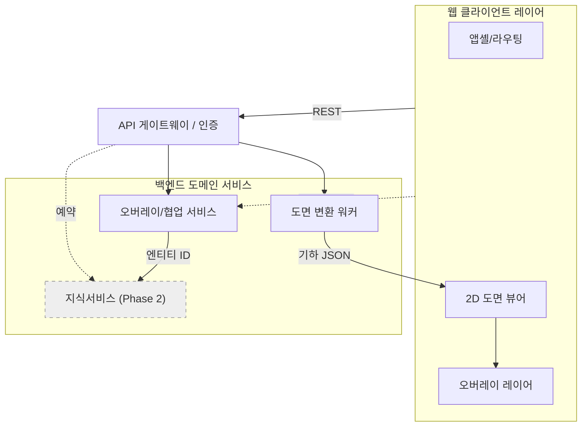

---
tags:
  - 아키텍처
  - 도면관리시스템
  - 논리아키텍처
  - SAD
  - 청주사업장
aliases:
  - 논리 아키텍처
  - Logical Architecture
  - 02-2 논리아키텍처
created: 2026-06-12
related:
  - "[[_ACC-Build-화면분석-재현설계]]"
  - "[[02-1_시스템개요]]"
  - "[[02-3_물리아키텍처]]"
  - "[[03_데이터모델]]"
---

# 논리 아키텍처 (Logical Architecture)

## ① 목적
- 청주 사업장 납품용 [[도면관리시스템]]을 구성하는 **레이어/컴포넌트의 논리적 구성**을 정의.
- [[ACC]] Build 동등 재현(1차) + 향후 [[TypeDB]] 온톨로지 연동(Phase 2)을 모두 수용하는 골격 제시.
- 이 문서가 소유하는 주제 = **"어떤 논리 컴포넌트가 존재하고 어떻게 책임이 나뉘는가"**. 배치/서버/네트워크는 [[02-3_물리아키텍처]]로 위임.

## ② 배경/전제 (★핵심 스코프 제약)
- **DWG 원본 비편집 원칙**: 흐름 = [[DWG]] → 백엔드 파싱 → 기하 JSON → 웹 2D 뷰어 렌더 → 마크업/이슈/이벤트 "오버레이". CAD 편집기가 아니라 **뷰어 + 주석/이벤트 오버레이** 시스템.
- 정밀 CAD 편집(osnap 스냅, 좌표 편집, [[SHX]] 폰트 정밀 렌더)은 **범위 밖**. (과거 Development_Design 초안의 CAD-editor 가정 폐기.)
- 1차 범위 = **2D 시트 한정**. 3D BIM 뷰어/Bridge 범위 밖.
- 차별점 = 핀/마크업/이슈를 픽셀 좌표뿐 아니라 **설비 엔티티 ID**에도 바인딩 → 향후 [[TypeDB]] 온톨로지 검색·영향도·AI채팅과 연결 ([[DKS]] 도면=진실원천 전제).

---

## 웹 클라이언트 레이어
> 채울 것: 브라우저에서 동작하는 SPA 구조와 2D 뷰어/오버레이 렌더 책임 분리.

### 앱셸 (App Shell)
> 채울 것: 모듈 사이드바·프로젝트 스위처·라우팅 셸. ACC 공통 UI 재현.
- 모듈 라우팅: 홈/시트/마크업/이슈/시트비교/파일/사진 (벤치마크 7모듈)
- 공통 컴포넌트 위임 → [[04_공통UI-컴포넌트]] (데이터테이블·인스펙터·위젯카드·모달·토스트·빈상태)

### 2D 도면 뷰어 (Viewer Core)
> 채울 것: 기하 JSON을 렌더하는 캔버스 엔진. 줌/팬/레이어 토글.
- 렌더 후보: Canvas 2D / WebGL / [[PDF.js]](변환 산출물이 PDF일 경우) — TBD
- 입력 = 백엔드 변환 산출물(기하 JSON 또는 타일/벡터). 원본 DWG 직접 파싱 안 함.

#### 오버레이 레이어 (Overlay Layer)
> 채울 것: 뷰어 위에 그려지는 마크업/핀/이슈/이벤트 레이어. 좌표계 매핑.
- 핀·마크업 좌표 = (시트 좌표) + (선택적 설비 엔티티 ID) 이중 바인딩
- 도면 좌표 ↔ 화면 좌표 변환 규약 → [[03_데이터모델]] 위임

### 클라이언트 상태/데이터 계층
> 채울 것: API 캐시·낙관적 업데이트·실시간 수신 상태 관리.
- 실시간 협업 수신 = [[WebSocket]] 구독 → 오버레이/협업 서비스와 연결
- 상태관리 라이브러리 선정 TBD

---

## API 게이트웨이 / 인증
> 채울 것: 클라이언트 단일 진입점. 인증/인가/라우팅 책임.

### 인증·세션
> 채울 것: 로그인·토큰·세션 수명. 청주 사내 인증 연동 여부.
- 인증 방식(JWT/세션쿠키) 및 사내 SSO 연동 여부 TBD ❓

### 인가·권한 모델 (RBAC)
> 채울 것: 프로젝트/폴더/이슈 단위 권한. ACC 역할 모델 참고.
- 역할(뷰어/마크업작성/이슈관리/관리자) 정의 TBD

### API 라우팅·게이트웨이 책임
> 채울 것: 후단 서비스로의 요청 분배·집계. BFF 패턴 적용 여부 TBD.

---

## 도면 변환 워커
> 채울 것: DWG를 웹 렌더 가능한 산출물로 변환하는 비동기 파이프라인. **시스템의 심장.**

### 변환 파이프라인
> 채울 것: 업로드 → 큐 → 파싱 → 기하 JSON/타일 생성 → 저장 단계.
- 비동기 잡 큐 기반(업로드와 변환 분리). 큐 기술 TBD
- 변환 산출물 포맷(벡터 JSON / 래스터 타일 / PDF) 결정 TBD ❓

#### DWG 파싱 엔진
> 채울 것: DWG 디코딩 라이브러리/도구 선정. 라이선스 검토.
- 후보 라이브러리·라이선스 검토 TBD ❓ (상용 SDK vs 오픈)
- **편집 아님** — 읽기 전용 기하 추출만.

#### 기하 추출·정규화
> 채울 것: 엔티티(선/원/텍스트/블록) → 정규화 기하 JSON 매핑 규칙.
- 분야·도면번호·태그 = Phase 0 파싱 산출물 재사용 ([[DKS]] 기존 자산)

### 버전·시트 비교 지원
> 채울 것: 버전 간 기하 diff 계산(시트비교 모듈 백엔드).
- diff 알고리즘 = 기하 오버레이 비교. 상세 규약 → [[03_데이터모델]] 위임

---

## 오버레이/협업 서비스
> 채울 것: 마크업·이슈·핀·이벤트의 CRUD + 실시간 동기화 도메인 서비스.

### 마크업 서비스
> 채울 것: 펜·도형·화살표 주석 저장/조회. 시트·버전 귀속.

### 이슈 서비스
> 채울 것: 핀+상세폼+목록+필터. 상태 워크플로우(열림/진행/닫힘 등).
- 이슈 ↔ 설비 엔티티 ID 바인딩 필드 포함(차별점)

### 협업/실시간 동기화
> 채울 것: 다중 사용자 동시 편집 브로드캐스트. [[WebSocket]] 채널.
- 충돌 처리 정책(last-write-wins vs 머지) TBD ❓

### 파일/CDE 서비스
> 채울 것: 폴더형 [[CDE]] 파일 관리. 버전·메타데이터.
- 사진 모듈 저장도 본 서비스 관할 여부 TBD

---

## 지식서비스 (향후 / Phase 2)
> 채울 것: 온톨로지 기반 검색·영향도·AI채팅. 1차 범위 밖, 인터페이스만 예약.

### 온톨로지 바인딩 계층
> 채울 것: 핀/마크업/이슈의 설비 엔티티 ID → [[TypeDB]] 엔티티 연결.
- 1차에서 "엔티티 ID 필드"만 데이터모델에 미리 확보(향후 무손실 연동)

### 엔티티 검색·영향도
> 채울 것: ACC엔 없는 "엔티티 단위" 검색·영향도 분석. 차별 기능.

### AI 채팅/지식질의
> 채울 것: 도면 컨텍스트 기반 질의. 뷰어/이슈에 바인딩.
- 모델·RAG 구성 일체 TBD (Phase 2 별도 설계 위임)

---

## 컴포넌트 다이어그램 (Mermaid)
> 채울 것: 위 레이어들의 의존 방향을 한 장으로. 초안 골격은 아래, 확정 시 갱신.

- 점선/회색 = Phase 2(향후) 또는 실시간 채널. 실선 = 1차 범위.

---

## ④ 결정 대기 항목 (TBD / ❓)
- ❓ 2D 뷰어 렌더 엔진: Canvas 2D vs WebGL vs [[PDF.js]]
- ❓ 변환 산출물 포맷: 벡터 JSON vs 래스터 타일 vs PDF
- ❓ DWG 파싱 라이브러리/SDK 및 라이선스
- ❓ 인증 방식 및 청주 사내 SSO 연동 여부
- ❓ 실시간 협업 충돌 처리 정책
- ❓ 잡 큐/메시지 브로커 기술 선정
- TBD: 클라이언트 상태관리 라이브러리, BFF 적용 여부, RBAC 역할 세분도

## ⑤ 관련 문서
- [[02-1_시스템개요]] — 전체 맥락·범위
- [[02-3_물리아키텍처]] — 배포/서버/네트워크 배치
- [[03_데이터모델]] — 좌표계·엔티티·버전 diff 스키마
- [[04_공통UI-컴포넌트]] — 데이터테이블·인스펙터·모달 등 공통 UI
- [[_ACC-Build-화면분석-재현설계]] — 벤치마크 37화면 분석
