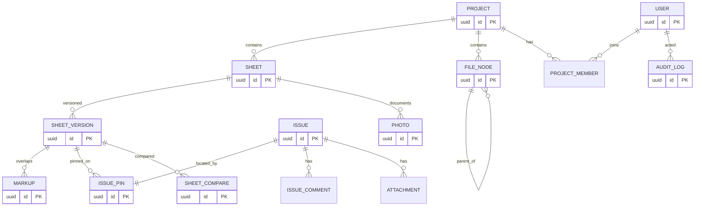

---
tags:
  - 도면관리시스템
  - 데이터설계
  - ERD
  - RDB
  - 상세설계
aliases:
  - RDB 전체 ERD
  - 관계형 DB 엔티티-관계도
created: 2026-06-12
related:
  - [[_ACC-Build-화면분석-재현설계]]
  - [[03-2_파싱-기하-JSON-스키마]]
  - [[03-3_TypeDB-온톨로지-바인딩]]
  - [[02_아키텍처-개요]]
---

## ① 목적

청주 사업장 도면관리 시스템의 **관계형 DB([[RDB]]) 전체 엔티티-관계도** 단일 소유 문서.
- [[ACC]] Build 동등 재현에 필요한 정규 스키마(시트/마크업/이슈/버전/파일/사진/사용자/프로젝트) 정의.
- 픽셀 좌표 + **설비 엔티티 ID 바인딩**(차별점) 양쪽을 수용하는 컬럼 설계 근거 제공.

## ② 배경 / 전제

- ★스코프 제약: [[DWG]] 원본 미편집. 흐름 = DWG → 백엔드 파싱 → 기하 JSON → 웹 2D 뷰어 → 마크업/이슈/이벤트 **오버레이**.
  - 따라서 RDB는 **CAD 형상 자체를 저장하지 않음**. 형상은 파일/오브젝트 스토리지의 기하 JSON에 위임 → [[03-2_파싱-기하-JSON-스키마]].
  - RDB가 책임지는 것 = 메타데이터 + 오버레이(주석/이슈/이벤트) + 버전/권한/감사.
- 1차 범위 = 2D 시트 한정. 3D BIM 엔티티 테이블 없음.
- Phase 0 파싱 산출물(분야·도면번호·태그)은 이미 존재 → 시트 메타 컬럼으로 수용.
- AI 채팅/온톨로지 엔티티는 향후 [[TypeDB]] 측 소유. RDB는 **엔티티 ID 참조 컬럼(FK 아님, 외부 키)** 만 보유 → [[03-3_TypeDB-온톨로지-바인딩]].

## ③ 상세 목차

## ERD(Mermaid)

> 전체 테이블·관계 한눈에. 아래는 골격 — 컬럼 상세는 각 절에서 확정.

> 위 다이어그램 갱신 시 컬럼 블록도 동기화. (지금은 PK만 표기, 절별 확정 후 핵심 FK·컬럼 추가)

### 엔티티 그룹별 책임

#### 프로젝트 / 사용자 / 권한
- 의도: `PROJECT`, `USER`, `PROJECT_MEMBER`(역할: 관리자/멤버/뷰어), 프로젝트 스위처·앱셸 권한의 데이터 출처.

#### 시트 / 버전
- 의도: `SHEET`(분야·도면번호·태그·제목 = Phase 0 파싱 메타), `SHEET_VERSION`(리비전·기하 JSON 포인터·발행상태). 버전 오버레이 diff의 좌·우 기준.

#### 마크업 오버레이
- 의도: `MARKUP`(펜·도형·화살표·텍스트 — type + 기하 좌표 JSON 컬럼). 시트가 아닌 **시트 버전**에 귀속(버전별 마크업 분리).

#### 이슈
- 의도: `ISSUE`(상세폼 필드: 상태·우선순위·담당자·기한·분류), `ISSUE_PIN`(뷰어 위 핀 좌표 + 엔티티 ID), `ISSUE_COMMENT`, `ATTACHMENT`. 핀 좌표와 엔티티 바인딩 분리 저장.

#### 파일(CDE)
- 의도: `FILE_NODE`(폴더형 [[CDE]] 트리, self-FK `parent_id`, 폴더/파일 구분). 시트 원본 DWG·발행 PDF 보관.

#### 사진
- 의도: `PHOTO`(메타 + 시트/이슈 선택적 연결, 위치 태그). 오브젝트 스토리지 경로 참조.

#### 시트 비교 결과
- 의도: `SHEET_COMPARE`(좌 version_id, 우 version_id, diff 산출물 포인터·생성시각). 비교는 캐시성 — 영속 필요성 TBD.

#### 감사 / 이벤트
- 의도: `AUDIT_LOG`(행위자·대상·액션·전후값). [[WebSocket]] 실시간 이벤트 브로드캐스트 원천 겸용 여부 TBD.

### 공통 컬럼 규약
- 의도: 모든 테이블 `id`(UUID PK), `created_at`/`updated_at`, soft-delete(`deleted_at`) 채택 여부, `project_id` 멀티테넌시 키 일관 적용.

### 설비 엔티티 ID 바인딩 컬럼 (차별점)
- 의도: `ISSUE_PIN.entity_id`, `MARKUP.entity_id`(nullable, 외부 키). RDB는 ID만 보유, 실제 영향도·관계 추론은 [[TypeDB]]에 위임. 컬럼 위치·인덱스·nullable 정책 명시.

## 정규화 원칙

- 의도: 3NF 기준 채택. 비정규화 허용 예외(시트 목록 데이터테이블 성능용 캐시 컬럼 등) 사례별 명시.

#### JSON 컬럼 사용 경계
- 의도: 마크업 기하·이슈 폼 가변필드 등 어디까지 `JSONB`로 두고 어디부터 정규 테이블로 뺄지 기준선. (검색·필터 대상 = 컬럼화, 렌더 페이로드 = JSON)

#### 참조 무결성 정책
- 의도: FK ON DELETE 정책(시트 삭제 시 마크업/이슈 cascade vs restrict). 외부 키(entity_id)는 FK 미설정 근거.

## 인덱싱 / 성능 고려

- 의도: 데이터테이블(정렬·필터·내보내기) 쿼리 패턴 기준 인덱스 설계.

#### 핵심 인덱스 후보
- 의도: `SHEET(project_id, discipline, sheet_no)`, `ISSUE(project_id, status, assignee_id)`, `MARKUP(version_id)`, `FILE_NODE(parent_id)`, `*.entity_id` 부분 인덱스.

#### N+1 방지 / 조인 전략
- 의도: 이슈 목록+핀+담당자 동시 로드, 시트 목록+최신버전 조인. 프로젝트 규칙(N+1 금지) 적용 지점.

#### 페이지네이션 / 카운트
- 의도: 대용량 시트·이슈 목록 keyset vs offset 선택, 필터 카운트 캐싱.

## ④ 결정 대기 항목

- ❓ DB 엔진 확정: [[PostgreSQL]] 가정(JSONB·부분인덱스 근거) — 청주 납품 인프라 제약 확인 필요. **TBD**
- ❓ `SHEET_COMPARE` 결과 영속화 vs 온디맨드 재계산. **TBD**
- ❓ `AUDIT_LOG` 를 RDB에 둘지, 이벤트 스토어 분리할지. **TBD**
- ❓ `entity_id` 타입·네임스페이스(TypeDB IID 직접참조 vs 자체 매핑테이블). [[03-3_TypeDB-온톨로지-바인딩]] 확정 후. **TBD**
- ❓ 멀티테넌시 격리 수준(단일 사업장이면 project_id만으로 충분?). **TBD**
- ❓ soft-delete 전역 적용 여부. **TBD**

## ⑤ 관련 문서

- [[_ACC-Build-화면분석-재현설계]] — 모듈·화면 요구 원천
- [[03-2_파싱-기하-JSON-스키마]] — 형상 페이로드(RDB 범위 밖)
- [[03-3_TypeDB-온톨로지-바인딩]] — entity_id 참조 대상
- [[02_아키텍처-개요]] — 시스템 전체 맥락
