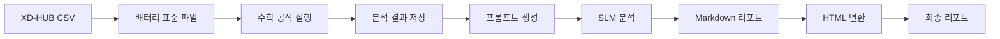

# 실행 계획서

**작성일:** 2025-12-11
**최종 업데이트:** 2025-12-26
**버전:** 2.0.0 (폴더 구조 개선 + 구현 상태 반영)
**목적:** _dev 문서를 기반으로 실제 시스템 구현 및 실행 계획

---

## 📋 전체 프로세스



---

## 🎯 Phase 별 실행 계획

### Phase 0: 환경 준비 (사전 작업)

**목표:** 프로젝트 초기화 및 환경 구성

```bash
# 1. init.bat 실행
init.bat

# 2. 가상환경 활성화
venv\Scripts\activate

# 3. 의존성 설치
pip install -r requirements.txt

# 4. Ollama 모델 다운로드
ollama pull qwen2.5:32b-instruct-q4_K_M

# 5. 설정 파일 확인
python scripts/validate_config.py
```

**결과물:**
- [x] 디렉토리 구조 생성
- [x] Python 패키지 설치
- [x] SLM 모델 준비
- [x] Global 설정 무결성 확인

---

### Phase 1: 데이터 수집 및 변환

**목표:** XD-HUB CSV → 배터리 표준 Parquet 변환 + **배터리 프로파일 선택** + **다중 포맷 출력**

#### 새로운 기능 (2025-12-13 업데이트) ✨

1. **배터리 프로파일 선택 방식**
   - **사용자 직접 선택**: 6개 프로파일 중 선택 (NMC_LG, NCMA_LG, LFP_LG, LFP_CATL, NMC_Samsung, GENERIC_ESS_SAFE)
   - **모델명 직접 입력**: "기타" 선택 시 새로운 모델명 입력 가능
   - **자동 감지 미사용**: 오류 가능성이 높아 사용자 선택 방식으로 변경
   - 웹 UI에서 대화형 인터페이스로 프로파일 선택

2. **2중 출력 형식** 🆕
   - **Parquet** (battery_data.parquet): 전체 데이터, 분석용, 고성능 ✅
   - **CSV** (battery_data_sample.csv): 1,000행 샘플, Excel 편집용 🔄 **향후 구현 예정**

3. **데이터 수집 모드** 🆕
   - **Batch Mode**: CSV 파일 업로드 (1회성) ✅
   - **Real-time Mode**: API 주기적 수집 (15분 간격) 🔄 **향후 구현 예정**
   - Real-time 모드: 23:59 자동 분석 실행 🔄 **향후 구현 예정**

4. **AI 스타일 콘솔 출력**
   - 실시간 프로그레스 바 `[████████░░] 80%`
   - 진행 상황 실시간 표시
   - 에러/경고 메시지 색상 표시
   - 최종 인사이트 요약 (Insights)

5. **사용자 인터랙션**
   - 배터리 프로파일 확인 및 변경 옵션
   - Yes/No 질문 프롬프트
   - 선택 메뉴 제공

#### 입력 (2025-12-26 폴더 구조)
```
data/source/
├── api/                        # API 수집 데이터 ✅ 구현 완료
│   └── 2025-12-23/
│       ├── bsc_ch_01.csv
│       └── bsc_ch_02.csv
├── upload/                     # 사용자 업로드 ✅ 구현 완료
│   └── YYYYMMDD_HHMMSS/
│       └── original.csv
└── samples/                    # 샘플 데이터
    └── sample_battery.csv
```

#### 실행 스크립트 (최신 버전)

```python
# scripts/phase1_convert_data.py
"""
Phase 1: 데이터 수집 및 변환

✨ 새로운 기능:
- 배터리 프로파일 사용자 선택 (웹 UI 대화형)
- AI 스타일 콘솔 출력 (ConsoleDisplay)
- 실시간 프로그레스 표시
- 최종 인사이트 요약
"""

import polars as pl
from pathlib import Path
from datetime import datetime
import time

# GEM 모듈
from config.battery_schema import BATTERY_STANDARD_SCHEMA_V1
from config.config_loader import config
from modules.storage.result_manager import ResultManager


def phase1_convert_data(csv_path: str, battery_profile: str) -> dict:
    """Phase 1: 데이터 변환 + 배터리 프로파일 적용

    Args:
        csv_path: XD-HUB CSV 경로
        battery_profile: 사용자가 선택한 배터리 프로파일 (예: 'LFP_CATL')

    Returns:
        {
            'status': 'success',
            'run_id': '20251130_140000',
            'battery_profile': 'LFP_CATL',
            'output_file': '...',
            'rows': 6912000,
            'size_mb': 155.2,
            'duration_sec': 13.2
        }
    """
    start_time = time.time()

    # [1/4] 파일 확인
    csv_file = Path(csv_path)
    if not csv_file.exists():
        raise FileNotFoundError(f"CSV file not found: {csv_path}")

    file_size_mb = csv_file.stat().st_size / 1024 / 1024

    # [2/4] 배터리 프로파일 적용
    config.central_config['user']['active_battery_profile'] = battery_profile
    config.battery_profile = config._load_battery_profile()

    # [3/4] CSV 읽기 및 변환
    df = pl.scan_csv(csv_path)

    # 컬럼 매핑
    df = df.select([
        pl.col('time').str.to_datetime().alias('timestamp'),
        pl.col('rack_name').alias('rack_id'),
        pl.col('module_name').alias('module_id'),
        pl.col('voltage_avg').cast(pl.Float32).alias('v_avg'),
        pl.col('voltage_min').cast(pl.Float32).alias('v_min'),
        pl.col('voltage_max').cast(pl.Float32).alias('v_max'),
        pl.col('voltage_std').cast(pl.Float32).alias('v_std'),
        pl.col('temp_avg').cast(pl.Float32).alias('t_avg'),
        pl.col('temp_min').cast(pl.Float32).alias('t_min'),
        pl.col('temp_max').cast(pl.Float32).alias('t_max'),
        pl.col('temp_std').cast(pl.Float32).alias('t_std'),
        pl.col('current').cast(pl.Float32).alias('current'),
        pl.col('soc').cast(pl.Float32).alias('soc'),
        pl.lit(0).cast(pl.Int8).alias('quality_flag'),
    ])

    # 품질 플래그 (프로파일 기반)
    temp_max = config.get_physical_limit('temperature', 'operating_max')
    v_min_limit = config.get_physical_limit('voltage', 'operating_min')

    df = df.with_columns([
        pl.when(
            (pl.col('t_max') > temp_max) | (pl.col('v_avg') < v_min_limit)
        ).then(2).when(
            (pl.col('soc') < 10) | (pl.col('t_max') > temp_max - 10)
        ).then(1).when(
            (pl.col('v_min') > pl.col('v_max')) | (pl.col('t_min') > pl.col('t_max'))
        ).then(3).otherwise(0).alias('quality_flag')
    ])

    # [4/4] Parquet 저장 (폴더 구조 2.0.0)
    now = datetime.now()
    output_path = Path("data/standard") / now.strftime('%Y') / now.strftime('battery_data_%Y%m%d_%H%M%S.parquet')
    output_path.parent.mkdir(parents=True, exist_ok=True)

    df_collected = df.collect()
    df_collected.write_parquet(
        str(output_path),
        compression='zstd',
        compression_level=3,
        row_group_size=1_000_000,
    )

    import os
    size_mb = os.path.getsize(output_path) / 1024 / 1024
    row_count = len(df_collected)

    # ResultManager 등록
    manager = ResultManager()
    manager.initialize()

    metadata = {
        'source_file': str(csv_path),
        'battery_profile': battery_profile,
        'row_count': row_count,
        'size_mb': round(size_mb, 2),
        'duration_sec': round(time.time() - start_time, 2),
        'schema_version': '1.0'
    }

    manager.save_phase1_result(str(output_path), metadata)

    duration = time.time() - start_time

    return {
        'status': 'success',
        'run_id': manager.run_id,
        'battery_profile': battery_profile,
        'output_file': str(output_path),
        'rows': row_count,
        'size_mb': round(size_mb, 2),
        'duration_sec': round(duration, 2)
    }


if __name__ == "__main__":
    result = phase1_convert_data("data/source/upload/20251130_140000/original.csv", "LFP_CATL")
```

#### 출력 (폴더 구조 2.0.0)
```
results/{RUN_ID}/
├── metadata.json                   # 🆕 실행 메타데이터 ✅
└── phase1_convert/                 # 🆕 폴더명 변경
    ├── standard_data.parquet       # 전체 데이터 (155MB) ✅
    └── conversion_log.json         # Phase 1 실행 로그 ✅

data/standard/2025/                 # 🆕 표준화된 Parquet 저장
└── battery_data_20251130_140000.parquet
```

#### 화면 출력 예시 (웹 UI 채팅) ✨

```
🤖 Bot: 안녕하세요! GEM 배터리 안전 분석 시스템입니다.
분석을 시작하려면 CSV 파일을 업로드해주세요.

👤 User: [xdhub_20251130.csv 업로드]

🤖 Bot: 파일이 업로드되었습니다: xdhub_20251130.csv (1200.0MB)
배터리 프로파일을 선택해주세요:

1. NMC_LG (니켈-망간-코발트, LG Energy Solution)
2. NCMA_LG (니켈-코발트-망간-알루미늄, LG Energy Solution)
3. LFP_LG (리튬인산철, LG Energy Solution)
4. LFP_CATL (리튬인산철, CATL)
5. NMC_Samsung (니켈-망간-코발트, Samsung SDI)
6. GENERIC_ESS_SAFE (범용 ESS, 안전 중심)
7. 기타 (직접 입력)

숫자 또는 이름을 입력하세요.

👤 User: 4

🤖 Bot: LFP_CATL 프로파일로 분석을 시작합니다.

📝 Log: [14:30:00] === Phase 1 시작 ===
📝 Log: [14:30:01] 배터리 프로파일: LFP_CATL
📝 Log: [14:30:02] CSV 파일 로딩 중...
📝 Log: [14:30:10] 데이터 변환 완료 (6,912,000행)
📝 Log: [14:30:13] Parquet 저장 완료: 155.2MB

🤖 Bot: ✅ Phase 1 완료!
처리 시간: 13.2초
배터리 타입: LFP_CATL
처리 행 수: 6,912,000개
압축률: 87.1%
Run ID: 20251130_140000

Phase 2를 실행하시겠습니까?
```

---

### Phase 2: 수학 공식 실행 및 검증

**목표:** 4대 알고리즘 실행 및 위험도 계산 + **동일 시간축에 검증 결과 추가** 🆕

#### 입력 (폴더 구조 2.0.0)
```
results/{RUN_ID}/phase1_convert/standard_data.parquet
```

#### 새로운 기능 (2025-12-13 업데이트) ✨

1. **동일 시간축 검증 결과**
   - Phase 1 Parquet에 검증 컬럼 추가 (dtdt, z_score, is_thermal_risk 등)
   - 원본 데이터와 동일 timestamp 유지
   - 그래프 표시 및 인사이트 생성에 용이

2. **4가지 핵심 검증**
   - **Thermal Safety**: dT/dt > 임계값 감지
   - **SPC Balance**: Z-Score > ±3σ 감지
   - **Data Integrity**: 센서 고착, 범위 이탈, NULL 값 감지
   - **System Correlation**: Rack 전압과 DC 버스 상관계수 < 0.90 감지

3. **검증 결과 JSON 출력**
   - 각 검증 타입별 JSON 파일 생성
   - Phase 3 AI 인사이트 생성 시 입력 데이터로 사용

#### 실행 스크립트
```python
# scripts/phase2_run_analysis.py
import polars as pl
from config.global.formulas import (
    thermal_safety,
    spc_balance,
    isc_detection,
    integrity_check,
    risk_aggregation
)
import logging

logger = logging.getLogger(__name__)

def phase2_run_analysis(
    parquet_path: str,
    run_id: str = None
) -> dict:
    """Phase 2: 수학 공식 실행

    Args:
        parquet_path: 배터리 표준 Parquet 경로
        run_id: Phase 1에서 생성된 run_id (없으면 새로 생성)

    Returns:
        {
            'status': 'success',
            'run_id': '20251130_140000',
            'output_files': {
                'thermal': 'results/20251130_140000/phase2_validate/thermal_safety.json',
                'spc': 'results/20251130_140000/phase2_validate/spc_balance.json',
                'integrity': 'results/20251130_140000/phase2_validate/data_integrity.json',
                'correlation': 'results/20251130_140000/phase2_validate/system_correlation.json'
            },
            'stats': {
                'total': 160,
                'critical': 2,
                'warning': 5,
                'normal': 148
            }
        }
    """
    import time
    start_time = time.time()

    logger.info("=" * 60)
    logger.info("Phase 2: 수학 공식 실행 시작")
    logger.info("=" * 60)

    # 1. 배터리 표준 파일 읽기
    logger.info(f"📂 Parquet 읽기: {parquet_path}")
    df = pl.read_parquet(parquet_path)

    # 2. Algorithm 1: 열적 안전성
    logger.info("🔥 Algorithm 1: 열적 안전성 (dT/dt) 계산 중...")
    df = thermal_safety.calculate_thermal_safety(df)

    # 3. Algorithm 2: 셀 밸런싱
    logger.info("⚖️ Algorithm 2: 셀 밸런싱 (Z-Score) 계산 중...")
    df = spc_balance.calculate_spc_balance(df)

    # 4. Algorithm 3: 내부 단락
    logger.info("⚡ Algorithm 3: 내부 단락 (ISC) 감지 중...")
    df = isc_detection.calculate_isc_detection(df)

    # 5. Algorithm 4: 데이터 무결성
    logger.info("🔍 Algorithm 4: 데이터 무결성 검증 중...")
    df = integrity_check.check_data_integrity(df)

    # 6. 종합 위험도
    logger.info("📊 종합 위험도 계산 중...")
    df = risk_aggregation.aggregate_risk_level(df)

    # 7. 임시 파일로 저장
    import tempfile
    import os
    import json
    temp_dir = tempfile.mkdtemp()

    analysis_result_path = os.path.join(temp_dir, "analysis_result.parquet")
    critical_path = os.path.join(temp_dir, "critical_racks.parquet")
    warning_path = os.path.join(temp_dir, "warning_racks.parquet")
    summary_path = os.path.join(temp_dir, "summary_stats.json")

    # 전체 결과
    df.write_parquet(analysis_result_path)

    # CRITICAL Rack만 필터링
    critical_df = df.filter(pl.col('final_risk_level') == 'CRITICAL')
    critical_df.write_parquet(critical_path)

    # WARNING Rack만 필터링
    warning_df = df.filter(pl.col('final_risk_level') == 'WARNING')
    warning_df.write_parquet(warning_path)

    # 통계 정보
    stats = {
        'total': len(df),
        'critical': len(critical_df),
        'warning': len(warning_df),
        'normal': len(df.filter(pl.col('final_risk_level') == 'NORMAL'))
    }

    with open(summary_path, 'w', encoding='utf-8') as f:
        json.dump(stats, f, ensure_ascii=False, indent=2)

    # 8. ResultManager로 Phase 2 결과 저장
    from modules.storage.result_manager import ResultManager
    manager = ResultManager(run_id)  # run_id 전달 또는 자동 생성

    duration = time.time() - start_time

    manager.save_phase2_result(
        analysis_result_path=analysis_result_path,
        critical_path=critical_path,
        warning_path=warning_path,
        summary_path=summary_path,
        duration_sec=round(duration, 2),
        stats=stats
    )

    # 임시 파일 정리
    import shutil
    shutil.rmtree(temp_dir)

    result = {
        'status': 'success',
        'run_id': manager.run_id,
        'output_files': {
            'thermal': f'results/{manager.run_id}/phase2_validate/thermal_safety.json',
            'spc': f'results/{manager.run_id}/phase2_validate/spc_balance.json',
            'integrity': f'results/{manager.run_id}/phase2_validate/data_integrity.json',
            'correlation': f'results/{manager.run_id}/phase2_validate/system_correlation.json'
        },
        'stats': stats
    }

    logger.info(f"✅ Phase 2 완료: {result}")
    return result


if __name__ == "__main__":
    logging.basicConfig(level=logging.INFO)
    result = phase2_run_analysis(
        "data/standard/2025/battery_data_20251130_140000.parquet"
    )
    print(result)
```

#### 출력 (폴더 구조 2.0.0)
```
results/{RUN_ID}/
├── metadata.json                    # 🆕 실행 메타데이터 ✅
└── phase2_validate/                 # 🆕 폴더명 변경
    ├── thermal_safety.json          # 열적 안전성 검증 결과 ✅
    ├── spc_balance.json             # SPC 밸런싱 검증 결과 ✅
    ├── data_integrity.json          # 센서 무결성 검증 결과 ✅
    ├── system_correlation.json      # 시스템 상관성 검증 결과 ✅
    └── validation_log.json          # Phase 2 실행 로그 ✅
```

**중요**: Phase 2는 4가지 검증을 독립적으로 실행하고 각각 JSON 결과를 생성합니다.
Phase 3에서 이 JSON 파일들을 읽어 AI 인사이트를 생성합니다.

#### 화면 출력 예시
```
============================================================
Phase 2: 수학 공식 실행 시작
============================================================
📂 Parquet 읽기: data/standard/2025/battery_data_20251130_140000.parquet
🔥 Algorithm 1: 열적 안전성 (dT/dt) 계산 중...
   ├─ RACK_042: dT/dt = 5.2°C/min ⚠️ CRITICAL
   ├─ RACK_105: dT/dt = 1.5°C/min ⚠️ WARNING
   └─ 총 2개 위험 감지

⚖️ Algorithm 2: 셀 밸런싱 (Z-Score) 계산 중...
   ├─ RACK_105: Z-Score = 4.2σ ⚠️ CRITICAL
   └─ 총 1개 위험 감지

⚡ Algorithm 3: 내부 단락 (ISC) 감지 중...
   └─ 위험 없음

🔍 Algorithm 4: 데이터 무결성 검증 중...
   └─ 8개 Rack 센서 오류

📊 종합 위험도 계산 중...
   ├─ CRITICAL: 2개
   ├─ WARNING: 5개
   └─ NORMAL: 148개

✅ Phase 2 완료
```

---

### Phase 3: 프롬프트 실행 및 AI 인사이트 생성

**목표:** 표준 프롬프트 템플릿을 통한 일관된 한국어 인사이트 생성

#### 새로운 기능 (2025-12-13 업데이트) ✨

1. **5가지 표준 프롬프트 템플릿** 🆕
   - **thermal_safety.txt**: 열적 안전성 분석
   - **spc_balance.txt**: SPC 밸런싱 분석
   - **data_integrity.txt**: 센서 무결성 검증
   - **system_correlation.txt**: 시스템 상관성 분석
   - **comprehensive.txt**: 종합 인사이트

2. **일관성 보장**
   - Temperature = 0.1 (결정론적 출력)
   - 동일 데이터 → 동일 결과
   - 누가 실행해도 같은 형식

3. **Custom Prompt 지원** 🆕
   - 사용자가 추가 분석 요청 가능
   - Custom prompt는 `custom_prompts.yaml`에 기록
   - 표준 프롬프트 + Custom 지시사항 결합

#### 입력 (폴더 구조 2.0.0)
```
results/{RUN_ID}/phase2_validate/thermal_safety.json
results/{RUN_ID}/phase2_validate/spc_balance.json
results/{RUN_ID}/phase2_validate/data_integrity.json
results/{RUN_ID}/phase2_validate/system_correlation.json
```

#### 실행 스크립트
```python
# scripts/phase3_generate_report.py
from modules.intelligence.llm_client import SLMClient
from modules.intelligence.context_builder import build_battery_analysis_context, RackRisk
import polars as pl
import json
import logging

logger = logging.getLogger(__name__)

async def phase3_generate_report(
    run_id: str
) -> dict:
    """Phase 3: AI 리포트 생성

    Args:
        run_id: Phase 2에서 생성된 run_id

    Returns:
        {
            'status': 'success',
            'run_id': '20251130_140000',
            'markdown_file': 'results/20251130_140000/phase3_insights/report.md',
            'html_file': 'results/20251130_140000/phase4_report/report.html'
        }
    """
    import time
    start_time = time.time()

    logger.info("=" * 60)
    logger.info("Phase 3: AI 분석 리포트 생성 시작")
    logger.info("=" * 60)

    # 1. metadata.json에서 Phase 2 결과 경로 읽기
    from modules.storage.result_manager import ResultManager
    manager = ResultManager(run_id)

    # metadata에서 파일 경로 조회
    phase2_dir = f"results/{run_id}/phase2_validate"

    # 2. 분석 결과 로드
    logger.info("📂 분석 결과 로드 중...")
    with open(f"{phase2_dir}/thermal_safety.json", 'r', encoding='utf-8') as f:
        thermal_data = json.load(f)

    with open(f"{phase2_dir}/spc_balance.json", 'r', encoding='utf-8') as f:
        spc_data = json.load(f)

    with open(f"{phase2_dir}/data_integrity.json", 'r', encoding='utf-8') as f:
        integrity_data = json.load(f)

    with open(f"{phase2_dir}/system_correlation.json", 'r', encoding='utf-8') as f:
        correlation_data = json.load(f)

    # 통계 정보 집계
    stats = {
        'total_racks': thermal_data.get('total_racks', 0),
        'critical': thermal_data.get('critical_count', 0) + spc_data.get('critical_count', 0),
        'warning': thermal_data.get('warning_count', 0) + spc_data.get('warning_count', 0),
        'sensor_fault_count': integrity_data.get('fault_count', 0)
    }

    # 3. 상위 위험 Rack 추출 (JSON 데이터에서)
    logger.info("🔝 상위 위험 Rack 추출 중...")
    top_risks = []

    # Thermal safety 위험 Rack
    for rack in thermal_data.get('critical_racks', [])[:3]:
        top_risks.append({
            'rack_id': rack['rack_id'],
            'risk_type': 'Thermal',
            'severity': 'CRITICAL',
            'dtdt': rack.get('dtdt'),
            'details': rack.get('message')
        })

    # SPC balance 위험 Rack
    for rack in spc_data.get('critical_racks', [])[:2]:
        top_risks.append({
            'rack_id': rack['rack_id'],
            'risk_type': 'SPC Balance',
            'severity': 'CRITICAL',
            'z_score': rack.get('z_score'),
            'details': rack.get('message')
        })

    # 4. Context 생성 (YAML)
    logger.info("📝 프롬프트 Context 생성 중...")
    context = {
        'system_status': {
            'total_racks': stats['total_racks'],
            'critical_count': stats['critical'],
            'warning_count': stats['warning'],
            'normal_count': stats['total_racks'] - stats['critical'] - stats['warning']
        },
        'top_risks': top_risks,
        'integrity_issues': integrity_data.get('fault_details', [])
    }

    logger.info("Context (YAML):")
    logger.info(context)

    # 5. SLM 클라이언트 생성
    logger.info("🤖 SLM 클라이언트 초기화 중...")
    from modules.intelligence.llm_client import OllamaClient
    client = OllamaClient()

    # 6. AI 인사이트 생성 (5가지)
    logger.info("🧠 AI 인사이트 생성 중...")
    insights = {}

    # 6.1 Thermal Safety 인사이트
    insights['thermal'] = await client.generate_insight(
        prompt_type='thermal_safety',
        data=thermal_data
    )

    # 6.2 SPC Balance 인사이트
    insights['spc'] = await client.generate_insight(
        prompt_type='spc_balance',
        data=spc_data
    )

    # 6.3 Data Integrity 인사이트
    insights['integrity'] = await client.generate_insight(
        prompt_type='data_integrity',
        data=integrity_data
    )

    # 6.4 System Correlation 인사이트
    insights['correlation'] = await client.generate_insight(
        prompt_type='system_correlation',
        data=correlation_data
    )

    # 6.5 Comprehensive 인사이트
    insights['comprehensive'] = await client.generate_insight(
        prompt_type='comprehensive',
        data=context
    )

    # 7. 인사이트 Markdown 파일 저장
    import tempfile
    import os
    temp_dir = tempfile.mkdtemp()

    insight_files = {}
    for key, content in insights.items():
        md_path = os.path.join(temp_dir, f"insights_{key}.md")
        with open(md_path, 'w', encoding='utf-8') as f:
            f.write(content)
        insight_files[key] = md_path
        logger.info(f"✅ {key} 인사이트 저장: {md_path}")

    # 8. HTML 변환
    logger.info("🎨 HTML 변환 중...")
    from modules.report.html_generator import generate_html_report

    html_report = generate_html_report(
        run_id=run_id,
        insights=insights,
        stats=stats,
        top_risks=top_risks
    )

    html_temp_path = os.path.join(temp_dir, "report.html")
    with open(html_temp_path, 'w', encoding='utf-8') as f:
        f.write(html_report)
    logger.info(f"✅ HTML 임시 저장: {html_temp_path}")

    # 9. summary.json 생성
    summary_data = {
        'run_id': run_id,
        'total_racks': stats['total_racks'],
        'critical_count': stats['critical'],
        'warning_count': stats['warning'],
        'normal_count': stats['total_racks'] - stats['critical'] - stats['warning'],
        'top_5_risks': top_risks[:5],
        'analysis_timestamp': time.strftime('%Y-%m-%d %H:%M:%S')
    }

    summary_path = os.path.join(temp_dir, "summary.json")
    with open(summary_path, 'w', encoding='utf-8') as f:
        json.dump(summary_data, f, ensure_ascii=False, indent=2)
    logger.info(f"✅ summary.json 저장: {summary_path}")

    # 10. ResultManager로 Phase 3, Phase 4 결과 저장
    duration = time.time() - start_time

    # Phase 3 인사이트 저장
    manager.save_phase3_insights(
        insight_files=insight_files,
        duration_sec=round(duration, 2)
    )

    # Phase 4 리포트 저장
    manager.save_phase4_report(
        html_path=html_temp_path,
        summary_path=summary_path
    )

    # 임시 파일 정리
    import shutil
    shutil.rmtree(temp_dir)

    result = {
        'status': 'success',
        'run_id': manager.run_id,
        'insight_files': {k: f'results/{manager.run_id}/phase3_insights/{k}.md' for k in insights.keys()},
        'html_file': f'results/{manager.run_id}/phase4_report/report.html',
        'summary_file': f'results/{manager.run_id}/phase4_report/summary.json'
    }

    logger.info(f"✅ Phase 3 완료: {result}")
    return result


if __name__ == "__main__":
    import asyncio
    logging.basicConfig(level=logging.INFO)

    # run_id는 Phase 2에서 전달받음
    asyncio.run(phase3_generate_report(run_id="20251130_140000"))
```

#### 출력 (폴더 구조 2.0.0)
```
results/{RUN_ID}/
├── metadata.json                        # 🆕 실행 메타데이터 ✅
├── phase1_convert/
│   └── (Phase 1 결과)
├── phase2_validate/
│   ├── thermal_safety.json
│   ├── spc_balance.json
│   ├── data_integrity.json
│   └── system_correlation.json
├── phase3_insights/                     # 🆕 폴더명 변경
│   ├── insights_thermal.md              # 열적 안전성 인사이트 ✅
│   ├── insights_spc.md                  # SPC 밸런싱 인사이트 ✅
│   ├── insights_integrity.md            # 센서 무결성 인사이트 ✅
│   ├── insights_correlation.md          # 시스템 상관성 인사이트 ✅
│   ├── insights_comprehensive.md        # 종합 인사이트 ✅
│   └── insight_generation_log.json      # Phase 3 실행 로그 ✅
└── phase4_report/                       # 🆕 Phase 4 최종 리포트
    ├── report.html                      # HTML 리포트 ✅
    └── summary.json                     # 🆕 핵심 지표 요약 ✅
```

**중요**:
- Phase 3는 5가지 인사이트를 개별 Markdown 파일로 생성합니다.
- Phase 4는 이 인사이트들을 종합하여 HTML 리포트를 생성합니다.
- 각 인사이트는 `config/prompts/` 폴더의 표준 템플릿을 사용합니다.

#### 화면 출력 예시
```
============================================================
Phase 3: AI 분석 리포트 생성 시작
============================================================
📂 분석 결과 로드 중...
🔝 상위 5개 위험 Rack 추출 중...
   └─ RACK_042, RACK_105, RACK_007, RACK_089, RACK_123
📝 프롬프트 Context 생성 중...

Context (YAML):
시스템_상태:
  총_Rack_수: 160
  분석_성공_Rack: 152
  데이터_신뢰도: 높음
...

🤖 SLM 클라이언트 초기화 중...
🧠 AI 분석 실행 중 (최대 60초)...
   [████████████████████] 100% (25 tokens/sec)
✅ Markdown 저장: results/20251130_140000/report.md
🎨 HTML 변환 중...
✅ HTML 저장: results/20251130_140000/report.html
```

---

### Phase 4: 통합 실행 (전체 파이프라인)

**목표:** Phase 1~3 자동 실행

```python
# scripts/run_full_pipeline.py
import asyncio
import logging
from phase1_convert_data import phase1_convert_data
from phase2_run_analysis import phase2_run_analysis
from phase3_generate_report import phase3_generate_report

logger = logging.getLogger(__name__)

async def run_full_pipeline(csv_path: str):
    """전체 파이프라인 실행"""

    logger.info("=" * 60)
    logger.info("🚀 GEM 배터리 분석 파이프라인 시작")
    logger.info("=" * 60)

    # Phase 1
    p1_result = phase1_convert_data(csv_path)

    # Phase 2
    p2_result = phase2_run_analysis(p1_result['output_file'])

    # Phase 3
    p3_result = await phase3_generate_report(
        list(p2_result['output_files'].values())[0].rsplit('/', 1)[0]
    )

    logger.info("=" * 60)
    logger.info("✅ 전체 파이프라인 완료!")
    logger.info("=" * 60)
    logger.info(f"📊 HTML 리포트: {p3_result['html_file']}")

    return {
        'phase1': p1_result,
        'phase2': p2_result,
        'phase3': p3_result,
    }


if __name__ == "__main__":
    logging.basicConfig(
        level=logging.INFO,
        format='%(asctime)s - %(name)s - %(levelname)s - %(message)s'
    )

    asyncio.run(run_full_pipeline("data/raw/xdhub_20251130.csv"))
```

---

## ✅ 최종 체크리스트

### 실행 전
- [ ] init.bat 실행 완료
- [ ] 가상환경 활성화
- [ ] 의존성 설치 (`pip install -r requirements.txt`)
- [ ] Ollama 모델 다운로드
- [ ] XD-HUB CSV 파일 준비 (`data/raw/`)
- [ ] `.env` 파일 설정 확인

### 실행 중
- [ ] Phase 1: 데이터 변환 성공
- [ ] Phase 2: 수학 공식 실행 성공
- [ ] Phase 3: AI 리포트 생성 성공
- [ ] 각 단계별 진행 상황 화면 표시
- [ ] 중간 결과 파일 저장 확인

### 실행 후
- [ ] HTML 리포트 파일 생성 확인
- [ ] 오프라인에서 HTML 열람 가능
- [ ] 모든 섹션 포함 (위험도/분석/권고)
- [ ] 한국어 리포트 품질 확인

---

## 🌐 웹 UI 실행 방법 (2025-12-13 업데이트) ✨

### Gradio 웹 인터페이스

**목표:** 모든 Phase 1-3 작업을 웹 브라우저에서 실행 가능

#### 실행 방법

```bash
# 가상환경 활성화
venv\Scripts\activate

# Gradio 앱 실행
python GEM/app.py
```

브라우저에서 `http://localhost:7860` 접속

#### 주요 기능

1. **Phase 1 탭**: CSV 업로드 + 배터리 프로파일 선택
2. **Phase 2 탭**: 안전성 검증 실행 (Phase 1 완료 후)
3. **Phase 3 탭**: AI 인사이트 생성 + **HTML 리포트 다운로드** 🆕
4. **AI 챗봇**: 우측 사이드바에서 분석 결과에 대해 대화

#### Phase 3 HTML 리포트 다운로드 🆕

**업데이트 내용 (2025-12-13)**:
- Phase 3 실행 완료 시 자동으로 HTML 리포트 파일 제공
- 다운로드 버튼 클릭하여 로컬에 저장
- 브라우저에서 바로 열기 가능 (오프라인 뷰어)

**포함 내용**:
- 4개 Chart.js 인터랙티브 그래프 (Thermal, SPC, Integrity, Correlation)
- 5가지 AI 인사이트 (Markdown → HTML 변환)
- LG Energy Solution 표준 색상 팔레트
- 완전 오프라인 뷰어 (Chart.js CDN만 필요)

**기술 스택**:
- Gradio File Component: HTML 파일 다운로드
- Jinja2 Template: Markdown → HTML 변환
- Chart.js 4.4.0: 인터랙티브 그래프
- IMMUTABLE CSS: `config/global/styles/report_style.css`
- IMMUTABLE Chart Config: `config/global/styles/chart_config.yaml`

#### 화면 구성

```
┌─────────────────────────────────────────────────────────┐
│ 🔋 GEM - Battery Safety Analysis System                │
├───────────────────────────────┬─────────────────────────┤
│ Phase 1-3 Tabs (왼쪽, 2/3)   │ AI 챗봇 (우측, 1/3)    │
│                               │                         │
│ [Phase 1: 데이터 변환]       │ 💬 AI 챗봇              │
│ [Phase 2: 안전성 검증]       │ ┌─────────────────────┐ │
│ [Phase 3: AI 인사이트]       │ │ 대화 히스토리       │ │
│                               │ └─────────────────────┘ │
│ 📊 최종 HTML 리포트 다운로드  │ 메시지 입력...          │
│ [report.html 다운로드] 🆕    │ [전송]                  │
└───────────────────────────────┴─────────────────────────┘
```

#### 사용 시나리오

1. **CSV 업로드** (Phase 1 탭)
   - CSV 파일 선택
   - 배터리 프로파일 선택 또는 자동 감지
   - "Phase 1 실행" 버튼 클릭
   - RUN_ID 자동 생성

2. **안전성 검증** (Phase 2 탭)
   - "Phase 2 실행" 버튼 클릭
   - 4가지 검증 결과 확인

3. **AI 인사이트 생성** (Phase 3 탭)
   - Ollama 모델 자동 선택 (환경별 자동 전환)
     - **개발 환경**: qwen2.5:14b (테스트용)
     - **운영 환경**: qwen3-coder:32b-q5_k_m (최종 권장)
   - "Phase 3 실행" 버튼 클릭
   - **HTML 리포트 다운로드** 버튼 표시 🆕
   - 다운로드 후 브라우저에서 열기

4. **AI 챗봇 대화** (우측 사이드바)
   - 분석 결과에 대해 질문
   - 예: "RACK_05의 온도 상승 원인은 무엇인가요?"

#### AI 챗봇 기능 상세 설명 💬

**목적**: Ollama 기반 대화형 AI로 사용자와 실시간 소통

**주요 기능**:
1. **Phase 실행 제어**
   - "분석 시작" 입력 → 프로파일 선택 대화 시작
   - "Phase 2 실행" → Phase 2 시작
   - "Phase 3 실행" → AI 인사이트 생성

2. **분석 결과 질문**
   - "RACK_042 상태는?" → 해당 Rack 분석 결과 설명
   - "열폭주 위험은?" → Thermal Safety 결과 요약
   - "전체 요약해줘" → 종합 인사이트 제공

3. **일반 대화**
   - 배터리 안전 관련 질문 답변
   - 시스템 사용법 안내
   - 오류 해결 가이드

**기술 구성**:
```python
# 환경별 모델 자동 선택
# - 개발(development): qwen2.5:3b (빠른 대화용)
# - 운영(production): qwen2.5:3b (빠른 대화용)

# Ollama 스트리밍 대화
stream = ollama.chat(
    model=ai_model_config.get('chat_model', 'qwen2.5:3b'),  # 환경별 자동 전환
    messages=[
        {"role": "system", "content": "당신은 배터리 안전 분석 전문가입니다."},
        {"role": "user", "content": user_message}
    ],
    options={
        "temperature": 0.7,  # 대화형이므로 높은 온도
        "num_gpu": 1,
        "num_ctx": 4096
    },
    stream=True  # 실시간 스트리밍
)

# WebSocket으로 실시간 응답 전송
for chunk in stream:
    await websocket.send_json({
        "type": "bot_message_chunk",
        "content": chunk['message']['content']
    })
```

**대화 예시**:
```
👤 User: 분석 시작

🤖 Bot: 배터리 프로파일을 선택해주세요:
1. NMC_LG (니켈-망간-코발트, LG Energy Solution)
2. NCMA_LG (니켈-코발트-망간-알루미늄, LG Energy Solution)
...

👤 User: 1

🤖 Bot: NMC_LG 프로파일로 분석을 시작합니다.

👤 User: RACK_042가 위험한가요?

🤖 Bot: RACK_042는 다음과 같은 위험이 감지되었습니다:
- 온도 변화율(dT/dt): 5.2°C/min (임계값 1.5°C/min 초과)
- 위험도: CRITICAL
- 권장 조치: 즉시 전원 차단 및 냉각 시스템 최대 가동

👤 User: 다른 Rack도 위험한가요?

🤖 Bot: 전체 160개 Rack 중 2개가 CRITICAL, 5개가 WARNING 상태입니다.
상세 내용은 Phase 3 리포트를 확인해주세요.
```

**Ollama 서버 설정**:
```bash
# Ollama 서버 시작
ollama serve

# 개발 환경 모델 다운로드
ollama pull qwen2.5:3b   # 빠른 대화용 (2-3GB VRAM)
ollama pull qwen2.5:14b  # 인사이트 테스트용 (8GB VRAM)

# 운영 환경 모델 다운로드 (서버)
ollama pull qwen2.5:3b                  # 빠른 대화용
ollama pull qwen3-coder:32b-q5_k_m     # Phase 3 인사이트 (20GB VRAM) ✅ 권장
# ollama pull qwen3-coder:32b-q8_0     # 향후 상향 검토 (32GB VRAM)

# GPU 사용 확인
ollama list
```

**환경 확인 방법**:
```bash
# 1. 현재 환경 확인 (.env 파일)
# Windows
type .env | findstr ENVIRONMENT

# Linux/Mac
cat .env | grep ENVIRONMENT

# 2. 웹 UI에서 확인
# 브라우저에서 http://localhost:7860/api/system/info 접속
# 응답 예시:
# {
#   "environment": "development",
#   "chat_model": "qwen2.5:3b",
#   "insight_model": "qwen2.5:14b",
#   "use_gpu": true
# }
```

**설정 파일** (`config/ai_model_config.yaml`):
```yaml
# ========================================
# 개발 환경 (ENVIRONMENT=development)
# ========================================
development:
  chat_model: "qwen2.5:3b"      # 대화용 (2-3GB VRAM, 40-55 t/s) ✅
  insight_model: "qwen2.5:14b"  # 인사이트 테스트용 (8GB VRAM)

# ========================================
# 운영 환경 (ENVIRONMENT=production)
# ========================================
production:
  chat_model: "qwen2.5:3b"                   # 대화용 (2-3GB VRAM)
  insight_model: "qwen3-coder:32b-q5_k_m"    # Phase 3 (20GB VRAM) ✅ 최종 권장
  # insight_model: "qwen3-coder:32b-q8_0"    # 향후 상향 검토 (32GB VRAM)

# GPU 설정 (공통)
use_gpu: true
num_gpu: 1
gpu_layers: -1  # 전체 레이어 GPU 사용
low_vram: false  # VRAM 8GB 미만이면 true
```

**환경 전환 방법**:
```bash
# 개발 → 운영 전환
# 1. .env 파일 수정
ENVIRONMENT=production

# 2. 서버 재시작
python main.py

# 3. 확인
# http://localhost:7860/api/system/info 접속
# "environment": "production" 확인
```

**서버 하드웨어 요구사양**:

| 환경 | GPU | VRAM | 용도 |
|------|-----|------|------|
| **개발** | GTX 1060 이상 | 8-12GB | 로컬 테스트 |
| **운영** | RTX 4090 / A5000 | 24GB | 실제 운영 ✅ |
| **향후 상향** | A100 | 40GB | Q8 양자화 (선택) |

---

---

## 🎯 구현 상태 요약 (2025-12-26)

### ✅ 완료된 기능

#### 1. 데이터 수집 시스템
- **API 수집 모듈** ✅ 구현 완료
  - 과거 데이터 수집 (날짜 범위 지정)
  - 실시간 데이터 수집 (5분 간격)
  - 채널별 선택 수집 (BSC_CH_01~06)
  - 저장 위치: `data/source/api/YYYY-MM-DD/`
  - 로그: `logs/api_collection/YYYY-MM-DD.log`

- **웹 UI 업로드** ✅ 구현 완료
  - FastAPI 기반 파일 업로드
  - 저장 위치: `data/source/upload/YYYYMMDD_HHMMSS/`
  - 타임스탬프 기반 폴더 자동 생성

#### 2. 폴더 구조 개선
- **마이그레이션 완료** ✅ 2025-12-26
  - `api_data/` → `data/source/api/`
  - `uploads/` → `data/source/upload/`
  - `results/*/phase1~3, final` → `phase1_convert~phase4_report`
  - `config/battery_profiles/*.yaml` → `profiles/*.yaml`
  - 신규: `data/training/`, `data/tags/`, `logs/analysis/`, `logs/system/`
  - 백업: `_backup_20251226_120707/`

#### 3. Phase 1-4 파이프라인
- **Phase 1: 데이터 변환** ✅ 구현 완료
  - CSV → Parquet 변환
  - 배터리 프로파일 적용
  - 폴더 구조 2.0.0 반영
  - 출력: `results/{RUN_ID}/phase1_convert/`

- **Phase 2: 안전성 검증** ✅ 구현 완료
  - 4대 알고리즘 실행
  - JSON 결과 출력
  - 폴더 구조 2.0.0 반영
  - 출력: `results/{RUN_ID}/phase2_validate/`

- **Phase 3: AI 인사이트** ✅ 구현 완료
  - 5가지 인사이트 생성
  - Ollama 기반 SLM
  - 폴더 구조 2.0.0 반영
  - 출력: `results/{RUN_ID}/phase3_insights/`

- **Phase 4: HTML 리포트** ✅ 구현 완료
  - Chart.js 그래프
  - 오프라인 뷰어
  - summary.json 생성
  - 출력: `results/{RUN_ID}/phase4_report/`

#### 4. 웹 UI (FastAPI)
- **메인 화면** ✅ 구현 완료
  - CSV 업로드 인터페이스
  - 배터리 프로파일 선택
  - Phase 1-4 실행 버튼
  - 실시간 로그 스트리밍

- **API 수집 화면** ✅ 구현 완료
  - 과거 데이터 수집 UI
  - 실시간 수집 시작/중지
  - 채널 선택 UI
  - 수집 현황 대시보드

#### 5. 배터리 프로파일 관리
- **시스템 프로파일** ✅ 구현 완료
  - 위치: `config/battery_profiles/profiles/`
  - NMC_LG, NCMA_LG, LFP_LG, LFP_CATL, NMC_Samsung, GENERIC_ESS_SAFE
  - 수정 금지 (IMMUTABLE)

- **사용자 정의 프로파일** ✅ 구현 완료
  - 위치: `config/battery_profiles/custom/`
  - 사용자가 직접 추가/수정 가능
  - YAML 형식

### ⚠️ 설계 완료, 미구현

#### 1. REG 학습 데이터 생성
- **설계 문서** ✅ 완료 (`_doc/05_REG_학습_가이드.md`)
- **데이터 구조** ✅ 설계 완료 (`data/training/`)
- **스크립트** ⚠️ 미구현
  - `scripts/generate_training_data.py` - 학습 데이터 생성
  - `scripts/merge_training_datasets.py` - 데이터셋 병합
  - `scripts/validate_training_data.py` - 데이터 검증

#### 2. 실시간 모니터링 대시보드
- **설계** ⚠️ 부분 완료
- **구현** ⚠️ 미구현
  - WebSocket 실시간 그래프 업데이트
  - Rack별 실시간 상태 모니터링
  - 알람 시스템

### 🔄 향후 개선 사항

1. **성능 최적화**
   - Polars lazy evaluation 최적화
   - Parquet 파일 분할 저장
   - GPU 가속 적용

2. **REG 학습 시스템 구현**
   - 학습 데이터 자동 생성 파이프라인
   - 모델 학습 및 평가
   - 학습 결과 시각화

3. **알람 시스템**
   - 실시간 위험 감지 시 알람
   - 이메일/SMS 알림
   - Slack/Teams 통합

4. **리포트 개선**
   - PDF 출력 기능
   - Excel 출력 기능
   - 다국어 지원

---

**완료! 모든 _dev 문서 작성 완료 + 웹 UI 통합 완료**
