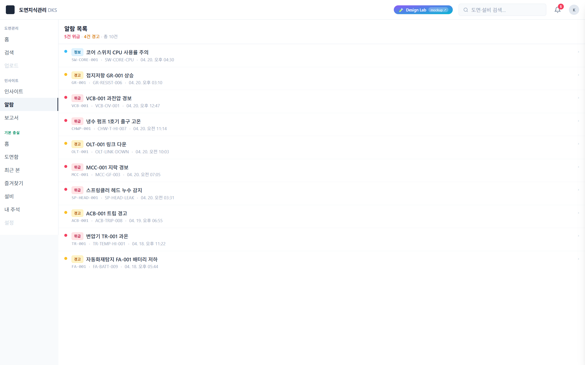
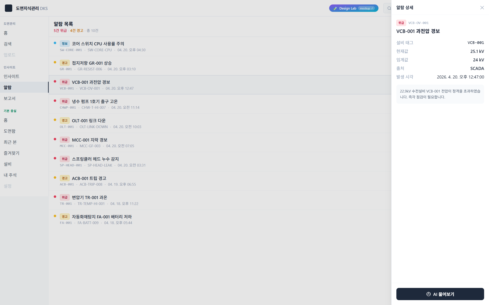

# 화면 · Insight Lab 화면 2 · 알람 목록

**경로**: `/insight/alarms`
**소속 트랙**: Insight Lab (서비스 2 · AI 인사이트)
**화면 분류**: 리스트 + 우측 드로어 상세

---

## 1. 화면 개요




이 화면은 최근 발생한 설비 알람 전체를 **심각도 카운트 헤더 + 세로 리스트 + 우측 슬라이드 드로어** 세 요소로 구성한 알람 브라우저입니다. 사용자는 시간 역순으로 정렬된 알람을 훑으며 위급 건을 먼저 파악하고, 특정 행을 클릭하면 우측에서 상세 정보와 **"AI에게 물어보기"** 버튼이 올라옵니다.

허브(화면 1)에서 "최근 알람 3건"만 보고 "더 자세히 보고 싶다"가 되는 순간 들어오는 공간입니다. 리스트 자체는 검색·정렬·필터를 과감하게 생략하고, **심각도별 색·배지로 스캔** → **행 클릭으로 즉시 드로어** → **드로어에서 AI 질의로 전환** 까지의 3-스텝 흐름만 남겼습니다. 화면의 존재 목적은 "알람을 보고 → 원인을 알고 싶다는 의도를 AI 답변 화면으로 넘기는 다리" 그 자체입니다.

---

## 2. 레이아웃 구조

```
┌───────────────────────────────────────────────────────────────┐
│  알람 목록                                                      │
│  5건 위급 · 4건 경고 · 총 10건                                  │
├───────────────────────────────────────────────────────────────┤
│ ● [위급] 냉수 펌프 1호기 출구 고온                            › │
│        CHWP-001 · CHW-T-HI-007 · 04-20 11:14                    │
│ ● [위급] VCB-001 과전압 경보                                  › │
│        VCB-001 · VCB-OV-001 · 04-20 12:47                       │
│ ● [경고] MCC-001 지락 검출                                    › │
│        MCC-001 · MCC-GF-003 · 04-20 13:02                       │
│ ● [정보] ...                                                    │
│ ...                                                             │
└───────────────────────────────────────────────────────────────┘

                                                ┌─ 드로어 (320px) ─┐
                                                │ 알람 상세       ✕ │
                                                │─────────────────── │
                                                │ [위급] CHW-T-HI-007│
                                                │ 냉수 펌프 1호기... │
                                                │                    │
                                                │ 설비 태그  CHWP-001│
                                                │ 현재값     15.3 °C │
                                                │ 임계값     12.0 °C │
                                                │ 출처       BMS     │
                                                │ 발생 시각  11:14   │
                                                │                    │
                                                │ [설명 한 단락]     │
                                                │                    │
                                                │ [AI에게 물어보기 →]│
                                                └────────────────────┘
```

| 영역 | 크기 | 역할 |
|---|---|---|
| 상단 헤더 | 풀폭, ~60px | 타이틀 + 심각도 카운트 메트릭 |
| 리스트 | 풀폭, 남는 공간 | 전체 알람을 한 컬럼으로 스크롤 |
| 우측 드로어 | 320px, 높이 풀 | 선택된 알람 상세 + 백드롭 + AI 버튼 |

---

## 3. UX 상세 설명

### 3.1 상단 헤더

- 타이틀: `text-base font-semibold`로 "알람 목록"
- 서브 메트릭: `5건 위급` (rose) · `4건 경고` (amber) · `총 10건` — 색과 숫자로 **스캔 전 사전 감각** 제공
- 컴파일 타임에 `recentAlarms.filter(...)`로 미리 계산 — 클라이언트 상호작용 없음
- 헤더는 `border-b border-slate-200 bg-white`로 분명한 경계 (아래 스크롤 리스트와 구분)

### 3.2 리스트 (AlarmList 컴포넌트)

- 각 행은 `<button>` 요소 — 키보드 포커스·접근성 확보
- 행 내부 구성 (좌→우):
  - **색 도트** (`mt-1 h-2 w-2 shrink-0 rounded-full`) — 심각도별 색 (`bg-rose-500`/`bg-amber-400`/`bg-sky-400`)
  - **심각도 배지** (`[위급]`/`[경고]`/`[정보]`) — 작은 `rounded` 박스, 심각도별 배경·테두리
  - **알람 이름** (`text-sm font-medium truncate`)
  - **메타 줄** (2줄째): `설비 태그 · 알람 코드 · 발생 시각` — 모두 `text-xs text-slate-400`, 태그는 `font-mono`
  - 우측 **꺽쇠** `›` — "클릭 가능" 시그널
- 호버 시 심각도별 배경 전환 (위급 hover 시 `hover:bg-rose-50`로 **위급감 유지**)
- 선택된 행은 `bg-slate-50 ring-inset ring-1 ring-slate-200`로 **고정 강조**
- 행 사이 구분선은 `divide-slate-100` — 조밀하지만 시선 흐름을 방해하지 않게
- 빈 상태: "알람 없음" 중앙 텍스트 fallback

### 3.3 시각 정렬 규칙

- 정렬 기준: `triggered_at` 내림차순 (최신 알람이 위) — `recentAlarms` 배열이 이미 정렬되어 전달됨
- 시간 포맷: `04-20 11:14` 형태 (월-일 시:분) — `ko-KR` 로케일 `toLocaleString`으로 생성

### 3.4 우측 드로어 (AlarmDetailDrawer)

- 드로어 열림 조건: `selected !== null` 상태 — `page.tsx`에서 `useState<AlarmEvent|null>`로 소유
- 열릴 때: `translate-x-0` (`duration-200` transition) / 닫힐 때: `translate-x-full`
- 뒤편에 반투명 백드롭 (`bg-black/10 z-20`) — 클릭 시 닫힘
- 드로어 자체는 `z-30`, 우측 붙음(`right-0 top-0`), 너비 **320px 고정**
- 내부 구성:
  - **헤더**: "알람 상세" + 닫기 ✕
  - **타이틀 블록**: 심각도 배지 + 알람 코드(monospace) + 큰 알람 이름
  - **메타 표** (`<dl>`): 설비 태그 / 현재값·단위 / 임계값·단위 / 출처(BMS·SCADA 등 uppercase) / 발생 시각 — `justify-between`으로 라벨·값 양쪽 정렬
  - **설명 박스**: `bg-slate-50 rounded-lg`로 감싼 한 단락 텍스트 (`alarm.description`)
  - **하단 액션**: `AskAIButton` — 누르면 `/insight/answers/{query_id}?alarm_id={id}`로 이동

### 3.5 AskAI 버튼의 역할

- 알람 상세의 **꼬리**가 아니라 **머리**: 드로어의 마지막이지만, 사용자 의도의 시작점
- 라벨: "AI에게 물어보기" — **수동적 정보 조회**를 **능동적 질의**로 전환하는 스위치
- 클릭 시 query_id가 자동 생성되어 답변 상세 화면으로 이동 (라우트는 화면 3에서 설명)

---

## 4. 이 UX가 만드는 효과

| UX 결정 | 사용 경험에서의 변화 |
|---|---|
| 심각도 카운트를 헤더에 먼저 표시 | 리스트 스크롤 전에 "위급이 몇 건인가" 큰 그림을 선점 |
| 리스트에 필터·검색 UI 없음 | 조작 단계를 없애 **훑기 → 클릭 → 드로어**로 직행하는 흐름이 끊기지 않음 |
| 심각도별 색 호버 | 위급 행 호버 시 rose 배경 — **위급감**이 인터랙션 중에도 유지 |
| 우측 드로어를 같은 화면 위에 표시 | 페이지 이동 없이 상세 조회 — 여러 알람을 왕복 비교 가능 |
| 드로어 백드롭 클릭으로 닫기 | 닫는 방법을 2개 제공(✕과 백드롭) — 이탈 경로의 안전 |
| 메타를 `<dl>` 표로 배치 | 라벨·값 쌍이 시각적으로 좌우 정렬되어 **스캔 속도가 가장 빠른 형식** |
| AI 버튼을 드로어 하단에 고정 | 정보를 다 읽은 후 자연스럽게 "원인은?"이라는 의문이 생기는 지점에 버튼이 대기 |
| 단위·수치를 병기 (`15.3 °C`) | 임계값 대비 초과 정도를 한눈에 계산 (12.0 → 15.3, 3.3°C 초과) |

---

## 5. 사용자 동작 흐름

| # | 액션 | 결과 | UX 의도 |
|---|---|---|---|
| 1 | `/insight/alarms` 진입 | 헤더 + 리스트 표시, 드로어 닫힘 상태 | 전체 건수부터 인지 |
| 2 | 첫 행(위급) 클릭 | 드로어가 우측에서 슬라이드 인, 선택된 행은 `bg-slate-50` 고정 강조 | 선택이 시각적으로 남음 |
| 3 | 드로어에서 현재값·임계값 비교 | 초과 정도를 인지 | 데이터로 판단 근거 형성 |
| 4 | 다른 행 클릭 | 드로어 내용만 교체 (애니메이션 없이 즉시) | 여러 알람 왕복 비교 |
| 5 | 드로어 ✕ 또는 백드롭 클릭 | 드로어 닫힘, 선택 해제 | 목록 모드로 복귀 |
| 6 | 드로어의 "AI에게 물어보기" 클릭 | `/insight/answers/{query_id}?alarm_id={id}`로 이동 | 정보 조회 → 원인 질의로 전환 |
| 7 | 뒤로 가기 | 알람 목록 복귀, 선택 상태는 초기화 | 스택이 직관적으로 유지 |

---

## 6. 데이터·API 의존성

### 원천 데이터
- `data/insight/alarms-fixed.json` — 알람 이벤트 10건 (`AlarmEvent[]`)

### 참조하는 lib
- `@/lib/insight/data-loader` — `recentAlarms` (정렬된 배열)
- `@/lib/insight/types` — `AlarmEvent`, `AlarmSeverity`

### 사용하는 컴포넌트
- `@/components/insight/AlarmList` — 행 렌더 + 심각도 스타일 맵 + 클릭 핸들러 prop
- `@/components/insight/AlarmDetailDrawer` — 드로어 본체 + 백드롭 + transition
- `@/components/insight/AskAIButton` — 드로어 하단 CTA (라우트 이동 처리)

### 상태 소유
- `AlarmsContent.tsx`가 `useState<AlarmEvent|null>` 하나 소유 — 선택된 알람을 `AlarmList`에 `selectedId`로, `AlarmDetailDrawer`에 `alarm`으로 동시 전달

### 실제 LLM 호출 여부
**없음**. 이 화면은 순수 리스트·드로어 UI. AI 호출은 "AI에게 물어보기" 버튼을 눌러 **다음 화면에 진입한 후**에야 발생합니다.

---

## 7. 이 화면이 기여하는 서비스 측면

| DKS 서비스 측면 | 이 화면이 맡는 역할 |
|---|---|
| **이상 이벤트 상시 모니터링** | 최근 알람을 시간 역순으로 항상 노출 — 대시보드성 |
| **심각도 기반 우선순위 인지** | 위급 · 경고 · 정보 3단계 색·배지·호버 — 우선 대응 대상을 즉시 식별 |
| **BMS·SCADA·방재 통합 뷰** | `source_system` 필드로 다중 소스 알람을 한 리스트로 합쳐 봄 (내부적으로는 BMS·SCADA·F-NET·PMS 구분) |
| **알람 → AI 분석** 파이프라인의 연결 고리 | 드로어의 "AI에게 물어보기" 버튼이 화면 3(답변 상세)으로 seamless 연결 |
| **정량 데이터 + 정성 설명의 결합** | 드로어 표의 수치값 + 한 단락의 서술 description — 숫자와 맥락이 함께 |

**이 화면이 해결하지 않는 것**: 알람 필터링·검색·정렬·승인·취소 등의 조작 기능은 전부 생략. 실 서비스에서는 필요하지만 목업은 "보고 → AI 질의" 흐름 증명에만 집중합니다.

---

## 8. 의견 수렴 포인트

### 스스로 본 보완 포인트

- **필터 없음**: 심각도별·설비별·기간별 필터 UI가 없음. 알람이 많아지면 스크롤로만 찾기 어려움
- **검색창 없음**: 설비 태그로 즉시 찾는 검색이 없음
- **정렬 옵션 없음**: 시간 역순 고정 — 심각도 우선·설비 그룹핑 등 토글 필요
- **알람 건수 헤더가 정적**: 컴파일 타임 계산이라 실시간 스트리밍에는 미대응. 실 서비스에서는 WebSocket/polling 필요
- **드로어가 모바일에서는 너무 넓음**: 320px 고정이라 400px 이하 디바이스에서 거의 화면 전체. 반응형 조정 필요
- **AI 답변 이력 연계 부재**: 과거에 이 알람으로 AI에 물어본 적이 있어도 드로어에 표시되지 않음
- **드로어에 "유사 과거 알람" 없음**: 같은 설비의 지난 알람 이력을 보여주면 패턴 파악에 도움

### 이해관계자 의견 기록란

<!-- 아래에 자유롭게 덧붙여 주십시오. 형식: `- **YYYY-MM-DD · 이름**: 의견` -->

-

---

## 9. 파일 레퍼런스

| 유형 | 경로 |
|---|---|
| 페이지 진입점 | `src/app/(s2)/insight/alarms/page.tsx` |
| 클라이언트 컨테이너 | `src/app/(s2)/insight/alarms/AlarmsContent.tsx` |
| 리스트 컴포넌트 | `src/components/insight/AlarmList.tsx` |
| 드로어 컴포넌트 | `src/components/insight/AlarmDetailDrawer.tsx` |
| AI 이동 버튼 | `src/components/insight/AskAIButton.tsx` |
| 데이터 로더 | `src/lib/insight/data-loader.ts` |
| 타입 정의 | `src/lib/insight/types.ts` |
| 알람 시드 | `data/insight/alarms-fixed.json` |

**관련 화면**: [화면 1 · 인사이트 홈](./01-hub.md) · [화면 3 · AI 답변 상세](./03-answers-detail.md) · [화면 4 · AI 자유 질의](./04-chat.md)
