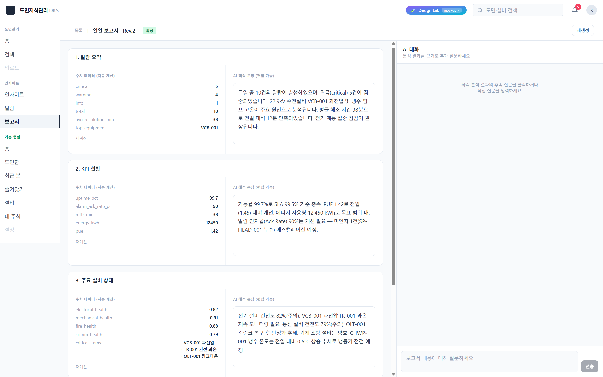

# 화면 · Insight Lab 화면 3 · 일일 보고서 상세·편집

**경로**: `/insight/reports/[id]`
**소속 트랙**: Insight Lab (1-트랙)
**화면 분류**: 문서 편집·재생성·AI 협업

---

## 1. 화면 개요



이 화면은 선택된 일일 보고서 한 건을 **좌측(섹션 편집) / 우측(AI 챗)** 2분할로 배치해, 담당자가 보고서 내용을 읽으며 동시에 AI에게 질문할 수 있게 합니다. 각 섹션은 수치 데이터(Python이 계산)와 AI 해석 문장(편집 가능) 두 칸으로 나뉘어 **"숫자는 기계가, 서사는 사람이 책임진다"** 는 협업 모델을 그대로 UI로 옮겨 놓았습니다.

상단 액션 바에는 **재생성(AI가 다시 써 줌)**과 **확정(담당자 최종 승인)** 두 버튼이 있어, 보고서 한 건을 통째로 다시 만들거나 현재 상태 그대로 잠글 수 있습니다. 우측 챗 패널은 현재 보고서 전체를 `contextSummary`로 주입받아 "이 수치는 왜 이렇게 나왔나?", "내일은 어떻게 대응하나?" 같은 **보고서 기반 Q&A**를 지원합니다. 편집과 질의가 한 화면에서 끊김 없이 오갈 수 있도록 설계되어 있습니다.

---

## 2. 레이아웃 구조

```
┌─ 헤더 (shrink-0, border-b) ─────────────────────────────────────────┐
│ ← 목록 | 일일 보고서 · Rev.1  [초안]          [재생성] [확정]        │
├───────────────────────────────────┬─────────────────────────────────┤
│        좌측 62%                    │        우측 38%                 │
│  bg-slate-50 · 섹션 카드 스택       │  ChatPanel                     │
│                                    │                                │
│  ┌─ 섹션 카드 ─────────────────┐  │  ┌ AI 대화 ─────────────────┐  │
│  │ 1. 알람 요약                │  │  │ 분석 결과 근거 질문       │  │
│  ├──────────────┬──────────────┤  │  │                          │  │
│  │ 수치 데이터  │ AI 해석 문장  │  │  │  (메시지 스트림)          │  │
│  │ (자동 계산)  │ (편집 가능)   │  │  │                          │  │
│  │              │               │  │  │   u: 질문                │  │
│  │ critical: 5  │ [textarea]   │  │  │   ai: 스트리밍 응답···    │  │
│  │ warning: 4   │               │  │  │                          │  │
│  │ ...          │               │  │  │                          │  │
│  │ [재계산]     │               │  │  │                          │  │
│  └──────────────┴──────────────┘  │  │                          │  │
│                                    │  │  ┌ 입력창 ──────────┐  │  │
│  ┌─ 섹션 카드: 2. KPI 현황 ────┐  │  │  │ [보고서에 대해…] │전송│  │
│  └─────────────────────────────┘  │  │  └──────────────────┘  │  │
│                                    │  └──────────────────────────┘  │
│  ┌─ 섹션 카드: 3. 설비 상태 ────┐  │                                │
│  └─────────────────────────────┘  │                                │
│  ...                               │                                │
└───────────────────────────────────┴─────────────────────────────────┘

                            ┌─ 토스트 ───────────────┐
                            │ 보고서가 재생성되었습니다. │
                            └───────────────────────┘
```

| 영역 | 너비 | 역할 |
|---|---|---|
| 헤더 | 풀폭, shrink-0 | 목록 복귀 링크 + 제목 + 상태 뱃지 + 재생성/확정 버튼 |
| 좌측 섹션 리스트 | 62% | 보고서 섹션별 수치·서사 2-column 편집 |
| 우측 ChatPanel | 38% | 보고서 전체를 컨텍스트로 받는 스트리밍 챗 |
| 토스트 | fixed bottom | 재생성·확정 등 액션 결과 알림 |

---

## 3. UX 상세 설명

### 3.1 헤더 — 상태와 액션을 한 줄에 압축

- 가장 왼쪽에 `← 목록` 링크 (텍스트만). 작고 옅은 회색으로, 이탈 경로를 눈에 띄지 않지만 놓치지 않게 배치
- 그 옆에 `일일 보고서 · Rev.N` (모노 느낌의 숫자와 함께)
- 상태 뱃지 (초안=회색 / 검토됨=호박 / 확정=에메랄드) — 목록 페이지와 동일한 신호등 코드를 재사용해 **화면 간 일관성** 유지
- 우측 끝에 **재생성** 버튼(테두리형) + **확정** 버튼(검은 배경). 중요도가 다른 두 액션을 시각 무게로 구별
- `finalized` 상태에서는 확정 버튼이 사라지고 재생성 버튼만 남음 — 이미 확정된 보고서는 다시 확정할 수 없음을 UI로 막음

### 3.2 좌측 섹션 카드 — 2-column 그리드

섹션 하나는 상단 **제목 바** + 본문 **2-column divide**로 구성됩니다.

| 열 | 제목 | 콘텐츠 |
|---|---|---|
| 좌 | **수치 데이터 (자동 계산)** | `DataTable` 컴포넌트가 `python_data`의 key-value를 렌더. 배열 값은 불릿 리스트로 |
| 우 | **AI 해석 문장 (편집 가능)** | `textarea` (6행). `defaultValue`로 `slm_narrative`를 로드, `onBlur`에서 저장 |

좌측 하단에는 얇은 underline 링크 "재계산" — Python 파이프라인을 다시 돌리는 액션. 실제 구현은 `handleRegenerate`로 통합 재생성과 동일한 API를 호출합니다.

### 3.3 좌측 — 편집 가능한 textarea의 세부

- `readOnly={report.status === "finalized"}` — 확정 상태에서는 수정 불가
- `onBlur={(e) => updateSection(report.id, section.id, e.target.value)}` — 포커스 해제 시 저장. **매 키스트로크마다 저장하지 않음**으로써 잦은 localStorage write를 피하고, 사용자가 의도적으로 영역을 떠나는 시점에 한 번만 확정
- 저장 호출 시 보고서 상태는 `draft`→`reviewed`로 자동 전환되어, "담당자가 한 번이라도 건드렸다"는 사실을 색 뱃지로 기록
- `focus:border-slate-400` — 편집 중임을 테두리 색으로 은은히 표시

### 3.4 `DataTable` — 수치 데이터 렌더러

- `dl` 시맨틱 태그 사용 — 정의 목록(definition list)으로 마크업
- 각 행은 `dt`(레이블, 옅은 회색) + `dd`(값, 볼드)를 flex로 좌우 배치
- 값이 배열이면 (예: `critical_items`, `scheduled_maintenance`) `<li>· ...</li>` 형태로 풀어서 표시
- 수치·이름이 섞여 있어도 `String(v)`로 안전 변환 후 렌더

### 3.5 재생성·확정 액션과 토스트

- 재생성 버튼 클릭:
  1. `setGenerating(true)` → 버튼 텍스트 "재생성 중…"으로 변경, 비활성화
  2. 토스트 "보고서 재생성 중…" 즉시 표시
  3. `POST /api/reports/generate` 호출
  4. 응답 후 `setGenerating(false)` + 토스트 "보고서가 재생성되었습니다."
- 확정 버튼 클릭:
  1. `finalizeReport(report.id)` (Zustand 액션) → 상태=`finalized`, revision+1
  2. 토스트 "보고서가 확정되었습니다."
  3. 헤더 뱃지가 에메랄드로 교체 + 확정 버튼이 즉시 사라짐
- 토스트는 3초 후 자동 소멸. 화면 하단 중앙에 `fixed` 배치, 검은 필 + 라운드

### 3.6 우측 — ChatPanel의 contextSummary 주입

보고서 상세가 아닌 일반 챗과의 결정적 차이는 **`contextSummary` 프롭**입니다.

```
일일 보고서 (2026년 4월 20일) — 상태: 초안

[1. 알람 요약]
수치: {"critical":5,"warning":4,...}
AI 해석: 금일 총 10건의 알람이 발생하였으며...

[2. KPI 현황]
수치: {"uptime_pct":99.7,...}
AI 해석: 가동률 99.7%로 SLA 99.5% 기준 충족...

... (섹션 4개 전부)
```

이 문자열이 서버로 전송되어 시스템 프롬프트에 삽입되므로, AI는 보고서 전체를 읽은 상태로 질의에 응답합니다. 사용자는 "3번 섹션의 전기 건전도 82%는 왜 그런가?"처럼 **섹션 번호로 직접 참조**하며 물을 수 있습니다.

### 3.7 우측 챗 패널 — 대화 UI 상세

- 헤더 "AI 대화" / "분석 결과를 근거로 추가 질문하세요"
- 메시지는 user(검은 말풍선, 우측 정렬) / ai(흰 카드 + AI 아바타, 좌측 정렬)
- SSE 스트리밍 응답은 `token` 단위 누적 + `animate-pulse` 커서로 타이핑 감각
- Markdown 렌더링 (ReactMarkdown) — AI가 표·리스트로 답해도 정상 출력
- 입력창은 2행 textarea, Enter 전송·Shift+Enter 줄바꿈
- `placeholder`를 `"보고서 내용에 대해 질문하세요…"`로 override해, 보고서 맥락 안에서의 질의임을 입력 시점부터 알림

### 3.8 좌/우 분할 비율 62/38

- 좌측이 넓은 이유: 섹션 카드는 2-column 내부 구조라 최소 폭이 필요함. 수치 테이블(좌)과 textarea(우)를 한눈에 보게 하려면 600~700px 이상이 필요
- 우측 챗은 420~480px면 충분 (말풍선 max-w-[85%] 기준)
- 이 비율은 하드코딩(`w-[62%]` / `w-[38%]`)이며 드래그 리사이저는 아직 없음 — 시연 고정 비율

---

## 4. 이 UX가 만드는 효과

| UX 결정 | 사용 경험에서의 변화 |
|---|---|
| 수치 / 서사 2-column 분리 | "숫자는 자동, 문장은 사람" 협업 모델이 UI 구조로 각인 |
| `onBlur` 저장 (매 키 저장 아님) | 타이핑 중 방해받지 않고, 포커스 해제라는 명시 행위로 커밋 |
| 편집 시 자동 `reviewed` 상태 전환 | 담당자가 한 번이라도 손댔다는 사실이 뱃지 색으로 영구 기록 |
| 확정 상태 textarea `readOnly` | 실수로 확정본을 수정하는 사고 방지 |
| 확정 후 "확정" 버튼 제거 | 이미 완결된 상태에서 재확정을 UI로 막음 — 상태기계 일관성 |
| 우측 챗에 보고서 전체 주입 | "보고서 내부 참조"가 가능한 질의응답 경험 ("3번 섹션 왜?") |
| 토스트 3초 자동 소멸 | 액션 결과 확인 → 시선이 본문으로 복귀 → 작업 흐름 유지 |
| 재생성 중 버튼 disabled | 중복 호출 방지 + "지금 처리 중"이라는 시각 피드백 |
| 스트리밍 챗 + Markdown | AI 응답을 기다리는 동안에도 토큰이 흐르며 "생각 중"을 보여줌 |
| 좌 62% / 우 38% 고정 비율 | 편집과 대화 중 어느 한쪽도 과도하게 축소되지 않도록 균형 |

---

## 5. 사용자 동작 흐름

| # | 액션 | 결과 | UX 의도 |
|---|---|---|---|
| 1 | 목록에서 카드 클릭 → 상세 진입 | 헤더 + 섹션 카드 4장 + 우측 챗 렌더 | 리스트에서 읽기로의 자연스러운 전환 |
| 2 | 1번 섹션 수치 테이블 스캔 | "critical 5건, warning 4건" 눈에 들어옴 | 기계 계산 결과 직접 확인 |
| 3 | 우측 AI 해석 textarea 수정 (예: 문장 추가) | 포커스 해제 시 저장, 상태가 `draft`→`reviewed`로 | 편집 의도를 명시 시점에 커밋 |
| 4 | 우측 챗에 "3번 섹션의 전기 건전도 82%는 왜 그런가?" 입력 | Bundle 컨텍스트로 보고서 전체를 받은 AI가 섹션 참조 응답 | 보고서 내부 질의 가능 |
| 5 | "재생성" 버튼 클릭 | "재생성 중…" 토스트 → 응답 후 "재생성되었습니다" 토스트 | AI 해석 전체를 한 번에 다시 쓰기 |
| 6 | 담당자가 전체 확인 후 "확정" 버튼 | 에메랄드 뱃지로 교체, 확정 버튼 사라짐, textarea가 read-only로 전환 | 워크플로우 종료 |
| 7 | 확정 후 재생성 버튼은 여전히 사용 가능 | 확정된 보고서도 참고 버전을 새로 만들 수 있음 (revision 증가) | 역사 기록 보존 + 새 버전 옵션 |
| 8 | `← 목록`으로 돌아가기 | 목록 페이지에서 해당 카드가 새 상태(확정)로 갱신되어 있음 | localStorage 영속으로 상태 유지 |

---

## 6. 데이터·API 의존성

### 원천 데이터
- `data/insight/reports/report-daily-2026042*.json` (목록과 공유)

### 상태 저장소
- `src/lib/insight/use-reports-store.ts` — `useReportsStore()` 훅
  - `updateSection(reportId, sectionId, narrative)` — textarea 저장. 상태를 `reviewed`로 자동 전환
  - `finalizeReport(reportId)` — 확정 버튼. 상태=`finalized`, revision+1
- Storage key `dks-reports-v1`, localStorage 영속

### API 엔드포인트
- `POST /api/reports/generate` — 보고서 재생성 (현재 구현은 mock). 재생성 버튼과 "재계산" 링크 모두 이 API 호출

### 챗 API
- `POST /api/insights/chat/stream` (`ChatPanel` 내부) — `{alarmId, question, history, contextSummary}` 전송, SSE로 `{token}` `{done}` 청크 반환
- `alarmId`는 이 화면에서 `undefined` (보고서 기반이므로)
- `contextSummary`에는 보고서 전체 직렬화본이 주입됨

### 참조하는 컴포넌트
- `@/components/insight/ChatPanel` — 스트리밍 챗 UI + SSE 디코딩 + 취소(AbortController)
- `next/link` — 목록 복귀 링크

### 실제 LLM 호출 여부
**있음**. 재생성 API와 챗 스트리밍 API 모두 실 Gemini를 호출할 수 있도록 엔드포인트가 구성되어 있으며, API 키/모델 설정에 따라 mock fallback이 동작합니다.

---

## 7. 이 화면이 기여하는 서비스 측면

| DKS 서비스 측면 | 이 화면이 맡는 역할 |
|---|---|
| **서비스 2 (AI 인사이트) — 운영 문서 산출** | 일일 보고서의 핵심 산출물을 편집·확정하는 메인 워크플로우 |
| **AI + 담당자 공동 편집 모델** | 수치(자동) / 서사(편집 가능)의 명시적 분리로 AI의 역할 경계를 UI에 새김 |
| **상태기계 기반 워크플로우** | draft → reviewed → finalized의 3-state 전이를 뱃지 + 버튼 + readonly 토글로 시각 구현 |
| **보고서 기반 질의응답** | contextSummary 주입으로 "보고서 전체를 읽은 AI와의 대화" — 매 응답이 현재 보고서 근거 |
| **재생성 가능성** | AI 해석이 마음에 들지 않으면 한 버튼으로 전체 재작성 — 비가역적 계산이 아님을 시각적으로 약속 |
| **편집 흔적의 영속화** | localStorage로 부담 없이 탐색하고 돌아올 수 있는 작업 기억 |
| **서비스 간 연결 (선택)** | 재생성이 내부적으로 SPC 이벤트 + 온톨로지 결합 결과를 재호출하도록 연결 가능 (미래 확장 지점) |

**이 화면이 해결하지 않는 것**: 섹션 추가·삭제·순서 변경, 여러 담당자 간 협업 편집(실시간 커서), diff 뷰(이전 리비전과의 비교), PDF 내보내기·인쇄 레이아웃 — 모두 Phase 2 이후의 범위입니다.

---

## 8. 의견 수렴 포인트

### 스스로 본 보완 포인트

- **매 섹션마다 재생성 불가**: 현재 "재계산" 링크는 전역 재생성과 동일한 API를 호출함. 섹션 단위 재생성이 필요 (특정 섹션만 다시 써 줘)
- **저장 피드백 없음**: `onBlur`로 저장되지만 시각 피드백이 없어 사용자가 저장 여부 확신이 어려움. 작은 체크 아이콘이나 "저장됨" 토스트 필요
- **편집 이력 없음**: 사용자가 수정한 문장과 AI 원문을 비교할 수 없음. 원문 복구(revert) 옵션 고려
- **확정 취소 불가**: 한 번 확정하면 `finalized` 상태에서 벗어날 방법이 UI상 없음 — 실수 확정 시 혼란. "확정 해제" 권한 버튼 필요
- **리비전 diff 없음**: Rev.N이 올라가도 N과 N-1 차이를 볼 수 없음. 간단한 텍스트 diff 뷰 필요
- **챗 컨텍스트가 고정 스냅샷**: 사용자가 textarea를 수정한 직후 챗에 물어도 `contextSummary`는 편집 전 문자열을 참조 가능 (렌더 타이밍 문제). 실시간 재계산 필요
- **모바일 대응**: 62/38 분할이 고정이라 좁은 화면에서는 둘 다 비좁아짐. 모바일에서는 탭 전환(편집/챗) 제안 필요
- **대용량 보고서 대응**: 섹션이 10개 이상이 되면 세로 스크롤이 매우 길어짐. 목차(TOC) 사이드바 필요
- **실 데이터 연결 미완**: 현재는 mock-events + 빌드타임 JSON. 실 운영에서는 Python 파이프라인에서 매일 실시간 생성되는 REST API 필요

### 이해관계자 의견 기록란

<!-- 아래에 자유롭게 덧붙여 주십시오. 형식: `- **YYYY-MM-DD · 이름**: 의견` -->

-

---

## 9. 파일 레퍼런스

| 유형 | 경로 |
|---|---|
| 페이지 | `src/app/(s2)/insight/reports/[id]/page.tsx` |
| 상태 저장소 | `src/lib/insight/use-reports-store.ts` |
| 챗 패널 | `src/components/insight/ChatPanel.tsx` |
| 챗 스트리밍 API | `src/app/api/insights/chat/stream/route.ts` |
| 재생성 API | `src/app/api/reports/generate/route.ts` |
| 보고서 시드 | `data/insight/reports/report-daily-2026042*.json` |
| LLM 클라이언트 | `src/lib/insight/llm-client.ts` |
| 관련 목록 페이지 | `src/app/(s2)/insight/reports/page.tsx` |

**관련 화면**: [화면 1 · Insight Lab](./05-lab.md) · [화면 2 · 보고서 목록](./06-reports-list.md) · [화면 4 · 근본원인 그래프](./08-root-cause.md)
