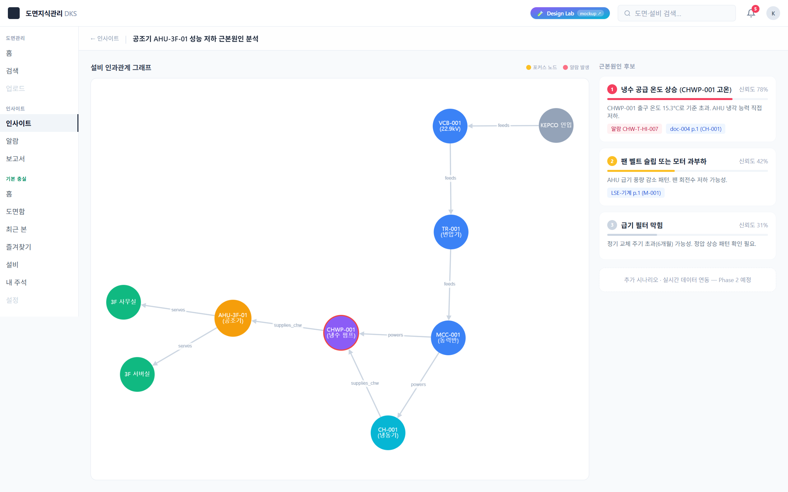

# 화면 · Insight Lab 화면 4 · 근본원인 분석 그래프

**경로**: `/insight/root-cause/[id]`
**소속 트랙**: Insight Lab (1-트랙)
**화면 분류**: 인과 그래프 시각화 · 후보 랭킹

---

## 1. 화면 개요



이 화면은 특정 알람·이상 현상에 대한 **근본원인 후보**를 두 가지 시점에서 동시에 보여줍니다. 왼쪽에는 **설비 인과관계 그래프**가 Cytoscape 기반 인터랙티브 네트워크로 렌더되고, 오른쪽에는 **후보 리스트**가 신뢰도 순으로 랭킹되어 각 후보의 근거(알람·도면 참조)가 칩으로 붙습니다. 그래프에서 계통 전체의 구조를 파악하면서, 리스트에서는 우선순위와 근거를 읽는 **한 화면 두 관점**의 구성입니다.

기존 RCA(근본원인 분석) 도구들이 트리나 피시본 다이어그램 정적 이미지를 제공하는 것과 달리, 이 화면은 **물리적 계통 관계**(전원 공급·냉수 공급·서비스 관계)를 노드 그래프로 재현합니다. 포커스 노드(문제 발생 설비)를 호박색 테두리로, 함께 경보를 낸 이웃 노드를 적색 테두리로 강조해, 담당자가 "전기 계통 상류부터 훑을지, 기계 계통 하류를 볼지"를 시각적으로 판단하게 합니다. 후보 리스트의 신뢰도 바는 0~100%로 **AI가 확신하지 않는 구간**을 숨기지 않고 드러냅니다.

---

## 2. 레이아웃 구조

```
┌─ 헤더 (sticky, backdrop-blur) ──────────────────────────────────────┐
│ ← 인사이트 | 공조기 AHU-3F-01 성능 저하 근본원인 분석                │
├────────────────────────────────────────────┬─────────────────────────┤
│        좌측 1fr (가변)                      │      우측 360px        │
│                                             │                        │
│  설비 인과관계 그래프      🟡포커스 🔴알람   │  근본원인 후보          │
│  ┌──────────────────────────────────────┐  │                        │
│  │                                        │  │  ┌ 후보 1 ──────────┐ │
│  │   KEPCO ──feeds──▶ VCB-001            │  │  │ ① 냉수 공급 온도   │ │
│  │                       │ feeds          │  │  │ 신뢰도 78% ████   │ │
│  │                       ▼                │  │  │ 설명 문장          │ │
│  │                    TR-001              │  │  │ [알람][도면 chip] │ │
│  │                       │ feeds          │  │  └──────────────────┘ │
│  │                       ▼                │  │                        │
│  │              ┌── MCC-001 ──┐           │  │  ┌ 후보 2 ──────────┐ │
│  │              │ powers  │ powers        │  │  │ ② 팬 벨트 슬립    │ │
│  │              ▼         ▼               │  │  │ 신뢰도 42% ████   │ │
│  │           CH-001 ─supplies_chw→       │  │  │ ...                │ │
│  │           CHWP-001(🔴)                 │  │  └──────────────────┘ │
│  │              │ supplies_chw            │  │                        │
│  │              ▼                          │  │  ┌ 후보 3 ──────────┐ │
│  │         🟡AHU-3F-01 ── serves ──▶ 3F  │  │  │ ③ 필터 막힘        │ │
│  └──────────────────────────────────────┘  │  │ 신뢰도 31% ███     │ │
│                                             │  └──────────────────┘ │
│                                             │                        │
│                                             │  ┌ 추가 시나리오        │
│                                             │  │ 실시간 연동          │
│                                             │  │ — Phase 2 예정       │
│                                             │  └──────────────────── │
└────────────────────────────────────────────┴─────────────────────────┘
```

| 영역 | 너비 | 역할 |
|---|---|---|
| 헤더 | 풀폭, sticky top-0 | 이탈 경로(← 인사이트) + 그래프 제목 |
| 좌측 그래프 | 1fr (가변) | Cytoscape 기반 네트워크. 최소 높이 400px, lg 이상에서 h-full |
| 우측 후보 리스트 | 360px (lg+) | 신뢰도 순 카드 3장 + "Phase 2" 플레이스홀더 |

`lg:grid-cols-[1fr_360px]` — 대형 화면에서는 2분할, 작은 화면에서는 자동 수직 스택으로 fallback.

---

## 3. UX 상세 설명

### 3.1 헤더 — sticky 배치로 제목 상시 노출

- `sticky top-0 z-10` + `backdrop-blur-sm` — 스크롤해도 상단에 반투명 고정
- 좌측에 `← 인사이트` (옅은 회색, 호버 시 짙어짐) — 알람 페이지로 복귀
- 구분선 `|` 후 그래프 제목 `graphData.title` (예: "공조기 AHU-3F-01 성능 저하 근본원인 분석")
- 헤더 자체는 얇아서(py-3) 본문이 최대한 많이 보이도록 함

### 3.2 좌측 — Cytoscape 그래프 캔버스

#### 3.2.1 SSR 비활성 (`ssr: false`)

Cytoscape는 브라우저 Canvas에 직접 그리므로 서버 렌더에서는 초기화 불가. `next/dynamic`으로 `CytoscapeCanvas` 컴포넌트를 `ssr: false`로 감싸고, 로딩 중에는 "그래프 로딩…" 플레이스홀더를 표시합니다.

#### 3.2.2 레이아웃 알고리즘 — `cose-bilkent`

물리 시뮬레이션 기반의 힘-지향(force-directed) 레이아웃:
- `idealEdgeLength: 120` — 엣지(연결선) 목표 길이
- `nodeRepulsion: 8000` — 노드 간 반발력
- `nodeDimensionsIncludeLabels: true` — 라벨이 겹치지 않도록 노드 크기 계산에 포함
- `animate: false` — 초기 배치는 애니메이션 없이 완성형으로 노출 (시연 대기 시간 단축)

#### 3.2.3 노드 스타일

| 노드 타입 | 색 | 용도 |
|---|---|---|
| `source` | `#94a3b8` (slate) | 외부 전원(KEPCO) |
| `electrical` | `#3b82f6` (blue) | VCB·TR·MCC 등 전기 설비 |
| `chiller` | `#06b6d4` (cyan) | 냉동기 |
| `pump` | `#8b5cf6` (violet) | 냉수 펌프 |
| `ahu` | `#f59e0b` (amber) | 공조기 |
| `space` | `#10b981` (emerald) | 서버실·사무실 등 서비스 대상 공간 |

- 기본 크기 60x60, 원형
- 라벨은 흰색·10px, `text-wrap: wrap`으로 줄바꿈 허용 (예: "CHWP-001\n(냉수 펌프)")
- **포커스 노드**(focus: true): 호박색 4px 테두리 — "여기가 문제의 시작점"
- **알람 노드**(alarm: true): 적색 2px 테두리 — "이것도 함께 경보 중"
- 두 속성 모두 아닌 노드는 테두리 없음

#### 3.2.4 엣지 스타일

- 얇은 회색 곡선(`bezier`) + 삼각 화살표
- `label: data(rel)` — 관계명을 엣지 위에 표시 (`feeds`, `powers`, `supplies_chw`, `serves`)
- 라벨 배경이 흰색 반투명으로 덮여 노드·엣지 교차점에서도 읽힘
- 엣지는 읽기 전용 — 드래그·삭제 불가

#### 3.2.5 범례 (그래프 우상단)

- "🟡 포커스 노드 · 🔴 알람 발생" 두 점을 인라인으로 표시
- 색의 의미를 범례 없이 맞추라고 강요하지 않음

### 3.3 우측 — 후보 리스트 (CauseCandidateList)

#### 3.3.1 랭킹 카드 3장

각 후보는 독립된 흰 카드로, 순위별 색상 코드가 있습니다:

| 순위 | 색 | 의미 |
|---|---|---|
| 1 | rose-500 (짙은 분홍) | 최유력 — 신뢰도 가장 높음 |
| 2 | amber-400 (호박) | 차유력 |
| 3 | slate-300 (회색) | 참고 가능성 |

- 순위 번호는 좌측에 색 원형 뱃지로 표시. 색만으로 "몇 순위인지" 인지 가능
- 카드 헤더: `[원형 뱃지][N]` + 원인 제목 + 우측 `신뢰도 NN%`

#### 3.3.2 신뢰도 바

- 카드 본문 바로 아래 얇은 프로그레스 바 (h-1)
- 배경은 `bg-slate-100`, 채움은 순위별 색 그대로
- `width: {confidence*100}%` — 시각적으로 신뢰도를 게이지로 표현
- **AI가 100% 확신하는 것이 아님**을 숨기지 않고 즉시 드러냄

#### 3.3.3 설명 문장 + 근거 칩

- 설명(`description`)은 한 단락으로 "왜 이게 의심되는지" 논리 제시
- 하단 `evidence[]` 배열을 `flex-wrap`으로 나열:
  - `type: "alarm"` + `alarmId` → 적색 칩 "알람 CHW-T-HI-007", `/insight/alarms`로 링크
  - `type: "drawing_page"` + `reference` → 파란 칩 "doc-004 p.1 (CH-001)", `buildEvidenceUrl()`로 도면 페이지 링크
- 칩이 없는 후보(3순위 필터 막힘 등)는 근거 없이 설명만 — AI가 추측 수준임을 명시

### 3.4 Phase 2 플레이스홀더

우측 하단에 dashed 테두리 회색 박스:
> "추가 시나리오 · 실시간 데이터 연동 — Phase 2 예정"

현재 화면이 시연 범위이고, 실시간 데이터 스트리밍·시나리오 축적은 추후임을 **시각적으로 공백을 차지**하며 알립니다. 빈 공간이 아니라 "여기가 확장 지점"이라는 신호.

### 3.5 반응형

- `grid lg:grid-cols-[1fr_360px]` — 태블릿 이상은 2분할, 모바일은 자동으로 세로 스택 (그래프 위, 후보 아래)
- 그래프 영역은 `h-96 lg:h-full min-h-96` — 모바일에서는 고정 높이, 큰 화면에서는 가용 공간 채움

### 3.6 정적 import로 빌드타임 safe

`import graphData from "@data/insight/root-cause/ahu-3f-01.json"` — 그래프 데이터는 빌드타임에 정적 import됩니다. URL 파라미터 `id`가 바뀌어도 현재는 고정 데이터만 렌더 — 목업 단계이므로 의도적.

---

## 4. 이 UX가 만드는 효과

| UX 결정 | 사용 경험에서의 변화 |
|---|---|
| 좌(그래프) + 우(리스트) 동시 노출 | 구조적 시점과 랭킹적 시점을 동시에 잡아 사고 누락 방지 |
| 포커스 호박색 + 알람 적색 테두리 | "문제의 중심"과 "동반 이상"을 색으로 즉시 분리 인지 |
| force-directed 레이아웃 | 노드를 수동 배치하지 않아도 관계 밀집도가 시각적으로 드러남 |
| 노드 타입별 색상 구분 | 전기·기계·공조·공간을 한눈에 계통별로 색구분 |
| 엣지 라벨 `feeds`·`supplies_chw` 등 | 단순 연결선이 아니라 **어떤 종류의 관계**인지 읽힘 |
| 신뢰도 바 + 색상 코드 | AI가 확신 못하는 구간을 숨기지 않고 운영자 판단에 맡김 |
| 순위별 뱃지 색 (rose→amber→slate) | 순위 번호를 읽기 전에 색만으로 "1등·2등·3등" 인지 |
| 근거 칩 클릭으로 알람·도면 즉시 열람 | "근본원인 후보"가 추상 문장이 아니라 **검증 가능한 링크**로 존재 |
| Phase 2 플레이스홀더 명시 | 현재 시연 범위와 미래 확장을 이해관계자에게 투명 공개 |
| sticky 헤더 | 그래프 스크롤·탐색 중에도 "무엇을 보고 있는지" 제목 유지 |
| cose-bilkent `animate: false` | 초기 로드 즉시 완성형 — 시연 대기 시간 없음 |

---

## 5. 사용자 동작 흐름

| # | 액션 | 결과 | UX 의도 |
|---|---|---|---|
| 1 | 다른 화면(알람 리스트 등)에서 "AI 분석" 진입 → 이 페이지 | Cytoscape 초기화 중 "그래프 로딩…" 플레이스홀더 잠시 표시 후 네트워크 완성 | SSR 불가라 약간의 지연이 있음을 숨기지 않음 |
| 2 | 그래프에서 호박 테두리 노드(AHU-3F-01)를 눈으로 따라감 | "여기가 포커스" 즉시 인지 | 문제의 시작점 시각 고정 |
| 3 | 노드 색으로 전기 계통(파랑)·기계(청록/보라)·공간(에메랄드) 구분 | 상류·하류를 타입별로 구분 가능 | 색을 통한 계통 정렬 |
| 4 | 적색 테두리 CHWP-001에 시선 이동 | "여기도 알람 중" 인지 | 동반 이상 발견 |
| 5 | 엣지 라벨 `supplies_chw`를 읽음 | CHWP가 AHU에 냉수를 공급한다는 관계 읽기 | 추상 연결이 아닌 실 관계 인식 |
| 6 | 우측 1순위 카드 "냉수 공급 온도 상승" 확인 | 신뢰도 78%, 분홍 바 | AI 유력 후보 식별 |
| 7 | 1순위 카드의 도면 칩 `doc-004 p.1 (CH-001)` 클릭 | 도면 뷰어로 이동, 해당 페이지 열림 | 추정 근거 직접 확인 |
| 8 | 뒤로 돌아와 2순위·3순위 설명 읽기 | 대안 후보의 가능성도 인지 | 1순위 확정 전 검토 |
| 9 | 3순위 카드에 근거 칩이 없음을 확인 | "추측 수준"임을 즉시 파악 | AI의 확신 수준 투명 공개 |

---

## 6. 데이터·API 의존성

### 원천 데이터 (빌드타임 정적 import)
- `data/insight/root-cause/ahu-3f-01.json`
  - `id`, `title`, `focus_node` (문자열, 노드 ID)
  - `nodes[]`: `{id, label, type, focus?, alarm?}`
  - `edges[]`: `{source, target, rel}`
  - `candidates[]`: `{rank, cause, confidence, description, evidence[]}`
    - `evidence[].type`: `"alarm"` / `"drawing_page"`
    - `evidence[].ref` / `reference`, `tag`, `alarmId`

### 그래프 엔진
- `cytoscape` + `cytoscape-cose-bilkent` (레이아웃 플러그인)
  - 동적 `await import()` — 클라이언트 번들에만 포함
  - `_cose_bilkent_registered` 플래그로 HMR 중복 등록 방지

### 라우팅·URL 빌더
- `@/lib/insight/url-builder` — `buildEvidenceUrl()` · 도면 참조 → `/drawings/[doc_id]?page=N&query=...` 형식 URL 생성
- 칩 클릭 시 `next/link`로 라우팅

### 참조하는 컴포넌트
- `src/app/(s2)/insight/root-cause/[id]/page.tsx` — 서버 컴포넌트, `params.id` 수신 후 Suspense로 Client 감쌈
- `src/app/(s2)/insight/root-cause/[id]/RootCauseClient.tsx` — 클라이언트, 그래프+리스트 레이아웃
- `@/components/insight/CytoscapeCanvas` (ssr:false)
- `@/components/insight/CauseCandidateList`

### 실제 LLM 호출 여부
**없음**. 이 화면은 **사전 분석 결과를 시각화**하는 전용 화면입니다. 후보·신뢰도·근거는 모두 JSON 시드로 고정. 실 서비스에서는 백엔드 분석 파이프라인이 이 JSON을 생성해 두고, UI는 조회만 담당하는 구조가 권장됩니다.

---

## 7. 이 화면이 기여하는 서비스 측면

| DKS 서비스 측면 | 이 화면이 맡는 역할 |
|---|---|
| **서비스 2 (AI 인사이트) — 근본원인 분석** | SPC 이상 감지·알람 → 근본원인 추론의 **최종 단계** 시각화 |
| **온톨로지의 설비 관계 활용 시연** | YAML 온톨로지의 `feeds`·`supplies_chw`·`serves` 관계를 그대로 엣지에 매핑 |
| **AI의 확신 수준 투명성** | 신뢰도 78%/42%/31%를 숨기지 않고 제시 — 운영자가 최종 판단 주체임을 UI로 약속 |
| **서비스 1 연결 (근거 도면)** | 후보 근거 칩이 본 서비스 도면 뷰어로 링크 — 두 서비스가 엔티티 참조로 연결 |
| **계통 구조 이해 훈련** | 신입 운영자가 그래프를 보며 "우리 센터의 전원·냉수·서비스 계통"을 시각 학습 |
| **알람 대응 가이드** | "어디부터 점검해야 하나?"에 대한 답변을 그래프 상류·하류 탐색으로 제공 |

**이 화면이 해결하지 않는 것**: 실시간 그래프 업데이트(새 알람 시 테두리 자동 갱신), 노드 상세 패널(클릭 시 스펙·주소 열람), 시나리오 간 비교, 해소 이력 추적, 사용자 주석(이 후보는 아니었다 같은 피드백) — 모두 Phase 2 범위입니다.

---

## 8. 의견 수렴 포인트

### 스스로 본 보완 포인트

- **고정 그래프 데이터 하나**: URL의 `[id]`가 바뀌어도 `ahu-3f-01.json`만 렌더됨. 실 운영에서는 id별 JSON 매핑 또는 API 조회 필요
- **노드 클릭 인터랙션 없음**: 노드를 클릭해도 상세 패널이 열리지 않음. 스펙·주소·최근 알람 이력이 보조 드로어로 나와야 함
- **엣지 방향성 단색**: 전원(feeds)·냉수(supplies_chw)·서비스(serves) 관계가 모두 회색 동일 색. 관계 타입별 색 구분이 필요
- **신뢰도 계산 기준 미공개**: 78%·42%·31%가 어떻게 나왔는지 UI에서 드러나지 않음. 툴팁이나 "근거 보기" 확장이 필요
- **후보가 항상 3개로 고정**: 경우에 따라 1개·5개가 필요할 수 있음. 현재 구조는 3개 미만일 때 색 fallback(slate-200)이 있으나 4개 이상은 모두 동색
- **알람 칩 클릭이 목록으로만**: 클릭 시 `/insight/alarms`만 열림. 해당 알람 상세 deeplink (`?id=alarm-001`)가 더 자연스러움
- **반응형 그래프**: 모바일에서 그래프 높이가 h-96 고정. 노드가 많은 그래프에서는 자동 줌/스크롤 어려움
- **Phase 2 플레이스홀더가 고정 문구**: 실제 Phase 2 진입 시기·사양이 결정되면 이 박스도 업데이트 필요
- **색맹 접근성**: rose/amber/slate 색상만으로 순위 구별. 숫자 뱃지가 함께 있어 최소한의 안전장치는 있지만 별도 패턴(빗금 등)도 고려 가능

### 이해관계자 의견 기록란

<!-- 아래에 자유롭게 덧붙여 주십시오. 형식: `- **YYYY-MM-DD · 이름**: 의견` -->

-

---

## 9. 파일 레퍼런스

| 유형 | 경로 |
|---|---|
| 페이지 (서버) | `src/app/(s2)/insight/root-cause/[id]/page.tsx` |
| 페이지 (클라이언트) | `src/app/(s2)/insight/root-cause/[id]/RootCauseClient.tsx` |
| 그래프 캔버스 | `src/components/insight/CytoscapeCanvas.tsx` |
| 후보 리스트 | `src/components/insight/CauseCandidateList.tsx` |
| 그래프 데이터 시드 | `data/insight/root-cause/ahu-3f-01.json` |
| URL 빌더 | `src/lib/insight/url-builder.ts` |
| Insight 타입 | `src/lib/insight/types.ts` |

**관련 화면**: [화면 1 · Insight Lab](./05-lab.md) · [화면 2 · 보고서 목록](./06-reports-list.md) · [화면 3 · 보고서 상세](./07-reports-detail.md)
