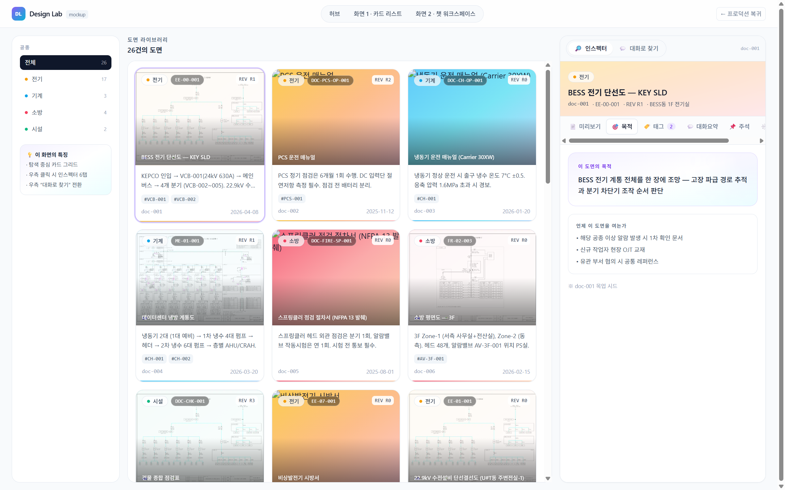
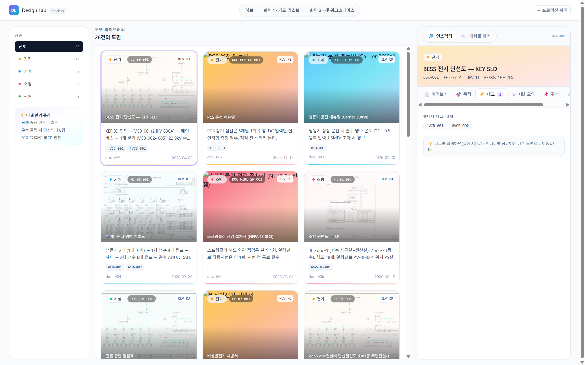
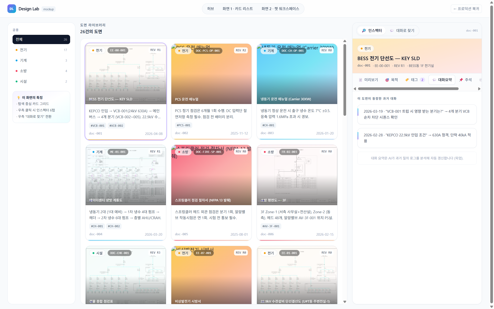
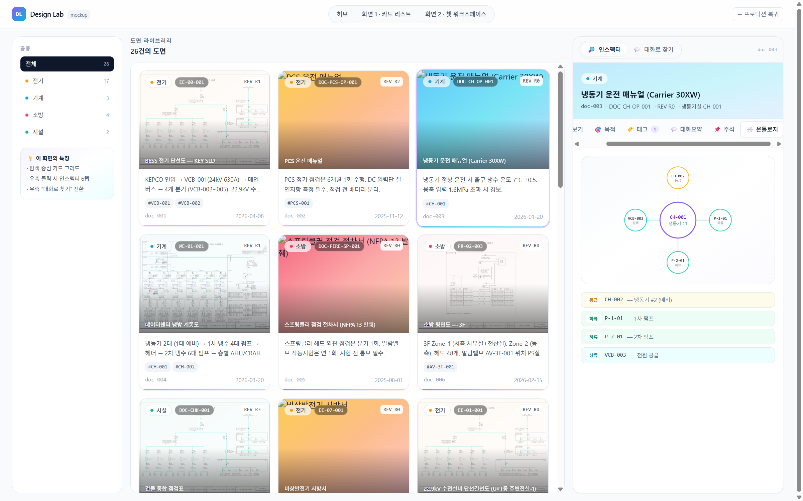
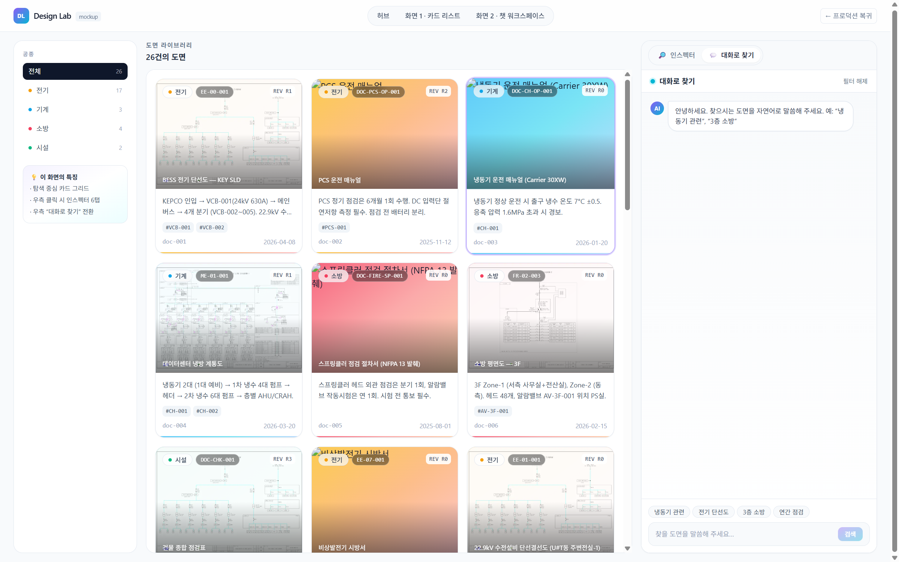
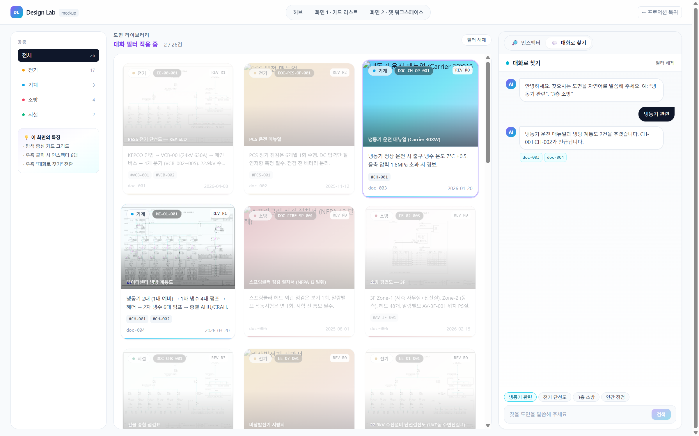

# 화면 · Design Lab 화면 1 · 카드형 도면 리스트

**경로**: `/design-lab/cards`
**소속 트랙**: Design Lab (2-트랙)
**화면 분류**: 탐색·브라우징 중심

---

## 1. 화면 개요


이 화면은 도면 26건을 **썸네일 중심의 카드 그리드**로 보여주고, 선택한 카드에 대한 상세 정보를 오른쪽 패널에서 여러 탭으로 살펴볼 수 있게 합니다. 오른쪽 패널은 **인스펙터(정보 조회)** 모드와 **대화로 찾기(자연어 검색 → 실시간 필터)** 모드 두 가지로 토글됩니다. 좌측 좁은 네비에는 공종(전기·기계·소방·시설) 카운트가 표시되어 큰 덩어리로 먼저 좁힐 수 있습니다.

전통적인 표 형식 리스트가 아니라 **카드를 훑는 경험**을 기본으로 삼아, 도면 제목·도면번호·공종·썸네일을 동시에 인지하게 합니다. 카드 클릭이 네비게이션(다른 페이지로 이동)이 아니라 **같은 화면 안에서 우측 패널을 채우는** 방식이라, 한 세션에서 여러 도면을 빠르게 비교·훑어볼 수 있습니다.

---

## 2. 레이아웃 구조

```
┌─ LabNav (상단) ──────────────────────────────────────────────────────┐
│ [DL] Design Lab · 허브 · 화면 1 · 화면 2 · [← 프로덕션 복귀]        │
├──────────┬──────────────────────────────────────┬────────────────────┤
│  좌측    │            중앙                       │       우측         │
│  220px   │  1fr (가변)                           │      420px         │
│          │                                       │ [인스펙터│대화로찾기]│
│  공종    │  헤더 (N건 / 필터 적용 중 배지)       │                    │
│  필터    │  ┌─────┬─────┬─────┐                 │  탭: 미리보기 /    │
│          │  │card │card │card │                 │    목적 / 태그 /   │
│  · 전체  │  ├─────┼─────┼─────┤                 │    대화요약 /      │
│  · 전기  │  │card │card │card │                 │    주석 /          │
│  · 기계  │  └─────┴─────┴─────┘                 │    온톨로지        │
│  · 소방  │                                       │                    │
│  · 시설  │                                       │                    │
│          │                                       │                    │
│  [이화면 │                                       │  (모드 전환 시     │
│  의 특징]│                                       │   패널 교체)       │
└──────────┴──────────────────────────────────────┴────────────────────┘
```

| 영역 | 너비 | 역할 |
|---|---|---|
| LabNav | 풀폭, 56px 고정 | Design Lab 내 네비 + 프로덕션 복귀 |
| 좌측 네비 | 220px | 공종 필터 + 화면 특징 안내 |
| 중앙 그리드 | 가변 | 카드 1~3열 반응형 |
| 우측 패널 | 420px | 인스펙터 / 대화로 찾기 토글 |

---

## 3. UX 상세 설명

### 3.1 카드 디자인 (Claude Code 스킬카드 감성)

- **썸네일 영역** 4:3 비율. 상단에 공종별 그라디언트 오버레이, 실제 도면 이미지가 있으면 `object-cover`로 채움
- **좌상단**: 공종 배지(색점 + 한글), 도면번호(`EE-01-001` 같은)
- **우상단**: REV 표시(흰 박스)
- **하단 그라디언트 마스크 위 제목**: 어두운 배경에 흰 제목으로 가독성 확보
- **카드 본문**: snippet 2줄 · 태그 chip 최대 4개 + `+N` · 우하단 `doc_id`와 마지막 수정일
- **공종 컬러 하단 라인**: 카드 바닥에 얇은 그라디언트 라인으로 공종을 재확인

### 3.2 카드 상태 3가지

| 상태 | 시각 표현 |
|---|---|
| 기본 | 흰 카드 · 얇은 회색 테두리 · 호버 시 그림자·살짝 위로 |
| 선택됨 | 보라 테두리 + ring · 1.01배 확대 |
| 대화 필터로 제외됨 | 투명도 40% + 채도 50% + 0.97배 축소 |

### 3.3 좌측 네비 — 공종 카운트

- "전체"와 4개 공종이 세로로 나열. 각 항목은 좌측에 색점, 우측에 개수 표시
- 현재 선택은 검은 바탕 + 흰 글씨 (나머지는 회색)
- 하단의 "이 화면의 특징" 박스 — **연한 보라·청록 그라디언트 배경**으로 Design Lab 임을 각인

### 3.4 우측 — 인스펙터 6탭






탭 하나하나는 **가로 스크롤 가능한 탭 바**에 emoji + 한글 라벨로 배치됩니다. 정보가 많아 한 번에 다 보여주지 않고 탭으로 **의도적으로 쪼갰습니다** — 한 번에 하나에 집중하도록.

| 탭 | 내용 |
|---|---|
| 📄 미리보기 | 썸네일을 페이지 넘김으로 (◀/▶ + 점 인디케이터). 하단에 snippet + 페이지 수·수정일 메타 |
| 🎯 목적 | 연한 보라 그라디언트 큰 박스에 "이 도면의 목적" 한 단락 + 언제 이 도면을 여는가 리스트 |
| 🏷️ 태그 | 엔티티 태그 chip 전체 (`#VCB-001` 등). 숫자 뱃지로 개수 표시 |
| 💬 대화요약 | 좌측 그라디언트 바를 가진 카드 형식으로 과거 Q&A 요약 (시드) |
| 📌 주석 | 주석 타입별 색상(info 하늘 · warning 호박 · field-note 에메랄드) + 페이지·작성자·날짜 |
| 🕸️ 온톨로지 | SVG 미니 그래프(중심 노드 + 방사형 관계) + 아래에 관계 리스트 |

### 3.5 우측 — 대화로 찾기 모드



- 상단에 **펄스 애니메이션 도트** + "대화로 찾기" 타이틀 + 필터 해제 버튼
- 대화 기록은 user(검은 말풍선, 우측 정렬) / assistant(흰 카드, AI 아바타, 좌측 정렬)
- 하단에 **빠른 프롬프트 칩** 4개 (냉동기 관련 / 전기 단선도 / 3층 소방 / 연간 점검)
- 입력창은 회색 배경 라운드 박스, 포커스 시 보라 테두리
- 검색 버튼은 **보라→청록 그라디언트**

### 3.6 필터 애니메이션



대화로 필터가 적용되면 중앙 그리드의 카드들이:
- 해당되는 카드: 그대로
- 제외된 카드: 0.5초에 걸쳐 투명도·채도·크기가 줄어듦
- `transitionDelay`로 6개 단위 stagger (한 번에 확 꺼지지 않고 물결처럼)

---

## 4. 이 UX가 만드는 효과

| UX 결정 | 사용 경험에서의 변화 |
|---|---|
| 표가 아닌 카드 그리드 | 제목만 읽는 대신 썸네일·공종색·도면번호를 동시에 인지 → 원하는 도면 찾는 시간 단축 |
| 카드 클릭으로 같은 화면 내 인스펙터 갱신 | 여러 도면을 비교할 때 뒤로가기·앞으로가기 없이 빠르게 왕복 가능 |
| 인스펙터의 6탭 분리 | 한 탭에 정보를 모두 욱여넣는 대신, 맥락(목적·태그·온톨로지)별로 시선을 분리해 정보 과부하 감소 |
| 제외된 카드를 **숨기지 않고** 투명·축소 | "있지만 지금 맥락엔 안 맞는다"를 시각적으로 남겨, 필터를 잘못 건 경우 즉시 알아챌 수 있음 |
| 필터 애니메이션의 stagger | 순간적으로 전체가 바뀐 게 아니라 **시스템이 반응하고 있다**는 감각 → 대화가 실제로 작동한다는 인지 강화 |
| 좌측의 "이 화면의 특징" 박스 | 처음 들어온 이해관계자가 왼쪽만 읽어도 이 화면이 무엇인지 3줄로 파악 가능 |
| 썸네일 위 공종별 그라디언트 | 이미지가 없어도 공종이 색으로 구별됨 — 실 데이터가 부족한 목업 단계에서도 시각적 풍성함 유지 |

---

## 5. 사용자 동작 흐름

| # | 액션 | 결과 | UX 의도 |
|---|---|---|---|
| 1 | 공종 좌측 네비에서 "기계" 클릭 | 중앙 그리드가 기계 도면만 표시 | 큰 덩어리로 먼저 좁히기 |
| 2 | 카드 하나 클릭 | 우측 인스펙터가 그 도면 정보로 교체, 카드는 보라 테두리 | 한 화면 안에서 즉시 상세 조회 |
| 3 | 인스펙터에서 "온톨로지" 탭 | 중심 엔티티와 관계 그래프 | 도면 간 연결 구조를 시각적으로 파악 |
| 4 | 우측 모드 토글 → "대화로 찾기" | 패널이 챗으로 전환, 빠른 프롬프트 4개 제시 | 검색창 타이핑 없이 자연어로 |
| 5 | 빠른 프롬프트 "냉동기 관련" 클릭 | 600ms 후 중앙 그리드가 2건(doc-003·doc-004)만 남기고 나머지는 페이드 | 대화가 **실제로** 결과를 바꾼다는 인지 |
| 6 | 필터 해제 버튼 클릭 | 모든 카드 원상 복귀 | 이탈 경로를 명확히 |
| 7 | 필터 상태에서 카드 클릭 | 선택은 되지만 모드는 자동으로 인스펙터로 전환 | 필터 결과에서 자연스럽게 상세 확인 |
| 8 | 인스펙터 미리보기 탭의 ◀▶ | 썸네일 여러 장 순회 | 한 도면의 여러 페이지를 카드 그리드로 돌아가지 않고 확인 |

---

## 6. 데이터·API 의존성

### 원천 데이터
- `data/drawings.json` — 26건 도면 메타 (실제 데이터)
- `data/doc-entity-links.json` — 도면-엔티티 링크 (태그 역추적용)
- `data/annotations.json` — 주석 시드

### 목업 메타 시드
- `src/lib/design-lab/mock-meta.ts`
  - `docMockMeta` (doc-001~008): 목적 한 단락 · 대화요약 2~3개 · 온톨로지 관계
  - `filterChatScenarios`: 4개 프롬프트 → 필터 결과 매핑
  - `thumbsFor(...)` — 도면에 썸네일이 없으면 공종별 기본 이미지 fallback

### 참조하는 lib
- `@/lib/data-loader` — `documents`, `docById`, `tagsForDoc`, `seedAnnotations`
- `@/lib/types` — `Discipline`, `DocSnippet`, `Annotation`

### 사용하는 컴포넌트
- `@/components/design-lab/shared` — `SkillCard`, `SegmentedToggle`, `DisciplineBadge` 등
- `@/components/design-lab/inspector` — `InspectorPanel` (6탭 전체)
- `@/components/design-lab/chat` — `FilterChatPanel`

### 실제 LLM 호출 여부
**없음**. 시나리오 매칭(`filterChatScenarios.find(...)`)으로 미리 정의된 결과를 600ms 지연 후 반환합니다. 실 서비스 연결 시에는 자연어 → 검색 쿼리로 치환하는 백엔드가 필요합니다.

---

## 7. 이 화면이 기여하는 서비스 측면

| DKS 서비스 측면 | 이 화면이 맡는 역할 |
|---|---|
| **도면 탐색·브라우징** (서비스 1) | 검색 전 단계의 *훑어보기* 경험 — "뭐가 있는지" 감을 잡기 |
| **공종·지역·상태 기반 정리** | 좌측 네비로 큰 덩어리 필터 · 카드의 메타 뱃지로 즉시 구별 |
| **자연어 검색** (미래 서비스 측면) | 우측 챗 모드는 **검색창을 대체할 수 있는 인터페이스**의 실현 가능성을 보여주는 목업 — 검색어를 떠올리지 못해도 설명으로 찾음 |
| **도면 지식의 맥락화** | 인스펙터 6탭에서 도면이 *어떤 목적·맥락·엔티티·과거 논의*를 가진 지식 자산임을 드러냄 |
| **온톨로지 기반 관계 이해** | 온톨로지 탭은 도면을 낱개가 아니라 **엔티티 네트워크의 한 노드**로 보게 함 |

**이 화면이 해결하지 않는 것**: 실제 깊이 있는 질의 응답(예: "doc-003의 응축 압력 기준치는?")은 화면 2(챗 워크스페이스)의 영역입니다.

---

## 8. 의견 수렴 포인트

### 스스로 본 보완 포인트

- **실 PDF 썸네일**: 현재 26건 중 일부는 공종별 fallback 이미지를 씀. 실 도면 이미지가 들어오면 시각적 인지가 훨씬 강해질 것
- **태그 chip 클릭 동작**: 목업에서는 hover 스타일만 있고 클릭 시 동일 엔티티 공유 도면으로 이동하지 않음 (추후 연결 필요)
- **온톨로지 그래프**: 정적 SVG라 노드를 드래그·확대할 수 없음. 엔티티 수가 많아지면 겹침 발생
- **대화 프롬프트 4개 고정**: 미리 정의된 시나리오만 동작. 실 서비스에서는 자연어 → 쿼리 변환 백엔드 필요
- **모바일 레이아웃 미검증**: 현재는 데스크탑 3분할 전제. 모바일에서는 좌측·우측 패널의 시트(drawer) 형태 제안 필요
- **카드 필터 시 정렬 기준**: 현재는 `documents.json` 순서 그대로. 최근 업데이트·사용 빈도 정렬 옵션이 있어야 할 수도

### 이해관계자 의견 기록란

<!-- 아래에 자유롭게 덧붙여 주십시오. 형식: `- **YYYY-MM-DD · 이름**: 의견` -->

-

---

## 9. 파일 레퍼런스

| 유형 | 경로 |
|---|---|
| 페이지 | `src/app/design-lab/cards/page.tsx` |
| 공용 컴포넌트 | `src/components/design-lab/shared.tsx` |
| 인스펙터 | `src/components/design-lab/inspector.tsx` |
| 챗 필터 패널 | `src/components/design-lab/chat.tsx` (`FilterChatPanel`) |
| 목업 메타 | `src/lib/design-lab/mock-meta.ts` |
| 전역 스타일 | `src/app/globals.css` |
| Design Lab 레이아웃 | `src/app/design-lab/layout.tsx` |

**관련 화면**: [화면 2 · 챗 워크스페이스](./03-chat.md) · [허브](./01-hub.md) · [트랙 개요](./00-overview.md)
