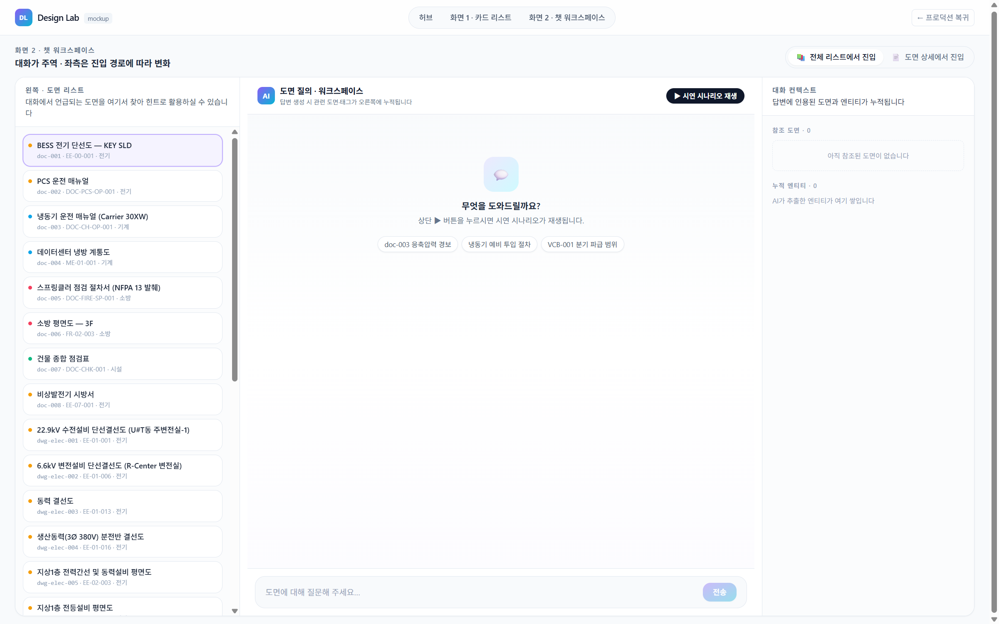
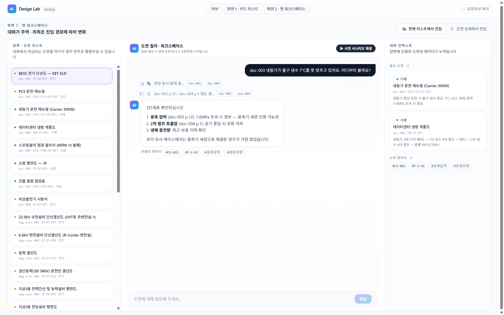

# 화면 · Design Lab 화면 2 · 챗 워크스페이스

**경로**: `/design-lab/chat`
**소속 트랙**: Design Lab (2-트랙)
**화면 분류**: 질의·탐구 중심

---

## 1. 화면 개요



이 화면은 **대화가 주역**인 3분할 워크스페이스입니다. 화면 1("카드형 도면 리스트")이 *무엇이 있는지 훑는* 탐색형이라면, 화면 2는 *이 질문에 답을 얻는* 질의형입니다. 중앙은 언제나 챗 패널로 고정되어 있고, **좌측은 사용자의 진입 경로에 따라 "도면 리스트" 또는 "도면 상세 뷰어" 두 얼굴**로 바뀌며, **우측은 챗의 부산물(답변에 인용된 도면·추출된 엔티티)이 누적**됩니다.

핵심 설계 원칙은 **"대화가 진행될수록 우측이 자동으로 자라난다"**는 것입니다. 사용자는 질문만 던지면 되고, 답변이 참조한 도면과 언급한 엔티티는 시스템이 우측 스택에 쌓아줍니다. 이 스택에서 도면 카드를 클릭하면 **좌측이 해당 도면의 뷰어로 전환**되어, 챗 → 인용 → 상세 확인이라는 **자연스러운 확대 루프**를 한 화면 안에서 완결합니다.

상단 토글로는 **"전체 리스트에서 진입"**과 **"도면 상세에서 진입"** 두 모드를 전환할 수 있어, 두 개의 전형적인 사용자 여정을 한 시연에서 모두 보여줄 수 있습니다.

---

## 2. 레이아웃 구조

```
┌─ LabNav (상단 56px) ───────────────────────────────────────────────────┐
│ [DL] Design Lab · 허브 · 화면 1 · 화면 2 · [← 프로덕션 복귀]          │
├────────────────────────────────────────────────────────────────────────┤
│  화면 2 · 챗 워크스페이스                   [📚 리스트 ↔ 📄 도면] 토글 │
│  대화가 주역 · 좌측은 진입 경로에 따라 변화                            │
├───────────────┬──────────────────────────────────┬─────────────────────┤
│  좌측 360px   │        중앙  (가변 1fr)           │   우측 340px        │
│               │                                   │                     │
│ [library 모드]│  ┌─ AI 헤더 · ▶ 재생 버튼 ──────┐ │ 대화 컨텍스트       │
│ 왼쪽·도면     │  │                               │ │                     │
│ 리스트        │  │  💬 빈 상태 (첫 진입)         │ │ 참조 도면 · N       │
│ 26건 스크롤   │  │  또는                         │ │ ┌─ 도면 카드 ─┐     │
│               │  │  user 말풍선 (우측 정렬)      │ │ │ 공종 배지    │     │
│ [drawing 모드]│  │  🔍 Searching… 한 줄          │ │ │ 제목         │     │
│ 상단 헤더:    │  │  📄 Reading… 한 줄            │ │ │ snippet      │     │
│  공종·제목·   │  │  ✍️ assistant 카드 (좌측)     │ │ └─────────────┘     │
│  도면 셀렉트  │  │      + 추출 엔티티 chip       │ │                     │
│ 큰 썸네일     │  │                               │ │ 누적 엔티티 · N     │
│  + ◀▶        │  └───────────────────────────────┘ │ [#CH-001][#P-2-01]  │
│ 하단: 태그 +  │  ┌─ 입력창 ─────────────────┐   │ [#응축압력]…         │
│  🎯 목적 박스 │  │ 도면에 대해 질문해 주세요│   │                     │
│               │  └───────────────────────────┘   │                     │
└───────────────┴──────────────────────────────────┴─────────────────────┘
```

| 영역 | 너비 | 역할 |
|---|---|---|
| LabNav | 풀폭 · 56px | Design Lab 내 네비 |
| 헤더 + 토글 | 풀폭 · 48px | 진입 모드 전환 및 화면 정체성 |
| 좌측 | 360px 고정 | `source`에 따라 `LeftLibrary` ↔ `LeftDrawing` 교체 |
| 중앙 | 가변 1fr | `WorkspaceChatPanel` (고정) |
| 우측 | 340px 고정 | `ReferenceStack` (참조 도면 + 누적 엔티티) |

3분할 영역 전체는 `rounded-2xl border` 박스로 감싸져 **한 덩어리의 워크스페이스**임을 시각화합니다. 최대 폭은 `max-w-[1600px]`로 화면 1(`1400px`)보다 넓어, **작업 중심 화면**임을 레이아웃으로 암시합니다.

---

## 3. UX 상세 설명

### 3.1 상단 토글 — 두 가지 진입 경로

`SegmentedToggle`로 두 옵션을 제공:

| 토글 | 아이콘 | 의미 | 좌측 패널 |
|---|---|---|---|
| 전체 리스트에서 진입 | 📚 | *"뭘 물어볼지 찾는 중"* 상태 | `LeftLibrary` — 26건 스크롤 리스트 |
| 도면 상세에서 진입 | 📄 | *"이 도면에 대해 묻는 중"* 상태 | `LeftDrawing` — 썸네일 뷰어 + 태그·목적 |

URL 쿼리 파라미터 `?source=library|drawing&id=doc-003`로 **외부에서 특정 모드로 직접 링크**할 수 있어, 화면 1의 인스펙터나 프로덕션의 다른 화면에서 "이 도면으로 질의 시작" 같은 동선을 지원합니다.

### 3.2 좌측 · library 모드 (`LeftLibrary`)

- 상단 헤더: *"대화에서 언급되는 도면을 여기서 찾아 힌트로 활용하실 수 있습니다"* — 이 패널이 **참조용 보조 리스트**임을 명확히
- 각 항목은 작은 라운드 카드로:
  - 좌측 공종 닷(2×2px)
  - 한 줄 제목 (`line-clamp-1`)
  - 회색 메타 라인: `doc-003 · E-02-001 · 기계`
- 선택된 항목은 **보라 테두리 + 연보라 배경 + 보라 ring**
- 총 26건이 세로 스크롤로 조회 가능

이 리스트는 **카드 그리드 대비 정보 밀도가 높은 얇은 행 형태**로, 화면 1의 "썸네일 위주 카드"와 의도적으로 대비됩니다 — 챗 워크스페이스에서는 리스트가 보조이므로 **밀도를 높이는 게 유리**.

### 3.3 좌측 · drawing 모드 (`LeftDrawing`)


하나의 도면을 **작은 상세 뷰어**로 보여주는 3단 구조:

1. **헤더** (그라디언트 + 블러 배경): 공종 배지 · 제목 · `doc_id · drawing_number` · 우상단 도면 셀렉트 박스
2. **본문** (가변 높이): 썸네일 큰 이미지(`object-contain`), 여러 페이지가 있으면 좌우 `◀`·`▶` 원형 버튼
3. **하단** (border-top 회색): 컨텍스트 태그 chip 최대 8개 · 연보라 **🎯 목적 박스**

도면 셀렉트 박스로 다른 도면으로 점프할 수 있지만, 실제 흐름은 **우측 참조 스택의 카드를 눌러 전환**하는 것이 주가 됩니다.

### 3.4 중앙 · `WorkspaceChatPanel`



#### 3.4.1 헤더

- 좌측: 그라디언트 AI 아이콘(`7×7`, violet→cyan) + 타이틀 *"도면 질의 · 워크스페이스"* + 작은 회색 부제 *"답변 생성 시 관련 도면·태그가 오른쪽에 누적됩니다"*
- 우측: **▶ 시연 시나리오 재생** 버튼 (검은 pill, 호버 시 살짝 밝아짐) — 목업의 핵심 연출 트리거

#### 3.4.2 빈 상태

첫 진입 시 중앙이 비어 있을 때:
- 큰 이모지 박스(`💬`) + *"무엇을 도와드릴까요?"* + *"상단 ▶ 버튼을 누르시면 시연 시나리오가 재생됩니다"*
- 세 개의 예시 프롬프트 pill (클릭 불가, 시각적 힌트용): `doc-003 응축압력 경보` · `냉동기 예비 투입 절차` · `VCB-001 분기 파급 범위`

#### 3.4.3 시나리오 재생 — 3단계 스트리밍

▶ 버튼을 누르면 `workspaceChatScenarios` 배열의 4 turn이 600~900ms 간격으로 순차 표시됩니다.

| # | phase | 표현 | 우측 스택 영향 |
|---|---|---|---|
| 1 | — | user 검은 말풍선 (우측 정렬): *"doc-003 냉동기가 출구 냉수 7°C를 못 맞추고 있어요…"* | — |
| 2 | `searching` | 회색 한 줄: **🔍 스피너 + 관련 문서 탐색 중…** + 참조 doc_id chip | — |
| 3 | `reading` | 회색 한 줄: **📄 스피너 + doc-003 p.12 / doc-004 p.1 읽는 중…** | — |
| 4 | `answering` | 흰 카드 말풍선 + AI 아바타 · 3단계 리스트 답변 · 하단 **추출된 엔티티 chip** | **추출 태그가 우측 `ReferenceStack`에 push** → 관련 doc들이 참조 도면에 자동 누적 |

`searching`·`reading` phase는 **"조사 중" 시각 언어**로 표현되어, 답변이 즉시 나오는 게 아니라 **"시스템이 찾고 읽고 답하는 단계를 거치고 있다"**는 인지를 심습니다. 이는 실제 LLM 호출 없이도 **에이전트형 체감**을 재현합니다.

#### 3.4.4 일반 입력창

하단에 `rounded-2xl` 회색 입력 폼. 포커스 시 보라 테두리 + 흰 배경. 제출 버튼은 violet→cyan 그라디언트 pill. 입력 시 **시나리오 재생이 아닌 일반 흐름**이 작동하지만, 목업에서는 안내문만 반환 (*"목업 환경에서는 시나리오 재생 버튼으로만 완성된 응답을 확인하실 수 있습니다"*).

### 3.5 우측 · `ReferenceStack`

두 섹션이 세로로 쌓여 있습니다.

#### 3.5.1 참조 도면 · N

- 답변에 인용된 도면이 **카드 형태로 자동 누적**
- 각 카드는 공종 배지 · 제목(1줄) · `doc_id · drawing_number` · snippet(2줄)
- 호버 시 `-translate-y-0.5`, 보라 테두리, 그림자 — 클릭 가능성 시각화
- **클릭 시** `onDocClick`이 실행되어:
  - 좌측 `source`가 `drawing`으로 **자동 전환**
  - 해당 `doc_id`가 좌측 뷰어에 로드
  - 즉, **"답변에서 언급된 도면을 바로 상세로 확대"** 루프 완성

#### 3.5.2 누적 엔티티 · N

- 답변에서 AI가 추출한 태그가 `TagChip` 형태로 누적
- `Set`으로 중복 제거, 새 대화마다 더해지기만 하고 지워지지 않음
- 빈 상태: *"AI가 추출한 엔티티가 여기 쌓입니다"*

이 섹션은 **대화 세션 동안 점점 늘어나는 지식 메모장** 역할을 합니다. 사용자는 여러 질문을 던지면서 "이번 세션에서 다룬 엔티티 전체"를 한눈에 복기할 수 있습니다.

### 3.6 3분할 간의 양방향 흐름

| 방향 | 트리거 | 결과 |
|---|---|---|
| **중앙 → 우측** | 답변 turn의 `extractedTags`·`referencedDocIds` | 우측 스택에 자동 push |
| **우측 → 좌측** | 참조 도면 카드 클릭 | 좌측이 drawing 모드로 전환, 해당 도면 로드 |
| **좌측 → 중앙** | (현재 목업에서는 직접 연결 없음 — 좌측 도면 선택이 챗 컨텍스트가 되지는 않음) | 추후 확장 포인트 |
| **상단 → 좌측** | 토글 클릭 | library ↔ drawing 교체 |

화면 2는 "좌 → 중 → 우"가 아니라 **중앙을 축으로 좌·우가 각자의 역할**을 하고, **우측 → 좌측 전환**이 유일한 강한 동선이라는 점이 특징입니다.

---

## 4. 이 UX가 만드는 효과

| UX 결정                                     | 사용 경험에서의 변화                                                |
| ----------------------------------------- | ---------------------------------------------------------- |
| 중앙 챗 고정 + 좌/우 보조                          | 사용자의 시선·커서가 **중앙에 머무름** → 질문 흐름을 끊지 않음                     |
| 좌측 패널이 진입 경로로 **모양을 바꿈**                  | "전체 훑으며 질의"와 "이 도면에 대해 질의" 두 서로 다른 심적 모델을 **동일 화면에서 지원**   |
| `searching → reading → answering` 3단 스트리밍 | 답변이 **단발성 출력**이 아니라 **과정**으로 보여, AI가 "실제로 일하고 있다"는 신뢰감     |
| 우측 자동 누적                                  | 사용자가 참조 도면을 따로 북마크하지 않아도 **시스템이 알아서 모아줌** → 인지 부하 감소       |
| 우측 카드 클릭 시 **좌측 모드 자동 전환**                | "답변 속 도면을 열어보고 싶다"는 욕구가 **한 번의 클릭으로 충족**                   |
| 추출 엔티티 chip을 답변 하단 + 우측 양쪽에 노출            | 한 답변의 컨텍스트를 확인할 때는 하단, 세션 전체 엔티티를 볼 때는 우측 — **스코프별 시선 분리** |
| 시나리오 재생 버튼의 **명시적 연출 트리거**                | 목업임을 감추지 않고 *"이렇게 흘러갑니다"*를 시연용으로 재현 가능 — 이해관계자 발표에 강함      |
| `max-w-[1600px]`로 화면 1보다 **넓게**           | 레이아웃만으로 **"이 화면은 작업용"**임을 암시                               |
| 빈 상태 예시 프롬프트 3종                           | 사용자가 "뭘 물을 수 있는지" 감 잡도록 안내 — 백지 화면 공포 회피                   |
| 좌측 drawing 모드의 **🎯 목적 박스**를 하단 고정        | 뷰어·태그·목적이 한 세로 축에 놓여 **도면 한 장에 대한 인지 프레임 완성**              |

---

## 5. 사용자 동작 흐름

### 5.1 library 모드 시연 흐름

| # | 액션 | 결과 | UX 의도 |
|---|---|---|---|
| 1 | `/design-lab/chat`으로 진입 (기본 `source=library`) | 좌측 26건 리스트 · 중앙 빈 상태 · 우측 빈 스택 | 기본 진입은 "탐색 중에 질문" 상태 |
| 2 | ▶ 재생 버튼 클릭 | 중앙이 비워지고 시나리오 재생 시작 | 데모용 완성 응답 |
| 3 | user 말풍선 표시 (0ms) | 검은 말풍선 우측 정렬 | 질문이 시작됨 인지 |
| 4 | 🔍 searching 한 줄 (600ms 후) | 스피너 + 참조 doc_id chip | AI가 탐색 단계 |
| 5 | 📄 reading 한 줄 (600ms 후) | 스피너 + 페이지 번호 | AI가 해당 페이지 읽는 단계 |
| 6 | ✍️ answering 카드 (900ms 후) | 3단계 리스트 답변 + 엔티티 chip | 완성 답변 |
| 7 | 우측 자동 업데이트 | 참조 도면 2건(doc-003·doc-004) + 엔티티 4개(CH-001 등) push | "답변의 컨텍스트를 자동 정리" |
| 8 | 우측 doc-003 카드 클릭 | 좌측이 drawing 모드로 전환, doc-003 썸네일 로드 | 답변 → 상세 확대 루프 |

### 5.2 drawing 모드 시연 흐름

| # | 액션 | 결과 |
|---|---|---|
| 1 | 상단 토글에서 "도면 상세에서 진입" 클릭 | 좌측이 `LeftDrawing`으로 전환, 기본 `doc-001` 로드 |
| 2 | 좌측 셀렉트 박스에서 doc-003 선택 | 썸네일·태그·목적 박스 교체 |
| 3 | 좌측 ◀▶로 페이지 탐색 | 여러 썸네일 순회 |
| 4 | ▶ 재생 버튼 | library 모드와 동일한 3단 스트리밍 재생 |
| 5 | 답변 완료 후 우측 카드 클릭 | 좌측이 다른 도면으로 바뀜 — 한 세션 안에서 **여러 도면 넘나들기** |

### 5.3 외부 딥링크

- `/design-lab/chat?source=drawing&id=doc-003` — 특정 도면 상세 상태로 바로 진입
- 화면 1 인스펙터 또는 프로덕션에서 **"이 도면에 대해 AI에게 질의"** 버튼으로 연결 상정

---

## 6. 데이터·API 의존성

### 원천 데이터

- `data/drawings.json` — 26건 도면 메타 (좌측 리스트와 우측 참조 카드가 공용)
- `data/doc-entity-links.json` — 태그 → 도면 매핑 (우측 누적 태그로부터 관련 도면 역산)

### 목업 메타 시드

- `src/lib/design-lab/mock-meta.ts`
  - `workspaceChatScenarios` — 4 turn 시나리오 (user → searching → reading → answering)
  - `docMockMeta` — 좌측 drawing 모드의 `metaFor(doc_id)`가 반환하는 purpose·conversationSummary·ontology·thumbnails
  - `thumbsFor(doc_id, discipline, drawing_ref)` — 썸네일 폴백

### 참조하는 lib

- `@/lib/data-loader` — `documents`, `docById`, `tagsForDoc`
- `@/lib/types` — `DocSnippet`
- `@/lib/design-lab/mock-meta` — `thumbsFor`, `metaFor`, `workspaceChatScenarios`, `ChatTurn`

### 사용하는 컴포넌트

- `@/components/design-lab/shared` — `DisciplineBadge`, `SegmentedToggle`, `TagChip`, `disciplineDot`, `disciplineLabelKo`, `disciplineGradient`
- `@/components/design-lab/chat` — `WorkspaceChatPanel`, `ReferenceStack`

### 실제 LLM 호출 여부

**없음**. 시나리오 재생은 `setTimeout` 기반 지연 + 정적 turn 배열 순회입니다. 사용자 자유 입력은 *"목업 환경에서는 시나리오 재생 버튼으로만…"* 안내만 반환합니다. 실 서비스 연결 시:
- 사용자 질문 → 문서 검색(벡터·키워드 하이브리드) → LLM 답변 생성
- 답변 스트리밍 중 단계별(searching/reading/answering) 상태 이벤트
- 답변에서 인용 문서와 엔티티를 추출해 우측 스택 갱신

모두 백엔드·LLM 오케스트레이션이 필요한 영역입니다.

---

## 7. 이 화면이 기여하는 서비스 측면

| DKS 서비스 측면 | 이 화면이 맡는 역할 |
|---|---|
| **자연어 질의 응답** (서비스 2 핵심) | 대화 중심 인터페이스의 **실현 가능성 시연** — 도면 지식을 키워드가 아닌 질문으로 꺼내기 |
| **답변의 출처 투명성** | `referencedDocIds`와 페이지 번호가 **답변과 함께 노출**되어, 사용자가 답변의 근거를 도면으로 확인 가능 |
| **컨텍스트 누적** | 우측 스택은 "세션 동안 무엇을 다뤘나"를 암묵적으로 기록 — **장기 대화의 기억 장치** |
| **답변 → 상세 확대 루프** | 우측 도면 클릭 → 좌측 뷰어 전환은 **답변과 원본 도면을 같은 화면에서** 비교 가능 |
| **두 진입 경로의 대등한 지원** | library 모드와 drawing 모드 토글로, **탐색 중 질의**와 **상세 속 질의** 두 시나리오를 하나의 UX로 통합 |
| **에이전트형 체감** | searching·reading·answering 3단 연출은 단발 Q&A가 아닌 **"도면을 탐색하고 읽고 답하는 에이전트"** 이미지 구축 |
| **엔티티 기반 지식 연결** | 누적 엔티티 chip은 향후 **"이 엔티티와 연결된 도면 전체 보기"**로 확장 가능한 단초 |

**이 화면이 해결하지 않는 것**:
- 실제 LLM 연결과 검색 품질 (백엔드 영역)
- 답변 정확도 평가·피드백 루프 (별도 평가 화면 필요)
- 대화 세션 저장·공유 (세션 ID·히스토리 관리 필요)
- 여러 사용자의 동일 질문 패턴 학습

---

## 8. 의견 수렴 포인트

### 스스로 본 보완 포인트

- **시연 시나리오 1종 고정**: `workspaceChatScenarios`는 현재 doc-003 냉동기 케이스 하나뿐 — 이해관계자가 "다른 공종은?"이라 물으면 전기·소방 시나리오 추가 필요
- **자유 입력 비활성 안내**: 목업임을 솔직히 밝히지만, 이해관계자에 따라 "그럼 실사용과 다르지 않나"는 우려 — 향후 **가벼운 키워드 매칭 fallback** 정도는 반응이 있어야 할 수 있음
- **좌측 library ↔ 중앙 챗 연결 부재**: 좌측에서 도면을 선택해도 챗은 아무 반응이 없음 — 선택된 도면을 **암묵적 컨텍스트**로 챗에 주입하는 연동 검토
- **우측 스택 초기화 UI 부재**: 누적 도면·엔티티가 계속 쌓이기만 하고 세션 리셋 버튼이 없음 — "대화 세션 새로 시작" 액션 필요
- **추출 엔티티의 상세 정보 부재**: chip을 클릭해도 동작 없음 — 엔티티 카드 열기 또는 "이 엔티티 관련 도면 전체" 라우팅 필요
- **모바일 레이아웃**: `grid-cols-[360px_1fr_340px]`는 **최소 1100px 이상** 가로폭 전제. 태블릿·모바일에서는 좌·우 패널을 **sheet(drawer)** 형태로 교체해야 함
- **시나리오 재생의 재생성 회귀**: 재생 도중 재생 버튼을 다시 눌러도 무시되지만, 외부에서 토글이 바뀌면 재생이 일시 끊길 수 있음 (state cleanup 확인 필요)
- **drawing 모드의 도면 셀렉트 박스**: 26건 전체가 한 셀렉트에 들어가 있어 찾기 어려움 — 검색 입력 또는 공종별 그룹화 필요
- **참조 도면의 중복 누적**: 여러 답변에 같은 도면이 인용되면 `Set`으로 de-dup되지만, **"몇 번 인용되었는가" 뱃지**가 없어 중요도가 안 드러남
- **좌측 drawing 모드 썸네일 개수 제한 부재**: `thumbs.length`가 많으면 ◀▶만으로는 느림 — 페이지 인디케이터·점프 필요

### 이해관계자 의견 기록란

<!-- 아래에 자유롭게 덧붙여 주십시오. 형식: `- **YYYY-MM-DD · 이름**: 의견` -->

-

---

## 9. 파일 레퍼런스

| 유형 | 경로 |
|---|---|
| 페이지 | `src/app/design-lab/chat/page.tsx` |
| 중앙 챗 패널 | `src/components/design-lab/chat.tsx` (`WorkspaceChatPanel`) |
| 우측 스택 | `src/components/design-lab/chat.tsx` (`ReferenceStack`) |
| 공용 컴포넌트 | `src/components/design-lab/shared.tsx` (`DisciplineBadge`, `SegmentedToggle`, `TagChip`, `disciplineDot`·`disciplineLabelKo`·`disciplineGradient`) |
| 목업 메타·시나리오 | `src/lib/design-lab/mock-meta.ts` (`workspaceChatScenarios`, `docMockMeta`, `thumbsFor`, `metaFor`) |
| 데이터 로더 | `src/lib/data-loader.ts` (`documents`, `docById`, `tagsForDoc`) |
| 타입 | `src/lib/types.ts` (`DocSnippet`) |
| Design Lab 레이아웃 | `src/app/design-lab/layout.tsx` |
| 전역 스타일 | `src/app/globals.css` |

**관련 화면**: [화면 1 · 카드형 도면 리스트](./02-cards.md) · [허브](./01-hub.md) · [트랙 개요](./00-overview.md)
