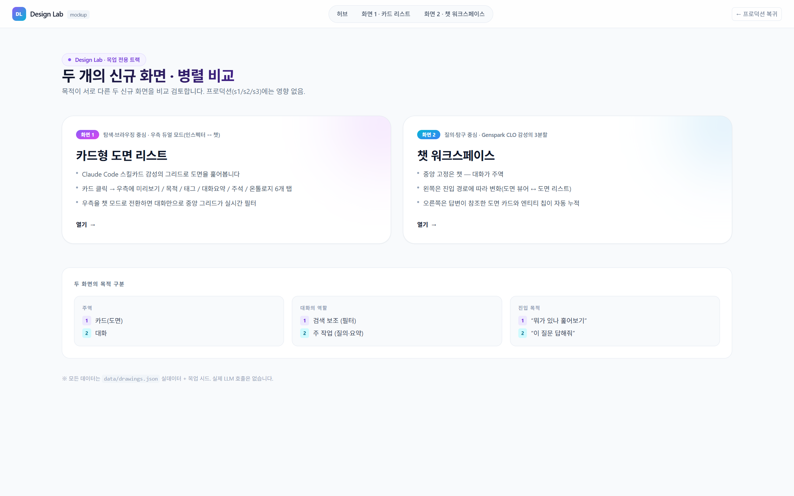
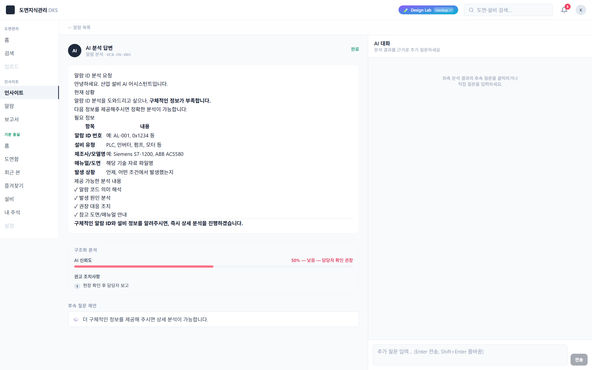
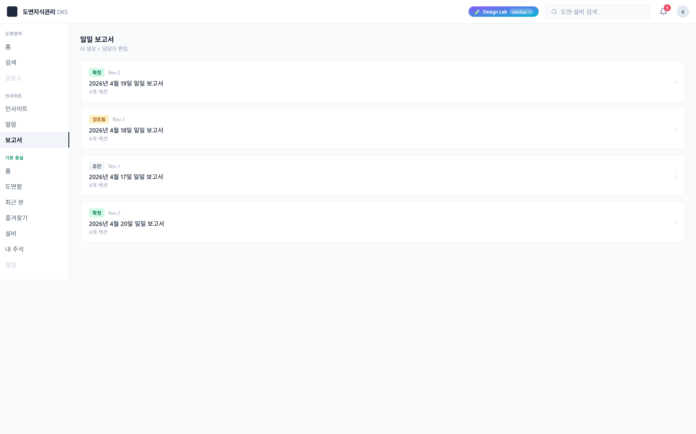

# DKS 목업 보고서 — UX 설명 및 의견 수렴

## 이 보고서의 목적

DKS 프로젝트에 존재하는 두 개의 목업 트랙(Insight Lab · Design Lab)을 한 장소에 정리한 문서 묶음입니다. 결재 설득이 아니라 **이 소프트웨어의 UX를 상세히 설명하고, 각 구성이 어떤 효과를 내며 어떤 서비스 측면을 위해 배치됐는지**를 이해관계자가 읽고 **자신의 관점에서 의견을 덧붙이도록** 설계되어 있습니다.

이 문서가 안정화되면, 그대로 **개발 착수용(FRS/NFR)** 문서로 이어집니다.

## 화면 갤러리 (전체 11화면 스크린샷)

### Design Lab (3화면)

| 허브 | 화면 1 · 카드 리스트 | 화면 2 · 챗 워크스페이스 |
|---|---|---|
|  |  |  |

### Insight Lab (8화면)

| 허브 | 알람 목록 | 알람 드로어 | 답변 상세 |
|---|---|---|---|
|  |  |  |  |

| AI 챗 | 통계×온톨로지 Lab | 보고서 목록 | 보고서 상세 |
|---|---|---|---|
|  |  |  |  |

| 근본원인 그래프 | | | |
|---|---|---|---|
|  | | | |

스크린샷은 Chrome DevTools(1600×1000)로 촬영. 상세 상태별 캡쳐는 각 화면 문서 내부에서 확인하실 수 있습니다.

---

## 전체 지도

| 번호 | 문서 | 1줄 요약 |
|---|---|---|
| 00 | [00-executive-summary.md](./00-executive-summary.md) | 두 트랙의 전체 그림과 읽는 방향 |
| 01 | [01-insight-lab/00-overview.md](./01-insight-lab/00-overview.md) | Insight Lab 트랙 개요 (8화면) |
| 01.1 | [01-hub.md](./01-insight-lab/01-hub.md) | `/insight` 홈 |
| 01.2 | [02-alarms.md](./01-insight-lab/02-alarms.md) | `/insight/alarms` 알람 목록 |
| 01.3 | [03-answers-detail.md](./01-insight-lab/03-answers-detail.md) | `/insight/answers/[id]` 알람 분석 상세 |
| 01.4 | [04-chat.md](./01-insight-lab/04-chat.md) | `/insight/chat` AI 자유 질의 |
| 01.5 | [05-lab.md](./01-insight-lab/05-lab.md) | `/insight/lab` 통계×온톨로지 Bundle |
| 01.6 | [06-reports-list.md](./01-insight-lab/06-reports-list.md) | `/insight/reports` 일일 보고서 목록 |
| 01.7 | [07-reports-detail.md](./01-insight-lab/07-reports-detail.md) | `/insight/reports/[id]` 보고서 상세·편집 |
| 01.8 | [08-root-cause.md](./01-insight-lab/08-root-cause.md) | `/insight/root-cause/[id]` 근본원인 그래프 |
| 02 | [02-design-lab/00-overview.md](./02-design-lab/00-overview.md) | Design Lab 트랙 개요 (3화면) |
| 02.1 | [01-hub.md](./02-design-lab/01-hub.md) | `/design-lab` 허브 |
| 02.2 | [02-cards.md](./02-design-lab/02-cards.md) | `/design-lab/cards` 카드형 리스트 (화면 1) |
| 02.3 | [03-chat.md](./02-design-lab/03-chat.md) | `/design-lab/chat` 챗 워크스페이스 (화면 2) |
| 03 | [03-comparison-matrix.md](./03-comparison-matrix.md) | 두 트랙의 UX 축 비교 |
| 04 | [04-non-functional-requirements.md](./04-non-functional-requirements.md) | 성능·접근성·권한 등 비기능 |
| 05 | [05-frs-seed.md](./05-frs-seed.md) | 개발 착수용 FRS 시드 |

## 읽는 순서

처음 읽으실 때:

1. **[00-executive-summary.md](./00-executive-summary.md)** — 두 트랙이 왜 존재하는지 먼저 파악
2. 관심 있는 트랙의 `00-overview.md`
3. 각 화면 문서는 1~8 순서를 따르셔도 되고, 관심 있는 순서대로 읽으셔도 됩니다 — **서로 독립적으로 이해 가능**하게 작성되어 있습니다
4. [03-comparison-matrix.md](./03-comparison-matrix.md)로 두 트랙을 대조
5. [04-non-functional-requirements.md](./04-non-functional-requirements.md)·[05-frs-seed.md](./05-frs-seed.md)는 실제 개발 시 참고

## 의견을 주시는 방법

모든 화면 문서 끝에 **§8 의견 수렴 포인트** 섹션이 있습니다. 하위에 두 영역이 있습니다.

- **스스로 본 보완 포인트** — 작성자(팀) 관점에서 현재 보이는 이슈·미결 사항
- **이해관계자 의견 기록란(비워둠)** — 이름·날짜·의견을 마크다운에 직접 덧붙이시면 됩니다

예시 형식:
```
### 이해관계자 의견
- **2026-04-23 · 홍길동**: 카드 썸네일이 너무 작아 현장에서 식별이 어렵다. 4:3 대신 1:1 정사각형 제안.
- **2026-04-24 · 김철수**: 우측 "대화로 찾기"가 기본 모드여야 하지 않을까. 검색이 더 자주 쓰이는 조작.
```

문서 외 채널로도 의견을 주실 수 있습니다 — 수합 후 해당 §8에 반영합니다.

## 관련 코드·데이터 경로

| 대상 | 절대경로 |
|---|---|
| 프로젝트 루트 | `D:\_Project\prototype-도면지식관리-mvp\` |
| 프로젝트 가이드 | [`CLAUDE.md`](../../CLAUDE.md) |
| 4주 업그레이드 상태 | [`docs/upgrade-plan/STATUS.md`](../upgrade-plan/STATUS.md) |
| 보존 6항목 (수정 금지) | [`docs/baseline-mvp/07-quirks-and-todo.md`](../baseline-mvp/07-quirks-and-todo.md) |
| Insight Lab 코드 | `src/app/(s2)/insight/*` |
| Design Lab 코드 | `src/app/design-lab/*` |
| 공통 Shell | `src/components/shell/*` |

## 버전

| 날짜 | 변경 |
|---|---|
| 2026-04-22 | 최초 작성 — 11개 화면 상세 + 최상위 4개 문서 |
