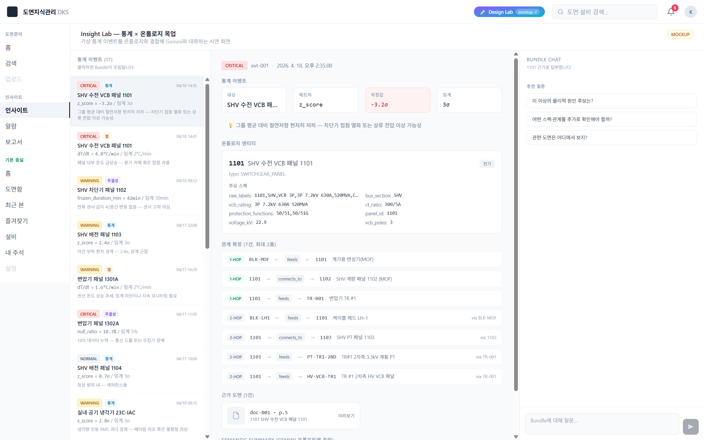
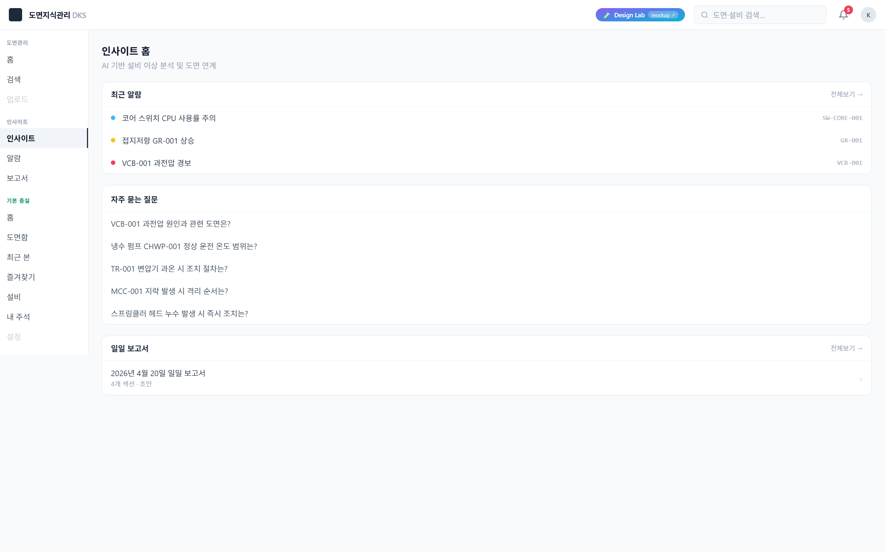
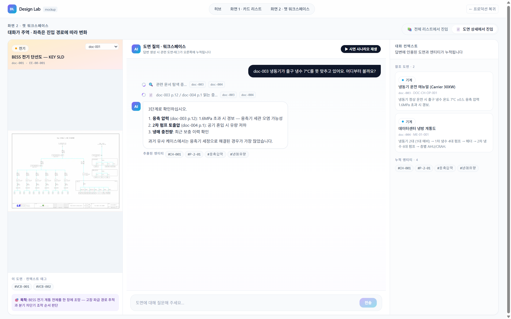
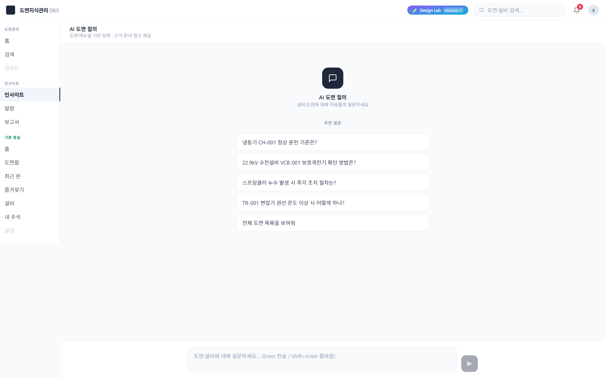

 
<!-- _class: cover -->

# DKS
## 도면 위에 지식을 더하다

공장 · 데이터센터 · 빌딩 설비 운영을 위한  
**설비 지식 관리 플랫폼**

*2026 — Preview*

<!--
발표자 노트:
- "Preview" 표기는 의도적. 확정 제품이 아닌 파일럿 단계임을 자연스럽게 내포.
- 첫 슬라이드에서 회사명/로고 추가 필요 시 상단 또는 하단에 삽입.
-->

---

# 지금 이 문제, 익숙하지 않으신가요?

| # | 현장에서 일어나는 일 |
|---|---|
| 1 | 도면은 있는데, **최신인지 모른다** |
| 2 | 설비를 바꿨는데, **누가 영향받는지 모른다** |
| 3 | 매주 같은 보고서를 **처음부터 다시 쓴다** |
| 4 | 낯선 알람이 울려도 **30초 안에 파악이 안 된다** |
| 5 | AI 챗봇에게 물어봤더니, **우리 현장을 몰랐다** |

<!--
발표자 노트:
- 5번 항목에서 고객 반응을 체크할 것. "우리도 그랬어요"가 나오면 진도가 빠름.
- "일반 AI"는 ChatGPT·Claude 등을 직접 언급하지 말고 구두로도 "일반 AI"로 표현.
- 항목 순서는 경중이 아닌 공감 빌드업 순서임.
-->

---

# 기존 도구들이 해결 못 하는 이유

| 도구 | 잘하는 것 | 연결되지 않는 공백 |
|---|---|---|
| EDMS / 문서관리 | 파일 저장 | 도면의 **"의미"** 를 모름 |
| CMMS / 설비관리 | 이력 관리 | 설비 간 **"관계"** 를 모름 |
| FMS / 통합시설 | 통합 관리 | 구축 6~18개월, 비용 폭증 |
| 일반 AI | 방대한 지식 | **현장 맥락 없어** 신뢰 불가 |

<!--
발표자 노트:
- "기존 시스템이 나쁘다"는 표현 절대 금지. "각자의 역할이 있지만, 연결되지 않는 공백이 있다"는 프레이밍 유지.
- 고객이 이미 CMMS 있다고 하면: "교체가 아닌 연결입니다. CMMS 이력을 도면 맥락과 연결합니다."
- FMS 도입 검토 중이라면: 구축 기간·비용 비교 포인트로 전환 가능.
-->

---

# DKS는 기존 시스템을 교체하지 않습니다

> **도면(PDF) → 설비 지식 그래프 → 현장 맥락을 가진 AI**

기존 시스템 위에 **맥락 레이어**를 추가합니다.  
교체 없이. **파일럿 기준 4~8주 안에.**

**무엇이 가능해지는가**

- 설비 간 관계를 자동으로 파악
- 변경 영향 범위를 즉시 추적
- 현장을 아는 AI와 대화

<!--
발표자 노트:
- "4~8주"는 반드시 "파일럿 기준"임을 구두로 부연.
- "맥락 레이어"가 낯설면: "기존 CMMS 위에 지도 레이어를 얹는 것" 비유 활용.
- 이 슬라이드가 DKS 전체 포지셔닝의 핵심. 천천히 읽힐 수 있도록 발표 속도 조절.
-->

---

# 도면 PDF에서 설비 지식 그래프까지

**Step 1 — 도면 업로드**
기존 PDF 도면 그대로 → 별도 변환 없음

**Step 2 — AI 자동 분석**
설비명, 연결관계, 태그 자동 추출·구조화
*(현재 파일럿 기준: 기계 90+종 · 전기 280+종 인식)*

**Step 3 — 설비 지식 그래프 완성**
검색 · 인사이트 · AI 대화 모두 이 그래프 위에서 동작

<!--
발표자 노트:
- 숫자(90+, 280+)는 현재 파일럿 환경 기준. 도면 품질·언어에 따라 다를 수 있음.
- 기술 용어 질문 나오면: "내부적으로 지식 그래프 구조를 씁니다" 수준으로만 답변.
- 오른쪽 이미지는 실제 도면에서 추출된 설비·통계 화면.
-->

---

# Insight Lab — 운영 현장의 질문에 즉시 답하다

- 알람 발생 → 관련 설비·이력 자동 연결 *(30초 이내 파악을 목표로 설계)*
- 일일 보고서 **초안 자동 생성** → 담당자 검토·수정
- AI에게 현장 질문 → 도면·이력 기반 답변
- 근본원인 그래프로 연쇄 영향 시각화

<!--
발표자 노트:
- "30초"는 목표 설계값. 현장 조건에 따라 달라질 수 있음. "목표로 설계" 표현 유지.
- "보고서 자동 생성"이 아닌 "초안 생성 + 담당자 검토" 구조임을 강조.
- 우측 화면 이미지: 알람·질문·보고서 3개 진입점이 한 눈에 보이는 허브 화면.
-->

---

# Insight Lab — 화면으로 보기

 

*알람 발생 즉시 관련 설비 정보 자동 연결* &nbsp;&nbsp;&nbsp;&nbsp;&nbsp; *보고서 초안 자동 생성, 담당자 검토·수정*

<!--
발표자 노트:
- 왼쪽: 알람 클릭 시 설비 정보·현재값·임계값·출처가 즉시 나타나는 드로어 화면.
- 오른쪽: AI가 초안을 작성하고 담당자가 섹션별로 수정하는 보고서 편집 화면.
- 질문: "이게 실제로 작동하나요?" → "현재 파일럿 환경에서 검증 중인 화면입니다.
  귀사 도면으로 직접 시연해 드릴 수 있습니다."
-->

---

# Design Lab — 도면을 파일이 아닌 지식으로 관리하다

- 도면별 설비 태그·목적·요약 자동 생성
- 필터로 원하는 도면 즉시 탐색
- 도면 선택 후 AI에게 직접 질문

*예: "이 계통도에서 냉각수 펌프의 백업 경로는?"*

<!--
발표자 노트:
- 자동 생성 태그·요약의 정확도는 도면 품질에 의존. 질문 시 솔직하게 언급.
- "Design Lab은 도면 관리 담당자, Insight Lab은 현장 운영 담당자"로 역할 구분 설명 가능.
- 카드 그리드: 표 형식 대신 썸네일로 도면을 훑어보는 경험.
-->

---

# Design Lab — 화면으로 보기

 

*도면 카드에서 설비 구조 한눈에 파악* &nbsp;&nbsp;&nbsp;&nbsp;&nbsp;&nbsp;&nbsp;&nbsp; *도면 보면서 바로 AI에게 질문*

<!--
발표자 노트:
- 왼쪽: 도면 카드의 "온톨로지 탭" — 이 도면에 어떤 설비들이 어떻게 연결되어 있는지.
- 오른쪽: 도면을 왼쪽에 띄워놓고 오른쪽 AI와 대화하는 워크스페이스.
- Slide 07과 동일 원칙: "파일럿 환경 검증 중" 답변 준비.
-->

---

# 파일럿 기준 4~8주로 시작하는 방법

| 기간 | 활동 |
|---|---|
| Week 1–2 | 기존 PDF 도면 업로드 → 설비 지식 그래프 초안 생성 |
| Week 3–4 | 현장 담당자와 함께 핵심 시나리오 검증 |
| Week 5–8 | 피드백 반영 → 전사 확장 또는 집중 영역 결정 |

> **파일럿 종료 후 도입 여부는 고객이 결정합니다.**

별도 인프라 구축 없음 &nbsp;·&nbsp; 기존 시스템 교체 없음

<!--
발표자 노트:
- "고객이 결정" 문구는 신뢰 구축의 핵심. 판매 압박하지 말 것.
- 인프라 조건 질문: "클라우드 환경에서 운영하며, 온프레미스 옵션은 파일럿 후 논의 가능"
- 파일럿 비용 질문: 이 자리에서 답변 금지. "파일럿 논의 시 개별 협의"로 유도.
-->

---

# 이런 환경이라면 파일럿에 적합합니다

- ☐&nbsp; PDF 또는 CAD 도면이 100장 이상 있다
- ☐&nbsp; 설비 변경 이력을 체계적으로 추적하지 못하고 있다
- ☐&nbsp; 현장 담당자가 알람·보고서에 반복적으로 시간을 쓴다
- ☐&nbsp; 기존 시스템에 도면은 있지만 **"의미"** 는 없다
- ☐&nbsp; AI를 도입하고 싶지만 현장 맥락 없는 AI가 걱정이다

**3개 이상 해당 → 파일럿 논의 가치 있습니다**

<!--
발표자 노트:
- 고객에게 직접 손들어 보라고 해도 좋음.
- 5개 모두 해당 → 높은 우선순위 파이프라인.
- 3개 미만 → 어떤 항목이 해당하는지 대화로 파악 후 집중 시나리오 조정.
-->

---

# 다음 미팅에서 함께 확인할 수 있습니다

> **귀사 도면 1~2장으로 직접 시연해 드립니다.**

**다음 미팅에서 할 수 있는 것**

- 실제 도면 샘플로 설비 지식 그래프 추출 시연
- 귀사 현장 시나리오에 맞춘 기능 확인
- 파일럿 범위·일정·조건 논의

---

*연락처: &nbsp;[담당자명] &nbsp;/&nbsp; [이메일] &nbsp;/&nbsp; [전화]*

<!--
발표자 노트:
- 가격, SLA, 라이선스 조건은 이 자리에서 답변 금지. "파일럿 논의 시 개별 협의"로 유도.
- "도면 1~2장 시연"은 가장 강력한 클로저. 사전에 샘플 시연 환경 준비 필수.
- 빈 챗 화면 이미지 = "여기에 귀사 데이터를 채울 수 있다"는 여백의 메시지.
-->
