# DKS 도면지식관리 시스템 — 시연 발표 스크립트

> 대상: 현장 사용자 / 영업 임원  
> 소요 시간: 약 20분  
> 서버: `npm run dev` → http://localhost:3000  
> 캡쳐 이미지: `docs/test-records/screenshots/`

---

## 여는 말 (1분)

> "현장에서 설비 정보가 필요할 때, 어디서 찾으시나요?
> 도면 PDF를 열어서 페이지를 넘기거나, 전임자한테 전화하거나, 엑셀 대장을 뒤지시죠.
> DKS는 그 모든 걸 한 곳에 모아서 자연어로 물어볼 수 있게 만든 지식 엔진입니다.
> 오늘은 기계, 전기, 소방, 안전 — 4명의 담당자 입장에서 각각 어떻게 쓸 수 있는지 보여드리겠습니다."

---

## 1. 메인 랜딩 — 페르소나 선택 (1분)

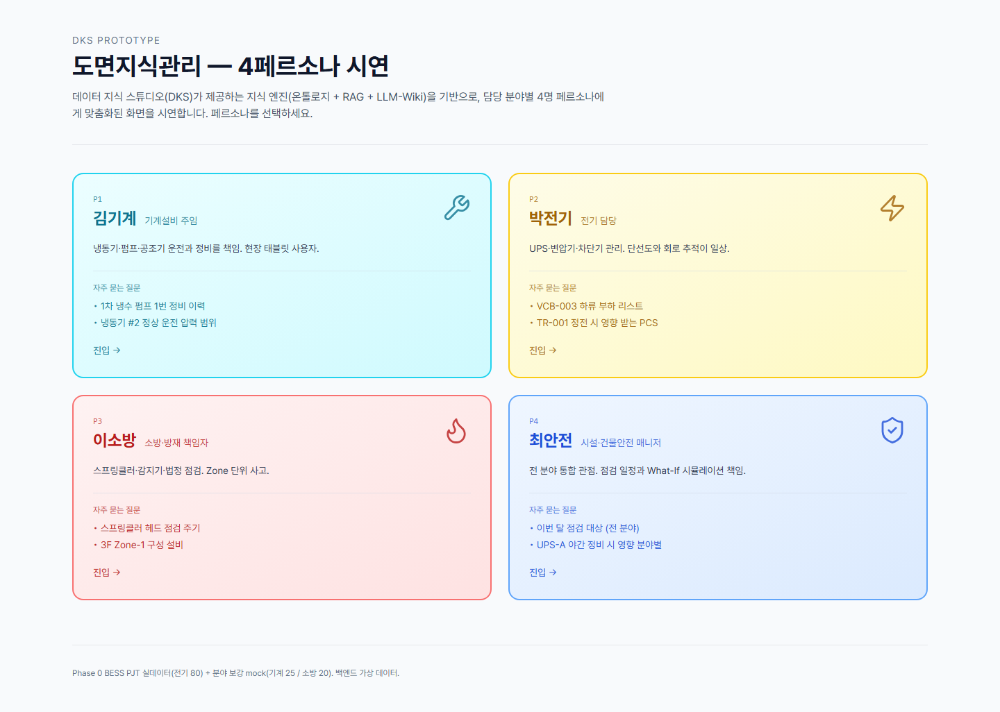

**설명 멘트:**
> "시스템에 들어오면 이 화면이 나옵니다.
> 왼쪽 위부터 기계 담당 김기계, 전기 담당 박전기, 소방 책임자 이소방, 시설안전 매니저 최안전.
> 각자의 역할에 맞게 화면이 완전히 다르게 구성됩니다.
> 같은 데이터를 보지만, 보여주는 방식은 각 담당자가 가장 필요한 형태로 맞춰져 있습니다.
> 헤더 오른쪽에 있는 버튼으로 어느 페르소나에서든 다른 담당자 화면으로 바로 전환도 됩니다."

**포인트:**
- 상단 오른쪽 P1~P4 스위처 버튼 짚어줄 것
- 각 카드 하단에 "자주 묻는 질문" 예시가 있음을 설명

---

## 2. P1 기계 담당 — 김기계 (5분)

### 2-1. 대시보드

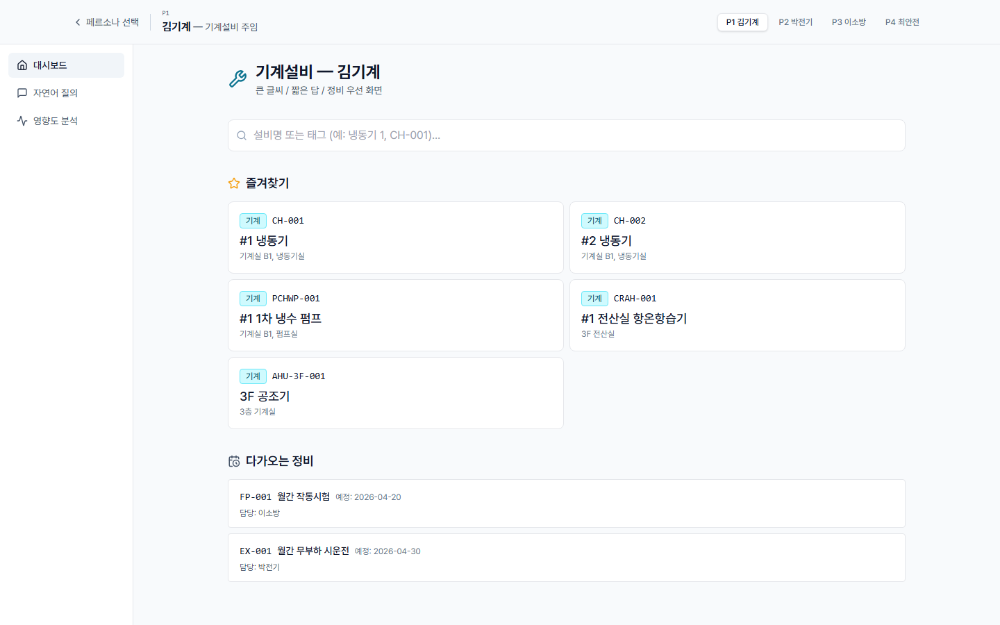

**설명 멘트:**
> "기계 담당자 김기계 화면입니다.
> '큰 글씨, 짧은 답, 정비 우선'이 이 화면의 설계 원칙입니다.
> 현장에서 장갑 끼고 폰으로 봐도 읽을 수 있도록 글씨가 큽니다.
> 위에는 즐겨찾기 설비 5개가 바로 보이고,
> 아래에는 오늘 기준으로 앞으로 30일 안에 예정된 정비 일정이 자동으로 올라옵니다.
> 날짜를 코드에 박아넣은 게 아니라 오늘 날짜 기준으로 항상 최신 일정이 나옵니다."

**포인트:**
- FP-001 월간 작동시험 2026-04-20, EX-001 2026-04-30 항목 짚어줄 것

---

### 2-2. 설비 검색

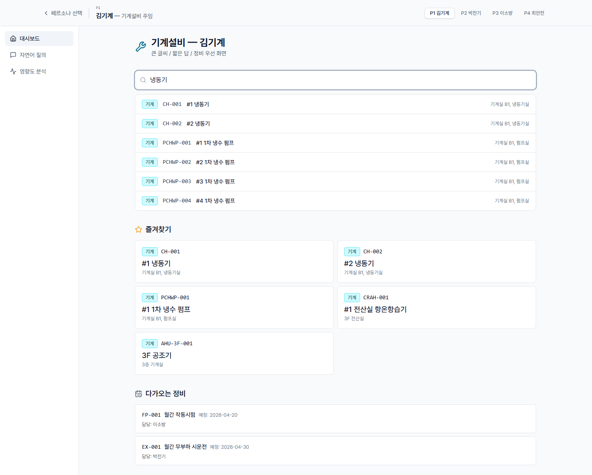

**설명 멘트:**
> "검색창에 '냉동기'라고 입력했더니 CH-001, CH-002와 관련 펌프들이 즉시 나옵니다.
> 태그 번호를 몰라도 설비명이나 위치로 검색이 됩니다.
> 입력할 때마다 서버를 치는 게 아니라 타이핑을 멈추고 0.3초 후에 한 번만 검색합니다.
> 빠르게 타이핑해도 화면이 깜빡이지 않습니다."

---

### 2-3. 설비 상세 — CH-001 냉동기

#### 속성 탭
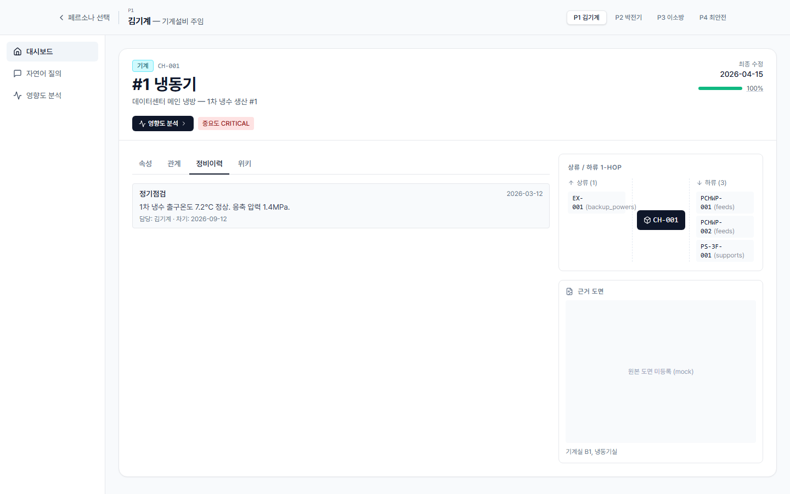

**설명 멘트:**
> "냉동기 CH-001을 클릭하면 이 화면이 나옵니다.
> 헤더에 뱃지가 없죠 — 이 설비는 담당자가 이미 데이터를 검토 완료한 설비입니다.
> 오른쪽 상단 100% 초록 바는 AI 추출 신뢰도입니다.
> 중요도 CRITICAL — 이 설비가 멈추면 큰일 납니다.
> 탭이 4개 있습니다: 속성, 관계, 정비이력, 위키."

---

#### 관계 탭
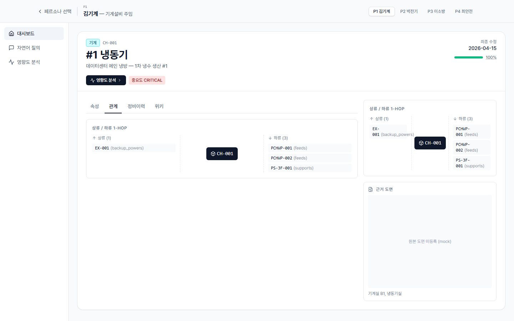

**설명 멘트:**
> "관계 탭을 누르면 이 설비가 어디에서 전력을 받고, 어떤 설비로 냉수를 보내는지 1-hop으로 바로 보입니다.
> 상류에 EX-001 비상발전기 — 냉동기가 비상전원을 받는다는 의미입니다.
> 하류에 PCHWP-001, 002 냉수 펌프와 3F 전산실 — 냉동기가 멈추면 이 설비들이 영향을 받습니다.
> 각 항목을 클릭하면 그 설비 상세 페이지로 바로 이동합니다."

---

#### 정비이력 탭

**설명 멘트:**
> "정비이력 탭입니다.
> 지난 3월 정기점검에서 1차 냉수 출구온도 7.2도 정상, 응축압력 1.4MPa — 구체적인 수치가 기록되어 있습니다.
> 담당: 김기계, 차기 점검 예정일 2026년 9월 12일.
> 전임자가 퇴사해도 이 기록이 남아 있으면 다음 담당자가 바로 파악할 수 있습니다."

---

#### 위키 탭
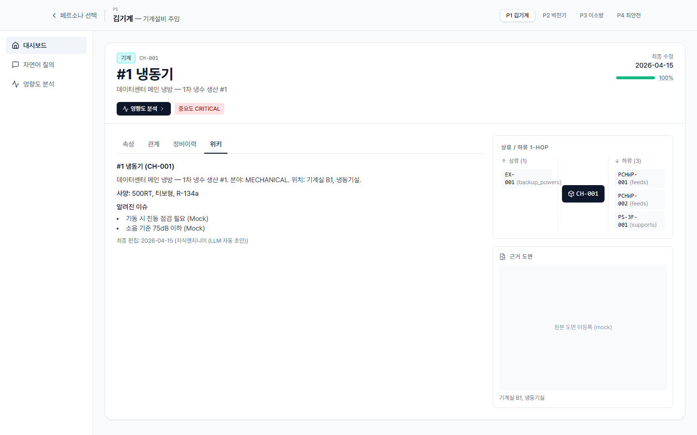

**설명 멘트:**
> "위키 탭은 LLM이 도면과 문서를 읽고 자동으로 생성한 설비 요약입니다.
> 사양 500RT, 티보형, R-134a.
> 알려진 이슈 — '기동 시 진동 점검 필요', '소음 기준 75dB 이하'.
> 아직 Mock 데이터라고 표시되어 있는데, 실제 도면과 시방서가 연결되면 훨씬 상세해집니다."

---

#### 신뢰도 툴팁

**설명 멘트:**
> "오른쪽 상단 100% 숫자에 마우스를 올리면 이렇게 설명이 나옵니다.
> 'AI 추출 신뢰도: LLM 추론 + 근거 문서 수 기반 산출. 80% 이상은 신뢰, 60~80%는 주의, 60% 미만은 반드시 직접 확인.'
> 숫자만 있으면 무슨 의미인지 모르는데, 이렇게 기준을 함께 보여줍니다."

---

### 2-4. 영향도 분석 — 체인 뷰

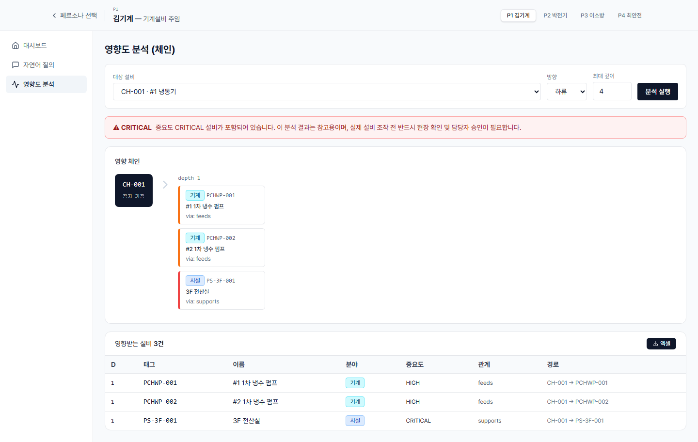

**설명 멘트:**
> "이게 이 시스템의 핵심 기능입니다.
> '냉동기 CH-001을 정지시키면 무엇이 멈추는가?'를 즉시 계산해줍니다.
> 상단에 빨간 경고 배너가 보이시죠 — CRITICAL 설비가 포함되어 있으니 실제 조작 전에 반드시 현장 확인하라는 안전 경고입니다.
> 체인을 보면 CH-001이 정지 가정이고 → depth 1에서 PCHWP-001, PCHWP-002 냉수 펌프 2대와 3F 전산실이 영향을 받습니다.
> 왼쪽 테두리 색이 주황이면 HIGH, 빨강이면 CRITICAL입니다.
> 아래 테이블에는 depth, 분야, 중요도, 경로가 정리되어 있고 엑셀로 내보내기 할 수 있습니다."

**포인트:**
- 하단 "엑셀" 버튼 클릭 시 "출처·주의" 시트도 함께 저장됨을 언급

---

### 2-5. 자연어 질의 — Chat

#### 답변 화면
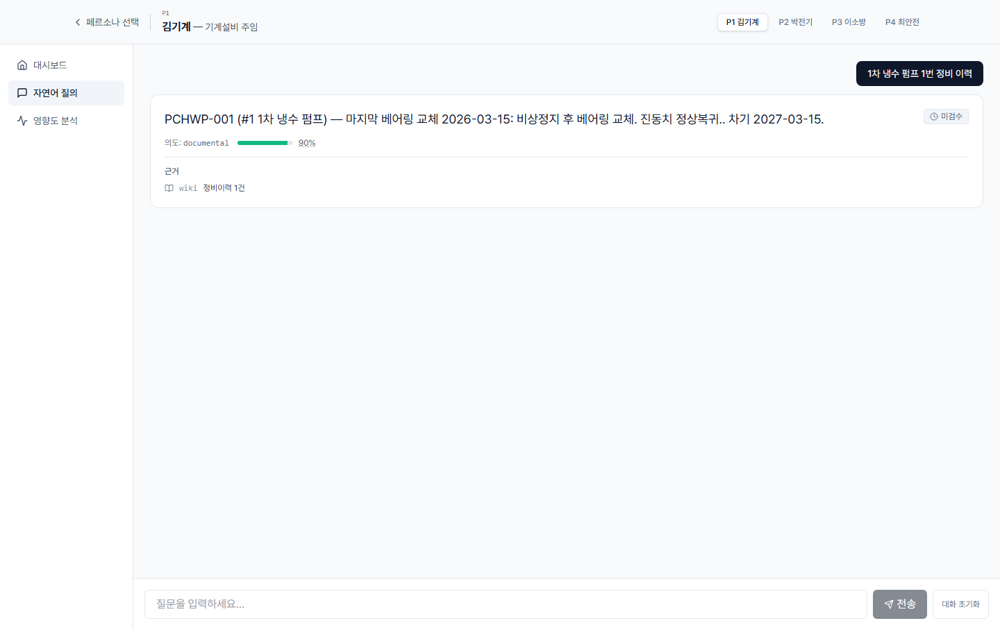

**설명 멘트:**
> "'1차 냉수 펌프 1번 정비 이력'이라고 물어보니 즉시 답이 나왔습니다.
> PCHWP-001의 마지막 정비는 2026년 3월 15일 베어링 교체, 비상정지 후 정상 복귀, 차기 정비는 2027년 3월.
> 의도: documental, 신뢰도 90%.
> 오른쪽에 '미검수' 뱃지 — 이 답변의 근거 데이터가 아직 전문가 검수를 받지 않은 상태라는 뜻입니다.
> 기계 담당자 화면은 답변이 짧고 굵습니다. 현장에서 빠르게 확인해야 하니까요.
> 하단에 '대화 초기화' 버튼 보이시죠? 누르면 샘플 질문이 다시 나타납니다."

#### 대화 초기화 후
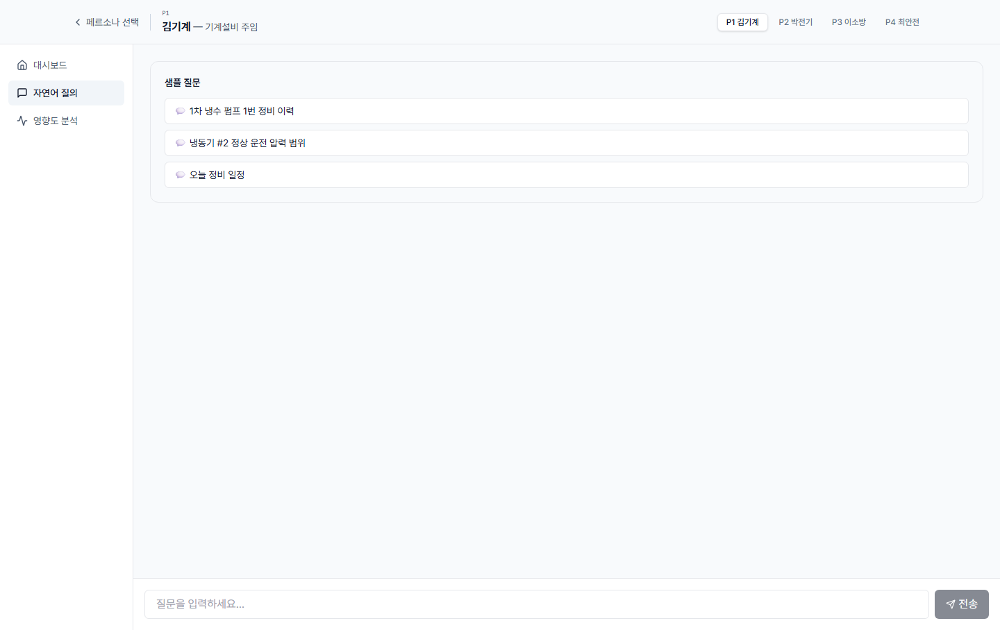

**설명 멘트:**
> "대화 초기화를 누르면 샘플 질문이 다시 보입니다.
> 새로운 주제로 질문할 때 처음 상태로 돌아오는 기능입니다."

---

## 3. P2 전기 담당 — 박전기 (4분)

### 3-1. 대시보드

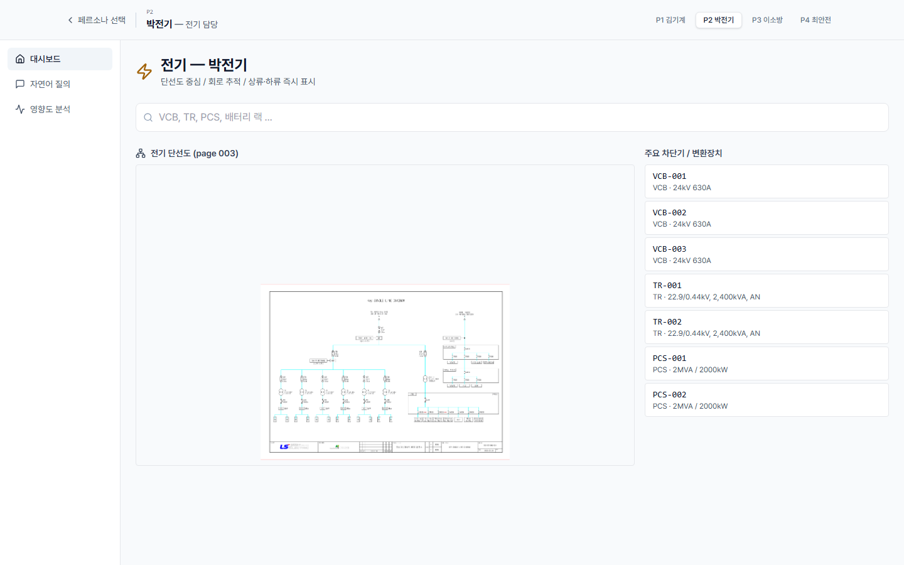

**설명 멘트:**
> "전기 담당자 박전기 화면입니다.
> '단선도 중심, 회로 추적, 상류·하류 즉시 표시'가 설계 원칙입니다.
> 왼쪽 큰 영역에 실제 전기 단선도 이미지가 보입니다.
> 오른쪽에는 주요 차단기와 변환장치 목록 — VCB-001, TR-001, PCS-001 등이 사양과 함께 나옵니다.
> 전기 엔지니어가 처음 진입하면 이 단선도를 보면서 설비를 찾아가는 방식입니다."

---

### 3-2. 미검수 뱃지 — VCB-001

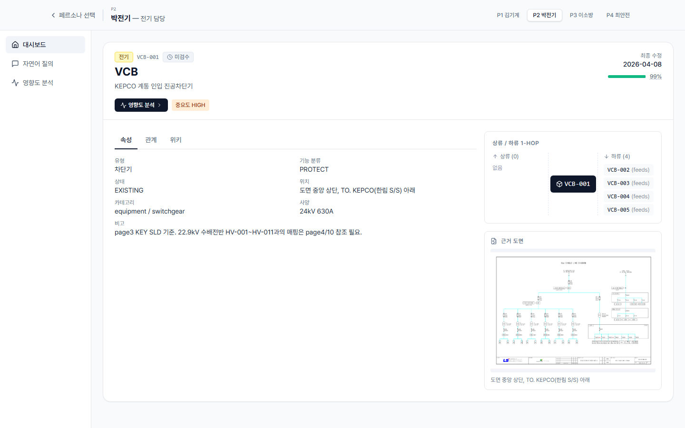

**설명 멘트:**
> "VCB-001 진공차단기입니다.
> 헤더를 보시면 '미검수' 회색 뱃지가 있습니다.
> AI가 도면에서 추출한 데이터지만 아직 사람이 검토하지 않은 상태입니다.
> 이 뱃지를 보면 담당자가 '한 번 더 확인하고 써야겠다'는 판단을 할 수 있습니다.
> 신뢰도는 99% — AI는 이 정보에 거의 확신하지만 사람 검수가 아직 없다는 의미입니다.
> 오른쪽에 실제 단선도 이미지도 함께 보입니다."

---

### 3-3. 영향도 분석 — React Flow 그래프

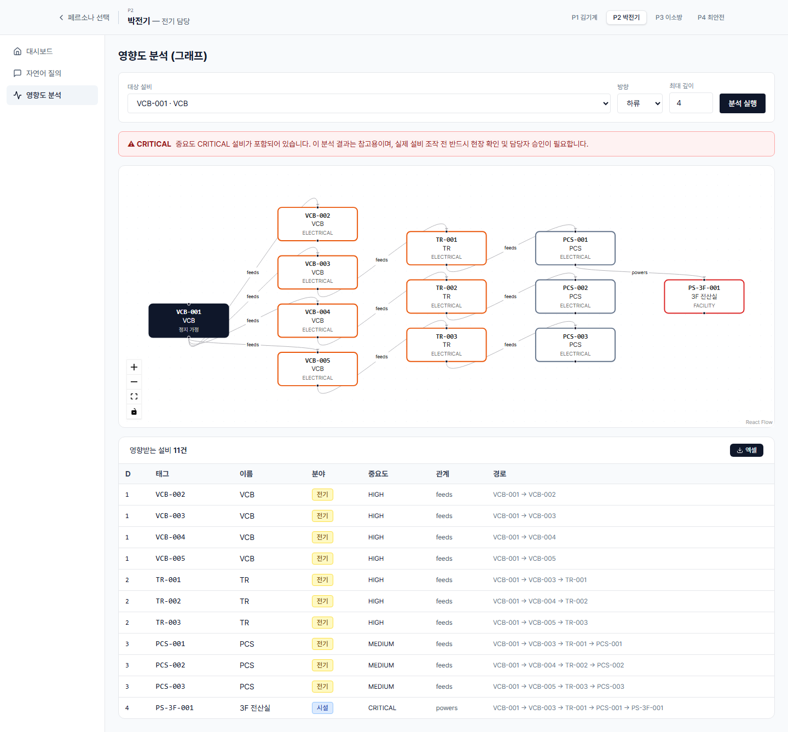

**설명 멘트:**
> "전기 계통은 트리가 아니라 망 구조입니다. 그래서 전기 담당자에게는 그래프 뷰를 제공합니다.
> VCB-001이 검정 박스(정지 가정)이고, 오른쪽으로 VCB-002~005 → TR-001~003 → PCS-001~003 → 3F 전산실까지 11개 설비가 영향을 받습니다.
> 이 그래프는 확대/축소, 드래그가 됩니다.
> 상단 빨간 배너 — CRITICAL 설비 포함, 참고용 분석이며 실제 조작 전 현장 확인 필수.
> 하단 테이블에는 depth별 경로가 상세히 나오고 엑셀로 내보낼 수 있습니다."

---

### 3-4. 자연어 질의 — 구조화 테이블

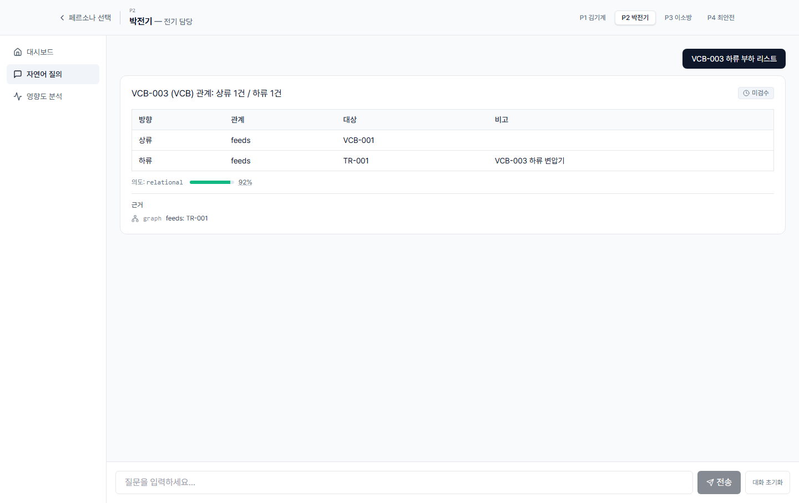

**설명 멘트:**
> "전기 담당자 Chat 화면입니다.
> 기계 담당자와 다르게 답변이 테이블 형태로 나옵니다.
> 상류/하류 방향, 관계 유형, 대상 설비, 비고가 정리된 표입니다.
> 기존에 엑셀로 손으로 만들던 회로 관계표를 자연어 한 줄로 바로 뽑는 겁니다."

---

## 4. P3 소방 담당 — 이소방 (4분)

### 4-1. 대시보드 — SVG 평면도

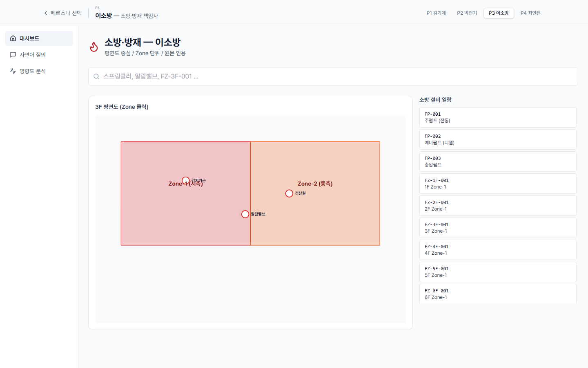

**설명 멘트:**
> "소방 담당자 이소방 화면입니다.
> '평면도 중심, Zone 단위, 원문 인용'이 설계 원칙입니다.
> 3F 평면도가 좌측에 크게 표시됩니다. Zone-1 서측, Zone-2 동측으로 방화구획이 색상으로 구분됩니다.
> 감지기군, 알람밸브 위치가 마커로 표시되고, 클릭하면 해당 설비 상세 페이지로 이동합니다.
> 오른쪽에는 전체 소방 설비 목록이 스크롤됩니다."

---

### 4-2. Zone 마우스 오버

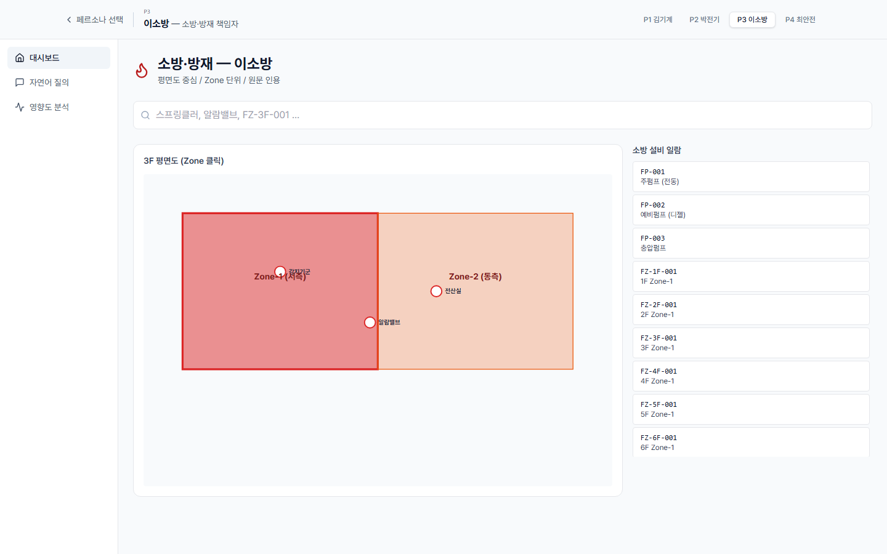

**설명 멘트:**
> "Zone에 마우스를 올리면 이렇게 강조됩니다.
> 클릭하면 그 Zone 설비 상세 페이지로 바로 이동합니다.
> 실제 소방 점검 때 어느 구역에 어떤 설비가 있는지 직관적으로 파악할 수 있습니다."

---

### 4-3. FP-001 주펌프 — 정비이력 탭

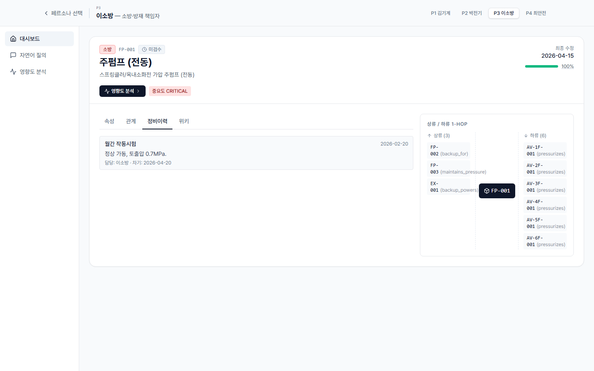

**설명 멘트:**
> "소방 주펌프 FP-001입니다.
> 중요한 점 — 소방 담당자 화면에서 '정비이력' 탭이 보입니다.
> 소방 법정 점검 이력은 기록 의무가 있습니다. 이 탭이 없으면 안 됩니다.
> 2월 20일 월간 작동시험, 정상 가동 토출압 0.7MPa, 담당 이소방, 차기 4월 20일.
> 검수를 받지 않은 상태라 '미검수' 뱃지가 표시됩니다."

---

### 4-4. 관계 탭 — pressurizes 관계

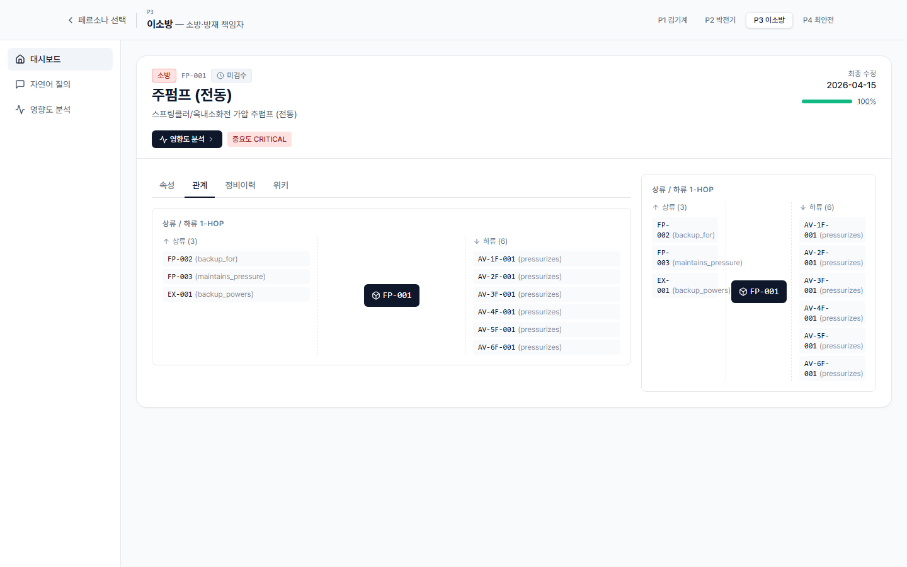

**설명 멘트:**
> "관계 탭입니다.
> FP-001 주펌프가 하류로 6개 알람밸브에 pressurizes(가압) 관계를 가집니다.
> 1층부터 6층 알람밸브 AV-1F~6F-001을 모두 가압합니다.
> 펌프가 멈추면 전층 알람밸브 작동 불가 — 이 관계가 시각화된 것입니다."

---

### 4-5. 영향도 분석 — 평면도 오버레이

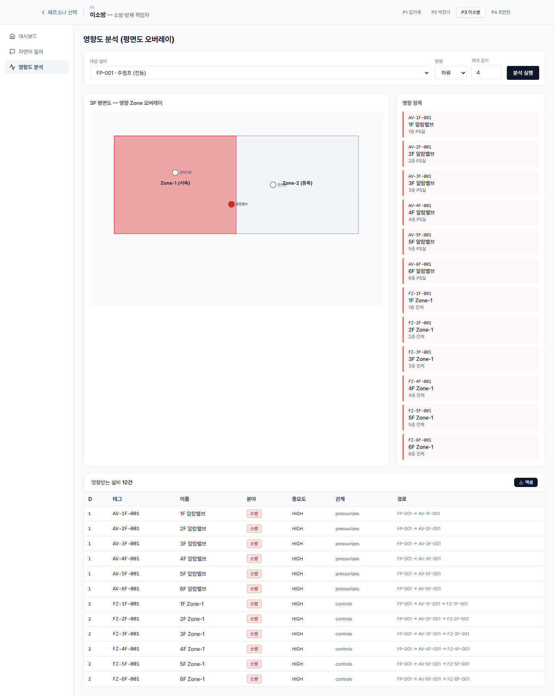

**설명 멘트:**
> "소방 담당자 영향도 분석입니다.
> FP-001 주펌프가 정지되면 — 평면도에서 Zone-1이 빨간색으로 색칠됩니다.
> 알람밸브 마커가 빨간 원으로 표시됩니다.
> 오른쪽에 영향 항목 목록: AV-1F~6F 알람밸브 6개, FZ-1F~6F Zone 6개, 총 12건.
> '주펌프 하나가 전층 소방 방호 구역에 영향을 준다' — 이게 한눈에 보입니다.
> 감사 대응 때 '이 설비 정지 시 영향 범위'를 문서로 만들어야 할 때 엑셀 버튼 하나로 뽑습니다."

---

### 4-6. 자연어 질의 — Citation 원문 인용

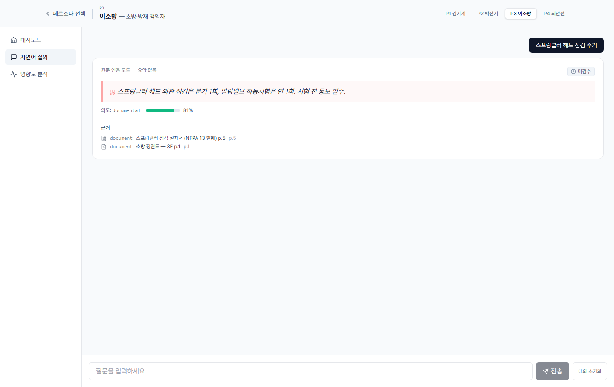

**설명 멘트:**
> "소방 담당자 Chat입니다.
> 다른 페르소나와 달리 답변이 인용 블록 형태로 나옵니다.
> 왼쪽에 빨간 선이 있는 blockquote 스타일 — '이건 원문에서 그대로 가져온 것'이라는 의미입니다.
> 소방청 감사에서 '이 기준 어디서 나왔냐'는 질문에 '이 문서 이 페이지에서 나왔다'고 근거를 보여줄 수 있습니다."

---

## 5. P4 안전팀장 — 최안전 (4분)

### 5-1. 대시보드 — 분야별 통계

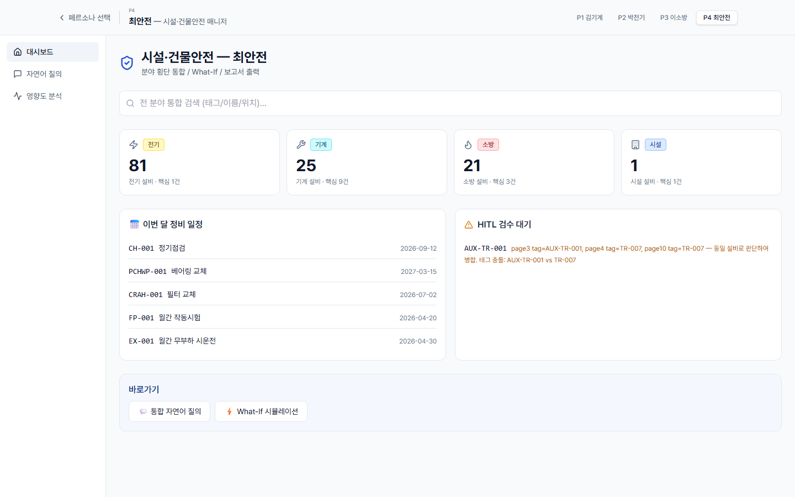

**설명 멘트:**
> "시설안전 팀장 최안전 화면입니다.
> '분야 횡단 통합, What-If 시뮬레이션, 보고서 출력'이 설계 원칙입니다.
> 위에 4개 분야 설비 숫자가 한눈에 보입니다 — 전기 81개, 기계 25개, 소방 21개, 시설 1개.
> 각 분야의 핵심(CRITICAL) 설비 수도 함께 표시됩니다.
> 이번 달 정비 일정과 HITL 검수 대기 항목이 한 화면에 모여 있습니다.
> 팀장이 아침에 들어와서 '오늘 뭘 신경써야 하나'를 즉시 파악합니다."

---

### 5-2. HITL 검수 필요 — amber 뱃지

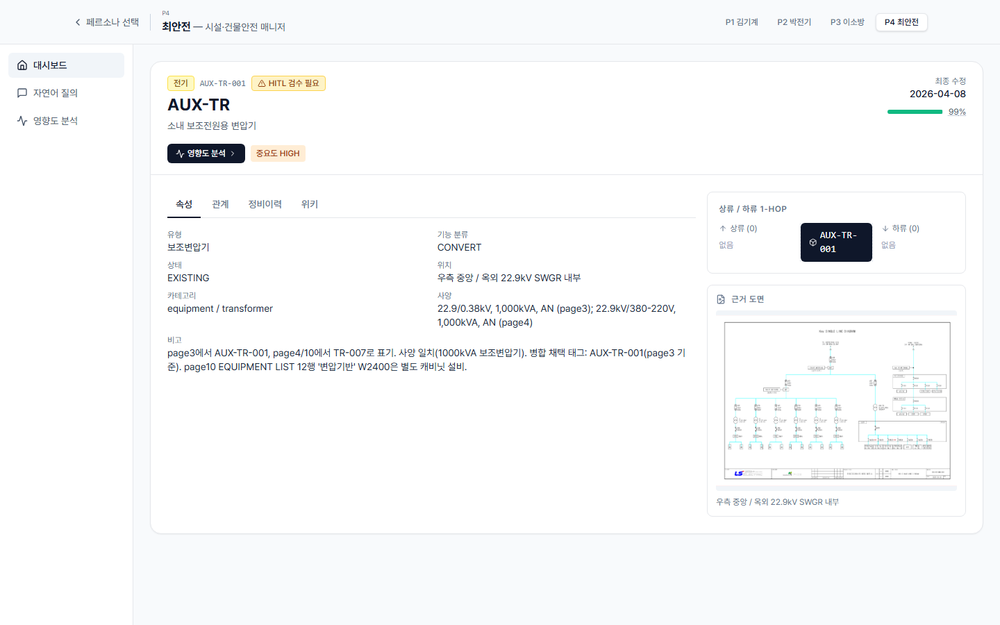

**설명 멘트:**
> "AUX-TR-001 변압기를 클릭했습니다.
> 헤더에 노란(amber) '⚠ HITL 검수 필요' 뱃지가 표시됩니다.
> AI가 여러 도면 페이지에서 같은 설비를 다른 태그로 인식했고 — page3의 AUX-TR-001과 page4의 TR-007이 동일 설비인데 태그가 충돌합니다.
> 미검수 뱃지(회색)와 HITL 검수 필요 뱃지(amber)는 다릅니다.
> 회색 — 아직 사람이 검토 안 함. 노란색 — AI가 의심스러운 부분을 발견해서 검토 필요 표시."

---

### 5-3. 자연어 질의 — Composite

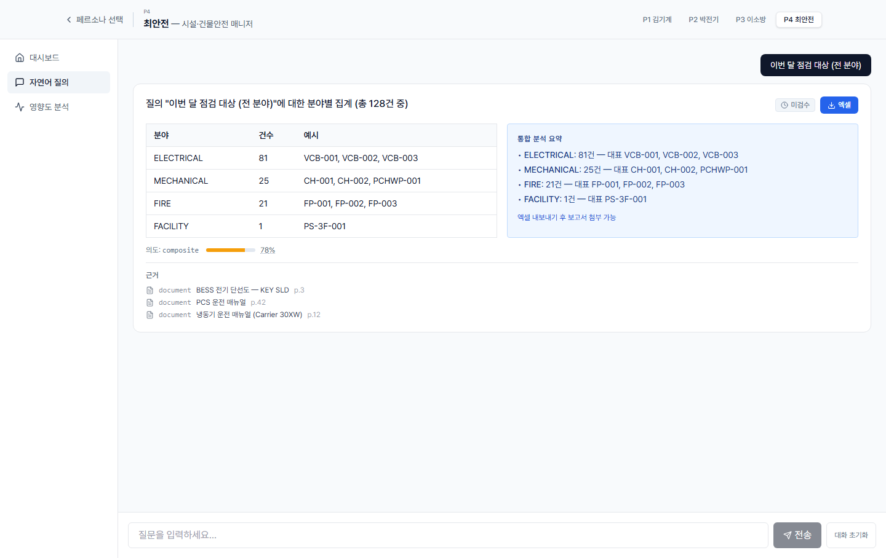

**설명 멘트:**
> "팀장 Chat 화면입니다.
> 전 분야 통합 질의를 하면 테이블과 분석 요약이 함께 나옵니다.
> 왼쪽 테이블, 오른쪽 통합 분석 요약 카드.
> 그리고 오른쪽 상단에 파란 '엑셀' 버튼 — 이 결과를 바로 xlsx로 내려받아서 보고서에 첨부할 수 있습니다.
> 다운받은 파일에는 데이터 시트와 별도로 '출처·주의' 시트가 자동으로 추가됩니다."

---

### 5-4. What-If 시뮬레이션

#### 초기 화면
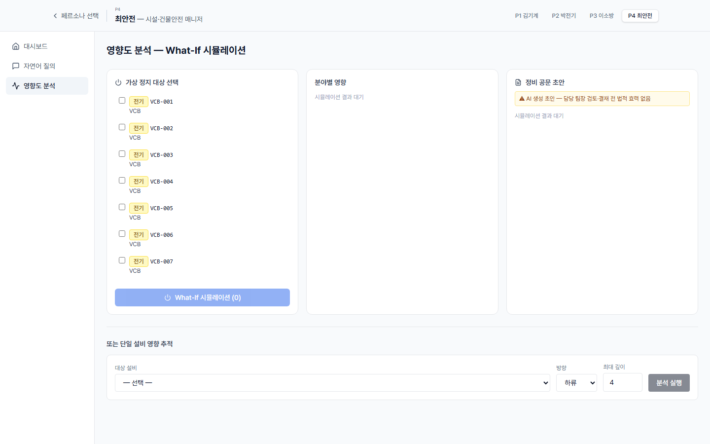

**설명 멘트:**
> "이게 팀장이 가장 많이 쓸 기능입니다 — What-If 시뮬레이션.
> 좌측 패널에 CRITICAL/HIGH 중요도 설비들이 체크박스로 나열됩니다.
> '이 설비들을 야간 보수 공사로 동시에 정지시키면 어떻게 되나?'를 시뮬레이션합니다."

#### 체크박스 선택
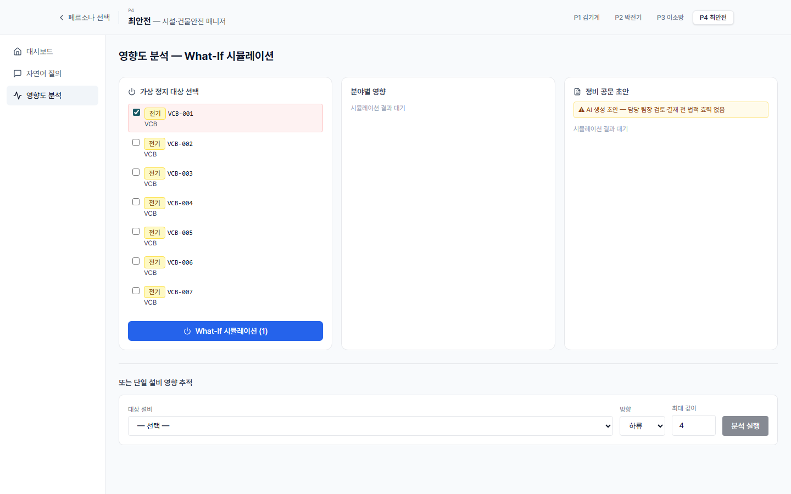

**설명 멘트:**
> "VCB-001을 체크하면 빨간 배경으로 강조됩니다.
> 여러 개를 동시에 선택할 수 있습니다."

#### 시뮬레이션 결과 + 공문 초안
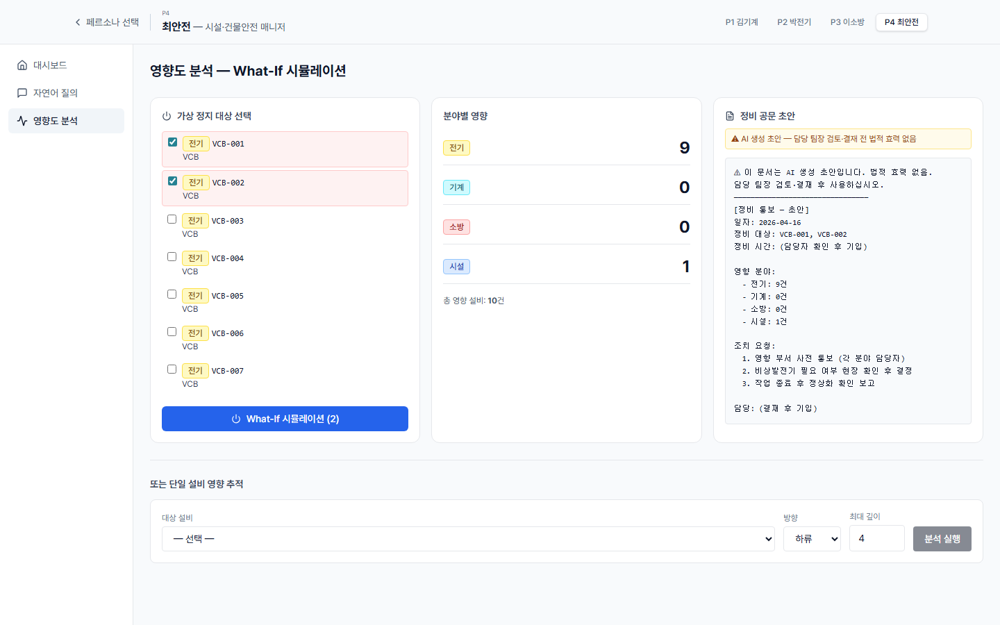

**설명 멘트:**
> "시뮬레이션 버튼을 누르면 이렇게 결과가 나옵니다.
> 가운데: 분야별 영향 집계 — 전기 9건, 기계 0건, 소방 0건, 시설 1건.
> 오른쪽: 정비 공문 초안이 자동으로 생성됩니다.
> 상단에 노란 뱃지 — 'AI 생성 초안 — 담당 팀장 검토·결재 전 법적 효력 없음'.
> 초안 텍스트 첫 줄에도 면책 경고가 명확히 들어갑니다.
> 비상발전기 문구도 '무조건 가동 준비'가 아니라 '필요 여부 현장 확인 후 결정'으로 바뀌어 있습니다.
> 담당자 란도 '(결재 후 기입)'으로 빈칸 처리 — 공문이 결재 없이 유통되는 것을 방지합니다.
> 이 초안을 복사해서 결재 올리면 됩니다. 공문 작성 시간을 대폭 줄여줍니다."

---

## 6. 마무리 — 데이터 품질 관리 (1분)

**설명 멘트:**
> "마지막으로 데이터 품질 관리에 대해 말씀드립니다.
> 이 시스템의 데이터는 3가지 상태로 관리됩니다.
> 첫째, 초록 신뢰도 80% 이상에 뱃지 없음 — AI 추출 + 인간 검수 완료. 가장 신뢰할 수 있습니다.
> 둘째, 회색 '미검수' 뱃지 — AI가 추출했지만 사람이 아직 확인하지 않은 상태. 참고는 하되 중요한 판단에는 한 번 더 확인하세요.
> 셋째, 노란 'HITL 검수 필요' 뱃지 — AI가 스스로 '이건 이상한 것 같다'고 표시한 것. 우선적으로 검토해야 합니다.
> 이 세 단계를 통해 사용자가 데이터를 맹신하지 않고 올바르게 활용할 수 있습니다."

---

## 7. 데모 후 논의 포인트 (사용자/임원과 확인할 것)

| 주제 | 질문 |
|------|------|
| 즐겨찾기 개인화 | 지금은 고정 5개입니다. 담당자마다 본인 설비를 직접 등록·수정하고 싶으신가요? |
| 설비 카드 우측 미니그래프 | 설비 상세 우측에 항상 떠 있는 관계 미니그래프 — 유용하게 쓰실 것 같으신가요, 아니면 탭으로 들어가서 보시는 게 충분한가요? |
| 평면도 층 선택 | 지금은 3층 하나만 보입니다. 전 층 관리가 필요하신가요? 층별로 따로 볼지, 전층 통합으로 볼지 어떻게 쓰실 것 같으세요? |
| 도면 이미지 연동 | 설비 카드에서 근거 도면 이미지를 직접 확인하는 게 필요하신가요? 아니면 외부 CAD 뷰어 프로그램과 연계하는 방식이 더 편하신가요? |
| 오프라인 지원 | 지하 기계실, 배관 피트처럼 WiFi 안 잡히는 곳에서도 사용하실 일이 있으신가요? |
| 모바일 vs 태블릿 | 현장에서 주로 폰으로 보실 건가요, 태블릿으로 보실 건가요? |

---

## 부록 — 캡쳐 이미지 전체 목록

| 번호 | 파일명 | 화면 |
|------|--------|------|
| 01 | 01-landing.png | 메인 랜딩 |
| 02 | 02-p1-dashboard.png | P1 기계 대시보드 |
| 03 | 03-p1-search.png | P1 검색 결과 |
| 04 | 04-p1-entity-attr.png | P1 CH-001 속성 탭 |
| 05 | 05-p1-entity-rel.png | P1 CH-001 관계 탭 |
| 06 | 06-p1-entity-maint.png | P1 CH-001 정비이력 탭 |
| 07 | 07-p1-entity-wiki.png | P1 CH-001 위키 탭 |
| 08 | 08-p1-confidence-tooltip.png | 신뢰도 툴팁 |
| 09 | 09-p1-impact-result.png | P1 영향도 체인 뷰 + CRITICAL 배너 |
| 10 | 10-p1-impact-both.png | P1 영향도 양방향 분석 |
| 11 | 11-p1-impact-excel.png | P1 영향도 엑셀 버튼 |
| 12 | 12-p1-chat-sample.png | P1 Chat 샘플 화면 |
| 13 | 13-p1-chat-answer.png | P1 Chat 답변 + 대화 초기화 버튼 |
| 14 | 14-p1-chat-cleared.png | P1 대화 초기화 후 |
| 15 | 15-p2-dashboard.png | P2 전기 대시보드 |
| 16 | 16-p2-entity-vcb-attr.png | P2 VCB-001 미검수 뱃지 |
| 17 | 17-p2-entity-vcb-rel.png | P2 VCB-001 관계 탭 |
| 18 | 18-p2-entity-vcb-wiki.png | P2 VCB-001 위키 탭 |
| 19 | 19-p2-impact-graph.png | P2 영향도 React Flow 그래프 |
| 20 | 20-p2-chat-structured.png | P2 Chat 테이블 답변 |
| 21 | 21-p3-dashboard.png | P3 소방 대시보드 SVG 평면도 |
| 22 | 22-p3-zone-hover.png | P3 Zone 마우스 오버 강조 |
| 23 | 23-p3-entity-fp-attr.png | P3 FP-001 속성 탭 |
| 24 | 24-p3-entity-fp-maint.png | P3 FP-001 정비이력 탭 |
| 25 | 25-p3-entity-fp-rel.png | P3 FP-001 관계 탭 |
| 26 | 26-p3-entity-fp-wiki.png | P3 FP-001 위키 탭 |
| 27 | 27-p3-impact-floor.png | P3 영향도 평면도 오버레이 |
| 28 | 28-p3-impact-marker.png | P3 평면도 마커 hover |
| 29 | 29-p3-chat-sample.png | P3 Chat 샘플 화면 |
| 30 | 30-p3-chat-citation.png | P3 Chat Citation 답변 |
| 31 | 31-p4-dashboard.png | P4 안전 대시보드 |
| 32 | 32-p4-entity-hitl.png | P4 HITL amber 뱃지 |
| 33 | 33-p4-chat-sample.png | P4 Chat 샘플 화면 |
| 34 | 34-p4-chat-composite.png | P4 Chat Composite 답변 |
| 35 | 35-p4-whatif-init.png | P4 What-If 초기 화면 |
| 36 | 36-p4-whatif-check1.png | P4 What-If 체크박스 선택 |
| 37 | 37-p4-whatif-result.png | P4 What-If 분야별 집계 결과 |
| 38 | 38-p4-whatif-draft.png | P4 공문 초안 면책 경고 |
